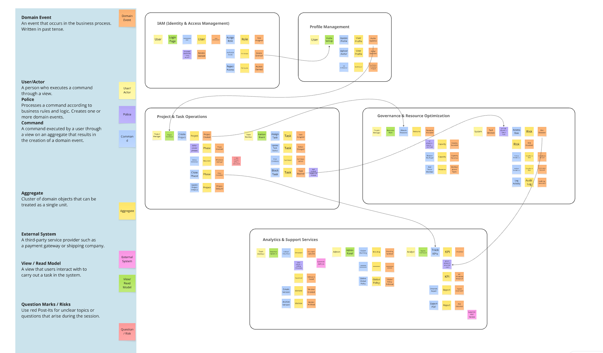
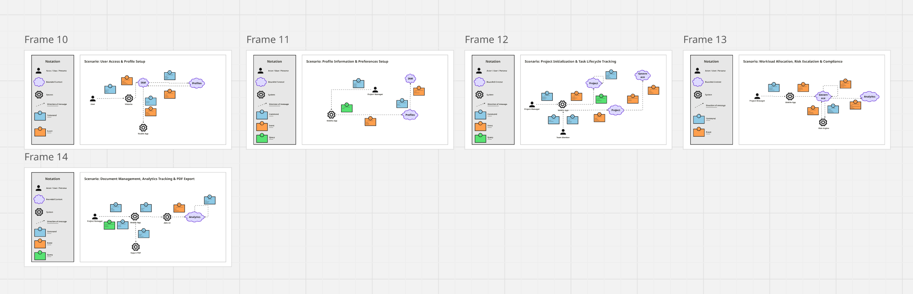
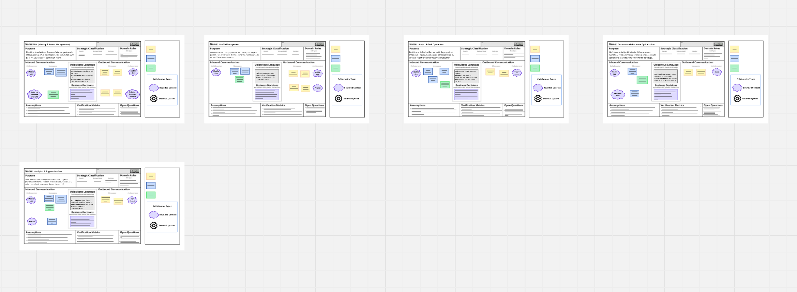
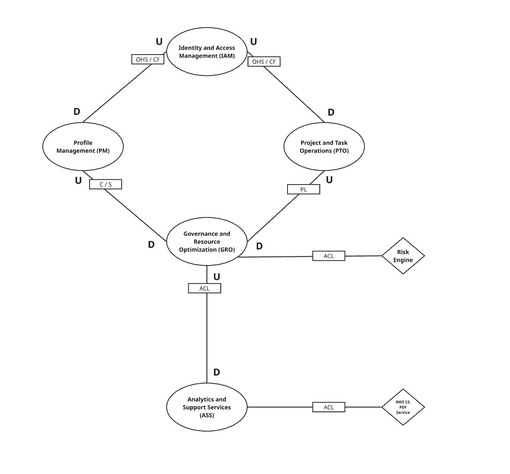

# Anexos

## Anexo A Event Storming

- Link del Event Storming: https://miro.com/app/board/uXjVHdJVxrc=/?share_link_id=503316698388

## Anexo B  Domain Message Flows Modeling

- Link del Domain Message Flows Modeling: https://miro.com/app/board/uXjVPYGRcyw=/?share_link_id=826582399087

## Anexo C  Bounded Context Canvases

- Link del Bounded Context Canvases: https://miro.com/app/board/uXjVHnf25gk=/?share_link_id=270018784387

## Anexo D  Context Mapping

- Link del Context Mapping: https://miro.com/app/board/uXjVHmgO__s=/?share_link_id=608827167269

