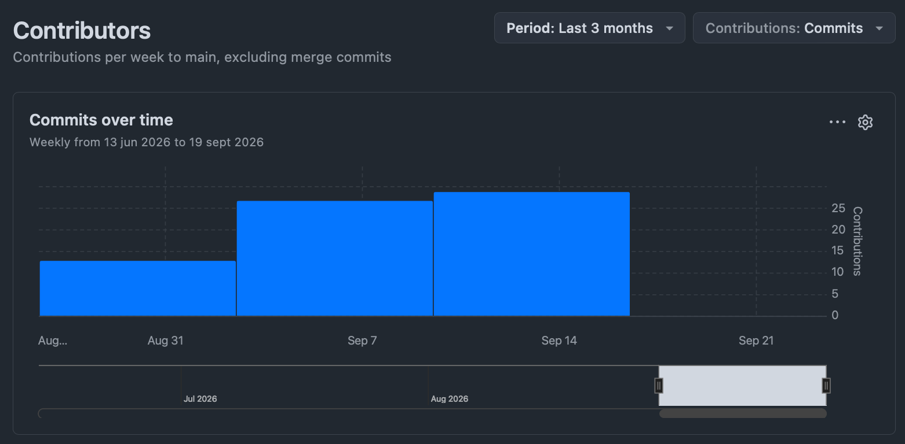
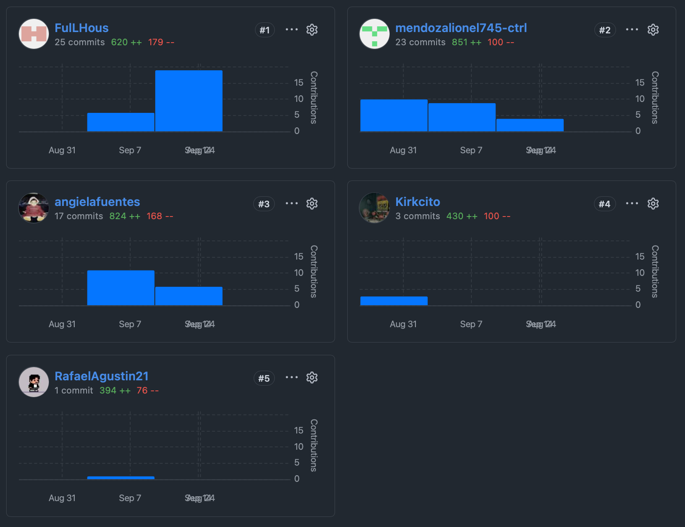
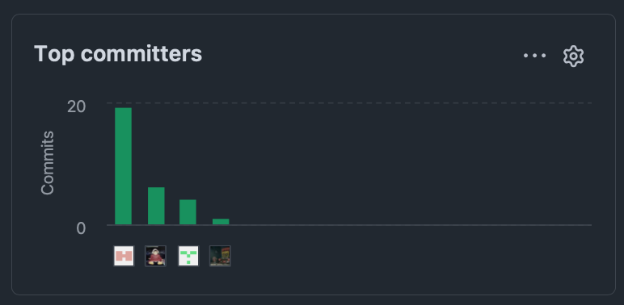

  

  <h3>Universidad Peruana de Ciencias Aplicadas</h3>
  <h3>Carrera de Ingeniería de Software</h3>

  
<strong>1ACC0238</strong> 
  <strong>Aplicaciones para Dispositivos Móviles</strong> 
  NRC 
  <strong>13975</strong> 
  <strong>Informe del Trabajo Final</strong> 
  Docente 
  <strong>David Gerardo Quevedo Velasco</strong> 
  Equipo 
  <strong>MDEPS</strong>

  
Proyecto 
  <strong>Vantage PMO</strong>

  <table align="center">
    <tr>
      <th>Código</th>
      <th>Apellidos y Nombres</th>
    </tr>
    <tr>
      <td>U202520331</td>
      <td>Fuentes Alvarez, Angiela Stephany</td>
    </tr>
    <tr>
      <td>U202211881</td>
      <td>Guillen Giraldo, Mike Dylan</td>
    </tr>
    <tr>
      <td>U202417433</td>
      <td>Mendoza Machoa, Lionel Snayder</td>
    </tr>
    <tr>
      <td>U202014215</td>
      <td>Pacheco Lavado, Rafael Agustin</td>
    </tr>
    <tr>
      <td>U202411378</td>
      <td>Quiliano Motta, Kirk Douglas</td>
    </tr>
  </table>

  
<strong>Periodo Académico:</strong> 2026-20 
  <strong>Fecha:</strong> Setiembre 2026

---

## Registro de Versiones del Informe

| Version | Fecha | Autor | Descripcion de Modificacion |
| :--- | :--- | :--- | :--- |
| 0.1 | 28/08/2026 | Todos | Estructuracion inicial y division de secciones para AV1 |
| 1.0 | 05/09/2026 | Quiliano Motta, Kirk Douglas | Elaboracion de Caratula, Capitulo I (Startup Profile, Solution Profile, Lean UX, Segmentos), Collaboration Insights y Student Outcome para la entrega AV1. |
| 1.0 | 15/09/2026 | Guillen Giraldo, Mike Dylan | Desarrollo del Capítulo 2.5 (Strategic-Level Domain-Driven Design), abarcando el modelado mediante EventStorming, Context Mapping y la definición de la arquitectura de software en los niveles Context, Container y Deployment. |
| 1.0 | --/09/2026 | Todos | Finalizacion del informe para la entrega AV1 (Semana 4) |

## Project Report Collaboration Insights

**Link del Repositorio de la Organizacion:** [Organización](https://github.com/MDEPS-Team) 
**Link del Repositorio del Reporte:** [Reporte](https://github.com/MDEPS-Team/MDEPS-report/tree/develop)

### Reporte de Colaboracion - Entrega AV1
Durante esta primera entrega, el equipo establecio la estructura base del repositorio utilizando el flujo de trabajo GitFlow. Las tareas se dividieron de forma equitativa, permitiendo que la redaccion del modelo de negocio, el analisis de la competencia y el diseno de la arquitectura se trabajaran en ramas independientes (feature/...) antes de integrarse a la rama develop. El equipo mantuvo sincronizacion constante para alinear los hallazgos del Lean UX con los requerimientos del producto.

#### Contributors

  
    
  

#### Commits Over Time & Pulse

  

---

## Contenido (Tabla de Contenidos)

- [Capitulo I: Presentacion](cap1-presentation.md#capitulo-i-presentacion)
  - [1.1. Startup Profile](cap1-presentation.md#11-startup-profile)
    - [1.1.1. Descripcion de la Startup](cap1-presentation.md#111-descripcion-de-la-startup)
    - [1.1.2. Perfiles de integrantes del equipo](cap1-presentation.md#112-perfiles-de-integrantes-del-equipo)
  - [1.2. Solution Profile](cap1-presentation.md#12-solution-profile)
    - [1.2.1. Antecedentes y problematica](cap1-presentation.md#121-antecedentes-y-problematica)
    - [1.2.2. Lean UX Process](cap1-presentation.md#122-lean-ux-process)
      - [1.2.2.1. Lean UX Problem Statements](cap1-presentation.md#1221-lean-ux-problem-statements)
      - [1.2.2.2. Lean UX Assumptions](cap1-presentation.md#1222-lean-ux-assumptions)
      - [1.2.2.3. Lean UX Hypothesis Statements](cap1-presentation.md#1223-lean-ux-hypothesis-statements)
      - [1.2.2.4. Lean UX Canvas](cap1-presentation.md#1224-lean-ux-canvas)
  - [1.3. Segmentos objetivo](cap1-presentation.md#13-segmentos-objetivo)
- [Capitulo II: Requirements Development and Software Solution Design](cap2-requirements.md#capitulo-ii-requirements-development-and-software-solution-design)
  - [2.1. Competidores](cap2-requirements.md#21-competidores)
    - [2.1.1 Análisis competitivo](cap2-requirements.md#211-analisis-competitivo)
    - [2.1.2. Estrategias y tacticas frente a competidores](cap2-requirements.md#212-estrategias-y-tacticas-frente-a-competidores)
  - [2.2. Entrevistas](cap2-requirements.md#22-entrevistas)
    - [2.2.1. Diseno de entrevistas](cap2-requirements.md#221-diseno-de-entrevistas)
    - [2.2.2. Registro de entrevistas](cap2-requirements.md#222-registro-de-entrevistas)
    - [2.2.3 Análisis de Entrevistas](cap2-requirements.md#223-analisis-de-entrevistas)
  - [2.3 Needfinding](cap2-requirements.md#23-needfinding)
    - [2.3.1 User Personas](cap2-requirements.md#231-user-personas)
    - [2.3.2 User Task Matrix](cap2-requirements.md#232-user-task-matrix)
    - [2.3.3 User Journey Mapping](cap2-requirements.md#233-user-journey-mapping)
    - [2.3.4 Empathy Mapping](cap2-requirements.md#234-empathy-mapping)
    - [2.3.5 Big Picture EventStorming](cap2-requirements.md#235-big-picture-eventstorming)
    - [2.3.6 Ubiquitous Language](cap2-requirements.md#236-ubiquitous-language)
  - [2.4 Requirements Specification](cap2-requirements.md#24-requirements-specification)
    - [2.4.1. User Stories](cap2-requirements.md#241-user-stories)
    - [2.4.2. Impact Mapping](cap2-requirements.md#242-impact-mapping)
    - [2.4.3. Product Backlog](cap2-requirements.md#243-product-backlog)
  - [2.5. Strategic-Level Domain-Driven Design](cap2-requirements.md#25-strategic-level-domain-driven-design)
    - [2.5.1. EventStorming](cap2-requirements.md#251-eventstorming)
      - [2.5.1.1. Candidate Context Discovery](cap2-requirements.md#2511-candidate-context-discovery)
      - [2.5.1.2. Domain Message Flows Modeling](cap2-requirements.md#2512-domain-message-flows-modeling)
      - [2.5.1.3. Bounded Context Canvases](cap2-requirements.md#2513-bounded-context-canvases)
    - [2.5.2. Context Mapping](cap2-requirements.md#252-context-mapping)
    - [2.5.3. Software Architecture](cap2-requirements.md#253-software-architecture)
      - [2.5.3.1. Software Architecture Context Level Diagrams](cap2-requirements.md#2531-software-architecture-context-level-diagrams)
      - [2.5.3.2. Software Architecture Container Level Diagrams](cap2-requirements.md#2532-software-architecture-container-level-diagrams)
      - [2.5.3.3. Software Architecture Deployment Diagrams](cap2-requirements.md#2533-software-architecture-deployment-diagrams)
  - [2.6. Tactical-Level Domain-Driven Design](cap2-requirements.md#26-tactical-level-domain-driven-design)
    - [2.6.1. Bounded Context: IAM](cap2-requirements.md#261-bounded-context-iam)
      - [2.6.1.1. Domain Layer](cap2-requirements.md#2611-domain-layer)
      - [2.6.1.2. Interface Layer](cap2-requirements.md#2612-interface-layer)
      - [2.6.1.3. Application Layer](cap2-requirements.md#2613-application-layer)
      - [2.6.1.4. Infrastructure Layer](cap2-requirements.md#2614-infrastructure-layer)
      - [2.6.1.5. Bounded Context Software Architecture Component Level Diagrams](cap2-requirements.md#2615-bounded-context-software-architecture-component-level-diagrams)
      - [2.6.1.6. Bounded Context Software Architecture Code Level Diagrams](cap2-requirements.md#2616-bounded-context-software-architecture-code-level-diagrams)
        - [2.6.1.6.1. Bounded Context Domain Layer Class Diagrams](cap2-requirements.md#26161-bounded-context-domain-layer-class-diagrams)
        - [2.6.1.6.2. Bounded Context Database Design Diagram](cap2-requirements.md#26162-bounded-context-database-design-diagram)
    - [2.6.2. Bounded Context: Profiles](cap2-requirements.md#262-bounded-context-profiles)
      - [2.6.2.1. Domain Layer](cap2-requirements.md#2621-domain-layer)
      - [2.6.2.2. Interface Layer](cap2-requirements.md#2622-interface-layer)
      - [2.6.2.3. Application Layer](cap2-requirements.md#2623-application-layer)
      - [2.6.2.4. Infrastructure Layer](cap2-requirements.md#2624-infrastructure-layer)
      - [2.6.2.5. Bounded Context Software Architecture Component Level Diagrams](cap2-requirements.md#2625-bounded-context-software-architecture-component-level-diagrams)
      - [2.6.2.6. Bounded Context Software Architecture Code Level Diagrams](cap2-requirements.md#2626-bounded-context-software-architecture-code-level-diagrams)
        - [2.6.2.6.1. Bounded Context Domain Layer Class Diagrams](cap2-requirements.md#26261-bounded-context-domain-layer-class-diagrams)
        - [2.6.2.6.2. Bounded Context Database Design Diagram](cap2-requirements.md#26262-bounded-context-database-design-diagram)
    - [2.6.3. Bounded Context: Projects](cap2-requirements.md#263-bounded-context-projects)
      - [2.6.3.1. Domain Layer](cap2-requirements.md#2631-domain-layer)
      - [2.6.3.2. Interface Layer](cap2-requirements.md#2632-interface-layer)
      - [2.6.3.3. Application Layer](cap2-requirements.md#2633-application-layer)
      - [2.6.3.4. Infrastructure Layer](cap2-requirements.md#2634-infrastructure-layer)
      - [2.6.3.5. Bounded Context Software Architecture Component Level Diagrams](cap2-requirements.md#2635-bounded-context-software-architecture-component-level-diagrams)
      - [2.6.3.6. Bounded Context Software Architecture Code Level Diagrams](cap2-requirements.md#2636-bounded-context-software-architecture-code-level-diagrams)
        - [2.6.3.6.1. Bounded Context Domain Layer Class Diagrams](cap2-requirements.md#26361-bounded-context-domain-layer-class-diagrams)
        - [2.6.3.6.2. Bounded Context Database Design Diagram](cap2-requirements.md#26362-bounded-context-database-design-diagram)
    - [2.6.4. Bounded Context: TaskCollaboration](cap2-requirements.md#264-bounded-context-taskcollaboration)
      - [2.6.4.1. Domain Layer](cap2-requirements.md#2641-domain-layer)
      - [2.6.4.2. Interface Layer](cap2-requirements.md#2642-interface-layer)
      - [2.6.4.3. Application Layer](cap2-requirements.md#2643-application-layer)
      - [2.6.4.4. Infrastructure Layer](cap2-requirements.md#2644-infrastructure-layer)
      - [2.6.4.5. Bounded Context Software Architecture Component Level Diagrams](cap2-requirements.md#2645-bounded-context-software-architecture-component-level-diagrams)
      - [2.6.4.6. Bounded Context Software Architecture Code Level Diagrams](cap2-requirements.md#2646-bounded-context-software-architecture-code-level-diagrams)
        - [2.6.4.6.1. Bounded Context Domain Layer Class Diagrams](cap2-requirements.md#26461-bounded-context-domain-layer-class-diagrams)
        - [2.6.4.6.2. Bounded Context Database Design Diagram](cap2-requirements.md#26462-bounded-context-database-design-diagram)
- [Conclusiones](conclusiones.md#conclusiones)
- [Recomendaciones](conclusiones.md#recomendaciones)
- [Bibliografia](Bibliografia.md#bibliografia)
- [Anexos](Anexos.md#anexos)
  - [Anexo A Event Storming](Anexos.md#anexo-a-event-storming)
  - [Anexo B Domain Message Flows Modeling](Anexos.md#anexo-b-domain-message-flows-modeling)
  - [Anexo C Bounded Context Canvases](Anexos.md#anexo-c-bounded-context-canvases)
  - [Anexo D Context Mapping](Anexos.md#anexo-d-context-mapping)

---

## Student Outcome

El curso contribuye al cumplimiento del Student Outcome ABET:  
**ABET EAC - Student Outcome 7:** La capacidad de adquirir y aplicar nuevos conocimientos segun sea necesario, utilizando estrategias de aprendizaje apropiadas.

En el siguiente cuadro se describe las acciones realizadas y enunciados de conclusiones por parte del grupo, que permiten sustentar el haber alcanzado el logro del ABET - EAC - Student Outcome 7.

| Criterio Específico | Acciones Realizadas | Conclusiones |
| :--- | :--- | :--- |
| **Actualiza conceptos y conocimientos necesarios para su desarrollo profesional y, en especial, para su proyecto en soluciones de software.** | **Fuentes Alvarez, Angiela Stephany:** Participación en el desarrollo del Capítulo 2 de Vantage PMO, trabajando en el análisis de competidores, diseño y realización de entrevistas y proceso de Needfinding. Se realizó la recopilación y análisis de información de los segmentos objetivo y se desarrollaron artefactos de análisis y experiencia de usuario, incluyendo User Personas, User Task Matrix, User Journey Mapping, Empathy Mapping, Big Picture EventStorming y Ubiquitous Language. Estas actividades permitieron aplicar y ampliar conocimientos sobre análisis de requerimientos, levantamiento de información y diseño centrado en el usuario, contribuyendo a la definición de las necesidades y oportunidades de mejora de la solución.  **Guillen Giraldo, Mike Dylan:** Investigación y actualización de conocimientos sobre Domain-Driven Design (DDD), EventStorming, Context Mapping y el modelo C4, aplicándolos en el análisis y definición de la arquitectura de VantagePMO. Asimismo, se estudiaron conceptos relacionados con Bounded Contexts, Domain Message Flows y diagramas de arquitectura a nivel Context, Container y Deployment, con el fin de seleccionar y aplicar estrategias adecuadas para el desarrollo de la solución de software.  **Mendoza Machoa, Lionel Snayder:**  Investigué y apliqué los principios de Clean Architecture y Domain-Driven Design (DDD) para estructurar y documentar los Bounded Contexts clave del backend (IAM, Profiles, Projects y TaskCollaboration). Además, actualicé mis conocimientos técnicos en la elaboración de diagramas de componentes (modelo C4), diagramas de clases UML y diseño de modelos relacionales de bases de datos, utilizando herramientas asíncronas como PlantUML y Markdown para la correcta especificación de la solución Vantage PMO.  **Pacheco Lavado, Rafael Agustin:** Investigué y apliqué técnicas de levantamiento y especificación de requisitos como User Personas, User Journey Mapping, EventStorming, User Stories con criterios Gherkin e Impact Mapping, fortaleciendo mis conocimientos para el análisis y diseño de la solución Vantage PMO.  **Quiliano Motta, Kirk Douglas:** Investigué y apliqué metodologías ágiles de diseño de producto (Lean UX) y técnicas de análisis de problemas (5W2H) para definir el alcance del proyecto Vantage PMO, actualizando mis conocimientos en gestión de portafolios y redacción técnica estructurada. | **AV1:**  El liderazgo compartido permitió que cada integrante asumiera responsabilidad sobre un módulo específico del reporte, aportando desde su especialidad sin depender de una figura central. Esta distribución de liderazgo fortaleció la autonomía del equipo y aceleró el avance en paralelo de los capítulos, demostrando que un liderazgo distribuido es viable cuando se establecen convenciones claras. Asumir resolución de problemas de integración y bases de datos demostró que gestionar y destrabar cuellos de botella técnicos agiliza enormemente el trabajo del resto del equipo. Esto garantizó que los compañeros pudieran enfocarse en desarrollar nuevas funcionalidades visuales sin retrasos, evidenciando que un liderazgo técnico proactivo es fundamental para mantener el ritmo del proyecto y asegurar la estabilidad de la plataforma.
 |
| **Reconoce la necesidad del aprendizaje permanente para el desempeño profesional y el desarrollo de proyectos en soluciones de software.** | **Fuentes Alvarez, Angiela Stephany:** [Acciones realizadas en AV1]  **Guillen Giraldo, Mike Dylan:** Investigué y aprendí de manera autónoma nuevos conceptos y herramientas relacionados con Domain-Driven Design, EventStorming, Context Mapping y C4 Model, aplicándolos en el desarrollo de la arquitectura de VantagePMO. Esto me permitió reconocer la importancia de mantener un aprendizaje continuo para poder afrontar nuevos requerimientos y mejorar mis competencias profesionales.  **Mendoza Machoa, Lionel Snayder:** Reconocí la importancia de adoptar estándares de la industria mediante el aprendizaje práctico de flujos de trabajo colaborativos, aplicando GitFlow (creación de ramas de características específicas, control de versiones y gestión de Pull Requests) directamente desde WebStorm hacia GitHub. Asimismo, comprendí que dominar la redacción técnica y la generación de diagramas por código es fundamental para mantener un aprendizaje continuo y asegurar la escalabilidad en proyectos de software profesionales.  **Pacheco Lavado, Rafael Agustin:** Reconocí la importancia del aprendizaje continuo al utilizar nuevas herramientas y metodologías como UXPressia, EventStorming e Impact Mapping, adaptándome a conceptos necesarios para transformar las necesidades de los usuarios en requisitos y funcionalidades concretas para el proyecto.  **Quiliano Motta, Kirk Douglas:** Reconocí que, para modelar una solución B2B efectiva, necesitaba aprender sobre los puntos de dolor reales de los Project Managers y el uso estandarizado de repositorios colaborativos (GitHub/GitFlow), lo cual es fundamental para el desarrollo profesional en la industria del software. | **AV1:** El entorno colaborativo creado permitió cumplir con los objetivos del proyecto dentro del plazo establecido, a pesar de la complejidad de coordinar cinco capítulos en paralelo. La planificación semanal y el uso disciplinado de GitFlow demostraron ser prácticas efectivas para un equipo distribuido, minimizando conflictos de integración y asegurando que cada entregable reflejara el aporte colectivo del grupo. La comunicación transparente durante la resolución de errores creó un ambiente de apoyo donde los fallos del código se solucionaron de forma educativa y conjunta, sin buscar culpables. La disciplina al sincronizar los avances locales y el trabajo en la calidad documental demostraron que la colaboración integral (tanto en el código como en el reporte) es clave para cumplir con los hitos del cronograma y entregar un producto de software robusto dentro de los plazos establecidos. |

---

## Objetivos SMART

### Fuentes Alvarez, Angiela Stephany
- **Objetivo 1:** Durante los dos primeros años después de graduarme de Ingeniería de Software, conseguir y mantener un puesto profesional como desarrolladora de software, fortaleciendo mis conocimientos en desarrollo backend, APIs y bases de datos mediante la participación en proyectos reales y la realización de al menos 2 cursos o certificaciones especializadas por año.
- **Objetivo 2:** Desarrollar un perfil profesional sólido en Ingeniería de Software, participando en al menos 3 proyectos de software y construyendo un portafolio técnico en GitHub que evidencie mis competencias en programación, desarrollo de aplicaciones y trabajo colaborativo.

### Guillen Giraldo, Mike Dylan
- **Objetivo 1:** Consolidarme como ingeniero de software durante los primeros 6 meses posteriores a mi graduación, aprovechando la experiencia adquirida en el desarrollo de proyectos de software de mayor escala que actualmente me encuentro construyendo, y fortaleciendo mis competencias en desarrollo, bases de datos, arquitectura y diseño de soluciones mediante experiencia profesional.
- **Objetivo 2:** Orientar progresivamente mi perfil hacia la ciberseguridad, complementando mi experiencia en desarrollo de software con formación especializada y participación en proyectos relacionados con seguridad durante los 2 primeros años posteriores a mi graduación, con el propósito de adquirir las competencias necesarias para desempeñarme en el área de seguridad de aplicaciones y sistemas.

### Mendoza Machoa, Lionel Snayder
- **Objetivo 1:** Consolidarme como desarrollador de software  durante los primeros 12 meses posteriores a mi graduación, obteniendo un puesto profesional donde pueda aplicar y profundizar mis conocimientos técnicos en C#, bases de datos relacionales y arquitecturas limpias , contribuyendo directamente en el desarrollo y despliegue de soluciones escalables.
- **Objetivo 2:** Fortalecer mi perfil profesional orientándolo hacia el diseño de arquitectura de software durante los primeros 2 años tras graduarme, obteniendo al menos una certificación reconocida en tecnologías de la nube (como Azure o AWS) y consolidando un portafolio en GitHub con al menos 3 proyectos robustos que evidencien el uso avanzado de GitFlow, modelado de bases de datos y diagramado técnico.

### Pacheco Lavado, Rafael Agustin
- **Objetivo 1:** Durante el primer año después de graduarme, conseguir un puesto profesional relacionado con el desarrollo de software o análisis de datos, fortaleciendo mis conocimientos en Python y desarrollo de aplicaciones mediante la realización de al menos 2 cursos o certificaciones especializadas.
- **Objetivo 2:** Construir un portafolio técnico en GitHub durante los primeros 18 meses posteriores a mi graduación, desarrollando al menos 4 proyectos que demuestren mis conocimientos en programación, análisis de datos y desarrollo de software, aplicando tecnologías como Python, C++ y JavaScript.

### Quiliano Motta, Kirk Douglas
- **Objetivo 1:** Obtener una certificacion en marcos de trabajo agiles (como Scrum Master o SAFe) dentro de los primeros 6 meses posteriores a la graduacion, dedicando 4 horas semanales de estudio, para mejorar mi perfil en la gestion y desarrollo de proyectos de software B2B.
- **Objetivo 2:** Dominar el desarrollo de arquitecturas en la nube (AWS o Azure) logrando una certificacion basica en el transcurso de un ano tras graduarme, mediante la realizacion de 3 proyectos practicos, para potenciar mi capacidad de disenar soluciones de software escalables.
