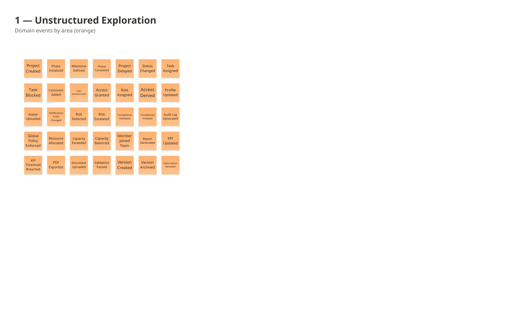
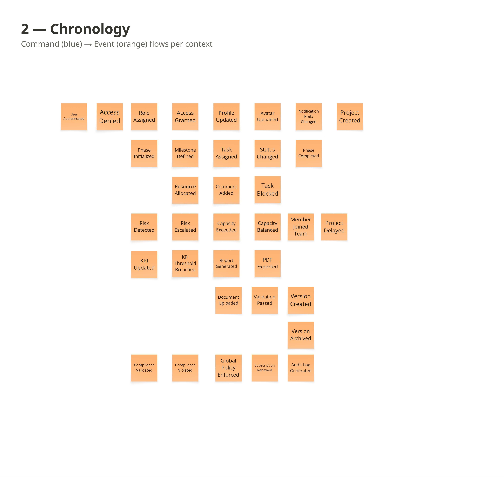
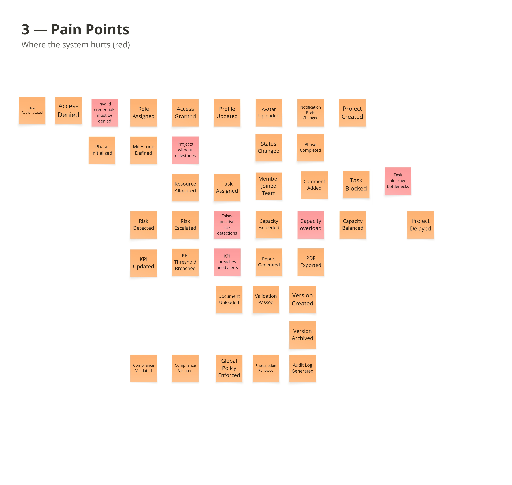
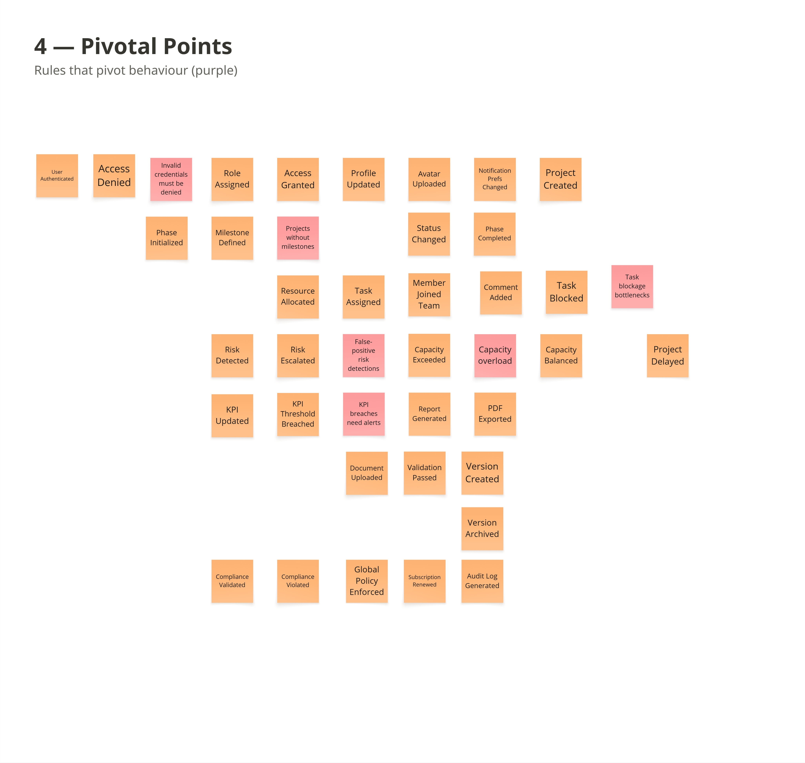
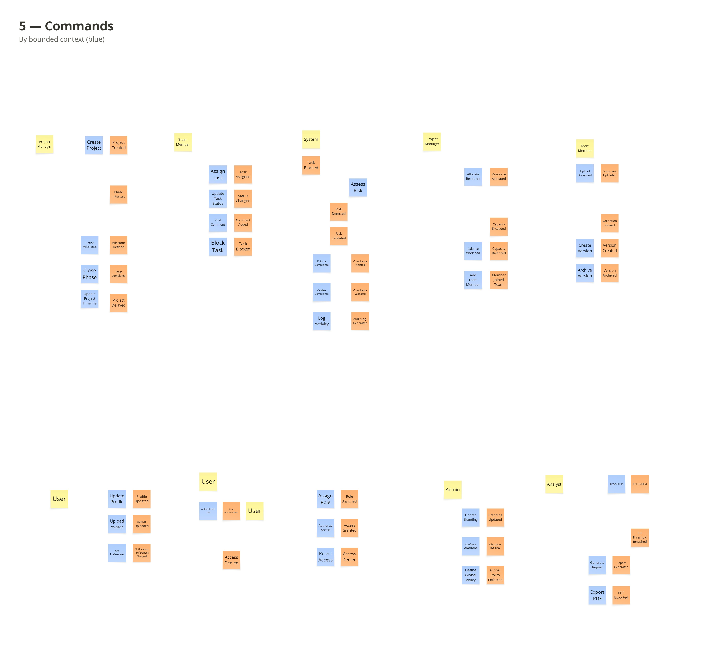
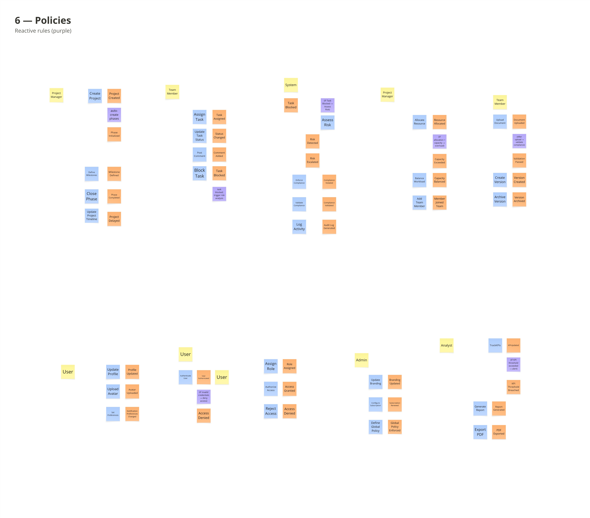
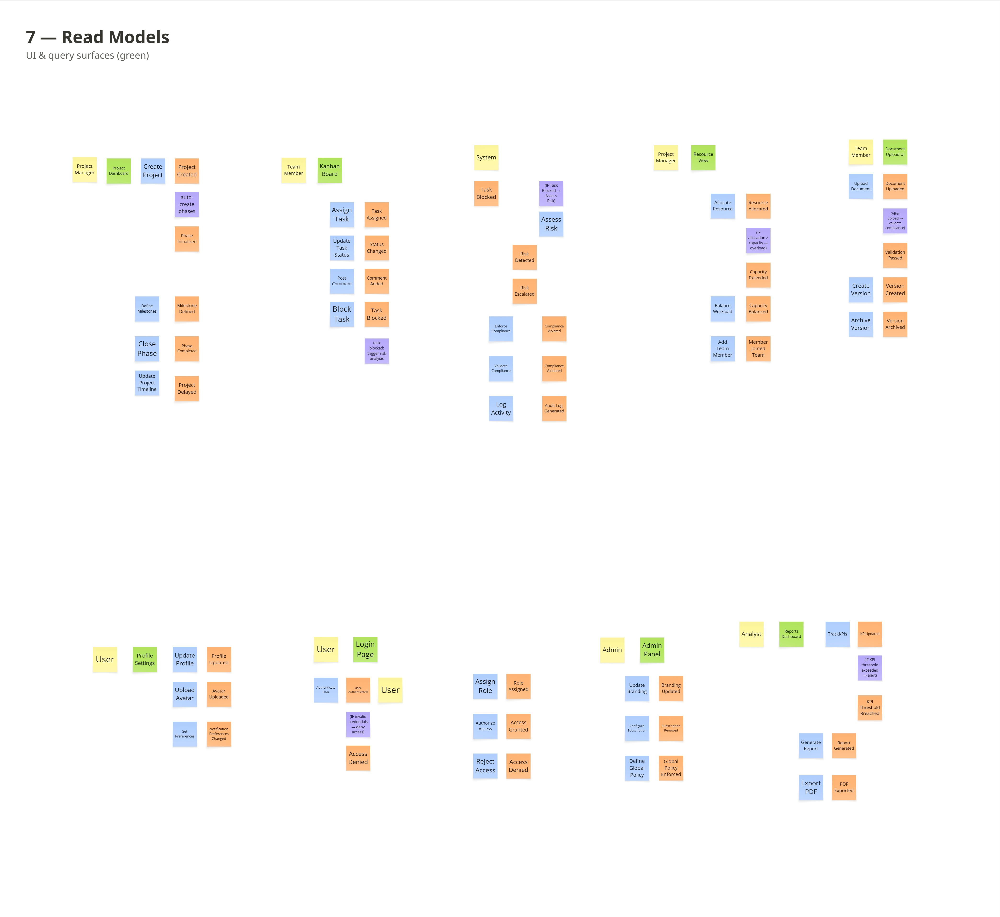
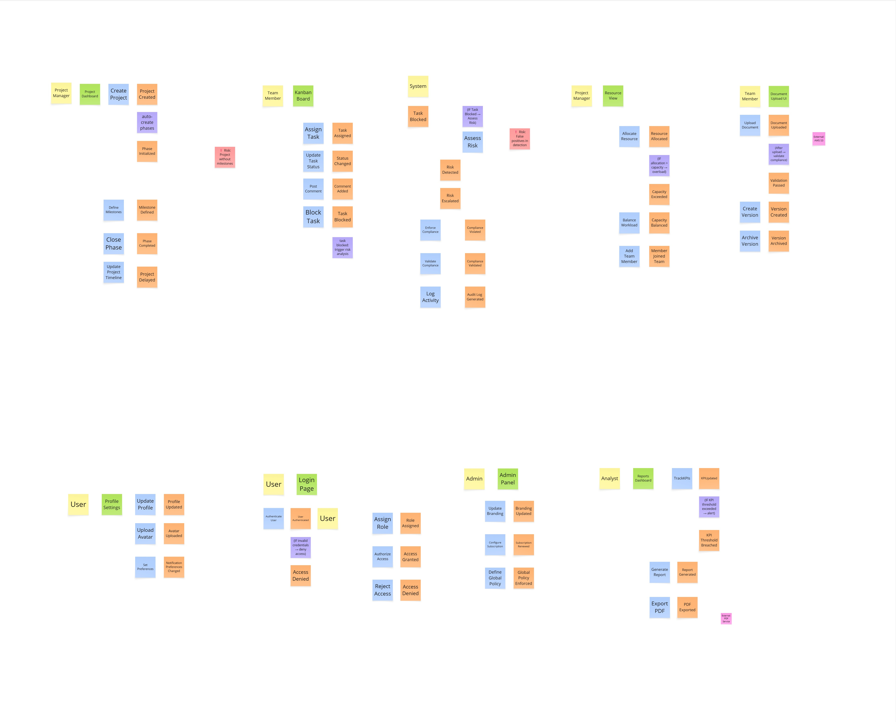

# Capitulo II: Requirements Development and Software Solution Design
La recolección y análisis de requisitos es una etapa fundamental en el desarrollo de Vantage PMO, ya que permite identificar y comprender las necesidades de los stakeholders involucrados en la gestión de proyectos. Para ello, se emplean técnicas como el análisis de la competencia y las entrevistas a usuarios pertenecientes a los segmentos objetivo.

A través de este análisis se busca identificar problemáticas relacionadas con la falta de visibilidad, la fragmentación de la información, las dificultades en el seguimiento de proyectos y la ausencia de estandarización en los procesos. Los resultados obtenidos permitirán definir las necesidades y requerimientos más relevantes de los usuarios, estableciendo una base para el diseño de una solución que facilite la gestión de proyectos y contribuya a una toma de decisiones más oportuna.
## 2.1. Competidores
En esta sección se analizan las principales soluciones existentes en el mercado relacionadas con la gestión de proyectos y portafolios. El objetivo es identificar sus principales características, ventajas y limitaciones para determinar oportunidades de diferenciación para Vantage PMO.

Los competidores seleccionados son Jira, monday.com y Planview Portfolios, debido a que ofrecen funcionalidades relacionadas con la planificación, seguimiento, visualización, gestión de recursos y toma de decisiones en proyectos.

Jira

Jira es una plataforma de gestión del trabajo ampliamente utilizada, especialmente en equipos de desarrollo de software. Permite planificar y asignar actividades, realizar seguimiento mediante tableros y cronogramas, automatizar flujos de trabajo y generar reportes y dashboards. También permite visualizar métricas y el estado de los proyectos para facilitar la toma de decisiones.

Su principal ventaja es su alto nivel de personalización y la gran cantidad de funcionalidades e integraciones disponibles. Sin embargo, su enfoque está fuertemente relacionado con la gestión del trabajo y el desarrollo de software, por lo que Vantage PMO puede diferenciarse mediante una experiencia más enfocada en la supervisión integral de portafolios y procesos de PMO.

monday.com

monday.com es una plataforma visual de gestión de proyectos y trabajo que permite organizar actividades, responsables, cronogramas y recursos. Cuenta con diagramas de Gantt, dashboards, gestión de carga de trabajo, hitos y automatizaciones. Sus dashboards permiten centralizar información de diferentes proyectos para facilitar el seguimiento y la toma de decisiones.

Su principal fortaleza es la facilidad de personalización y la experiencia visual. Sin embargo, al ser una plataforma generalista, Vantage PMO puede diferenciarse mediante funcionalidades diseñadas específicamente para las necesidades de una PMO, como estandarización de procesos, seguimiento de portafolios y generación de información ejecutiva.

Planview Portfolios

Planview Portfolios es una solución orientada directamente a la gestión de portafolios de proyectos. Permite conectar la estrategia empresarial con proyectos, gestionar recursos y capacidad, priorizar iniciativas, controlar aspectos financieros y generar dashboards y reportes para la toma de decisiones.

Su principal ventaja es su orientación hacia la gestión estratégica de portafolios y organizaciones de gran escala. Como oportunidad para Vantage PMO, se puede plantear una experiencia más sencilla y accesible para organizaciones que necesitan centralizar el seguimiento de proyectos sin enfrentarse a la complejidad de una plataforma empresarial de gran escala.

### 2.1.1 Análisis competitivo

| **¿Por qué llevar a cabo este análisis?** | Evaluar el posicionamiento de Vantage PMO frente a sus competidores para identificar oportunidades de diferenciación y definir estrategias competitivas. |
| ----------------------------------------- | -------------------------------------------------------------------------------------------------------------------------------------------------------- |

| **Categoría** | **Vantage PMO (Startup)** | **Jira** | **Monday.com** | **Planview Portfolios** |
| ------------------------------------------ | ---------------------------------------------------------------------------------------------------------------- | ---------------------------------------------------------------- | ---------------------------------------------------------------- | ---------------------------------------------------------------- |
| **Perfil** | | | | |
| **Overview** | Plataforma orientada a centralizar la gestión y supervisión de proyectos y portafolios, proporcionando dashboards, reportes y control de recursos. | Plataforma de gestión del trabajo y proyectos, especialmente utilizada en equipos de desarrollo de software. | Plataforma visual y personalizable para gestionar proyectos, tareas, recursos y flujos de trabajo. | Plataforma empresarial especializada en la gestión estratégica de portafolios y proyectos. |
| **Ventaja competitiva (valor al cliente)** | Centralización de información, visibilidad de proyectos y enfoque específico en las necesidades de una PMO. | Alta personalización, automatización e integración con herramientas de desarrollo. | Facilidad de uso, flexibilidad y visualización de información. | Gestión integral de portafolios, recursos, planificación, análisis y alineación estratégica. |
| **Perfil de Marketing** | | | | |
| **Mercado objetivo** | Empresas medianas y grandes que gestionan múltiples proyectos y requieren mayor visibilidad y estandarización. | Equipos de desarrollo de software y organizaciones que gestionan diferentes tipos de trabajo. | Equipos y empresas que buscan organizar proyectos y procesos de manera flexible. | Empresas y organizaciones de gran escala con necesidades de gestión de portafolios y recursos. |
| **Estrategias de marketing** | Enfoque en productividad, centralización de información y transformación digital de la gestión de proyectos. | Posicionamiento dentro del ecosistema tecnológico, integraciones y gestión del trabajo de desarrollo. | Comunicación centrada en facilidad de uso, personalización, colaboración y gestión visual. | Posicionamiento empresarial basado en gestión estratégica, optimización de recursos y toma de decisiones basada en datos. |
| **Perfil de Producto** | | | | |
| **Productos & Servicios** | Dashboards, seguimiento de proyectos, reportes, gestión de recursos y centralización de información. | Gestión de tareas, tableros, cronogramas, automatizaciones, reportes y dashboards. | Gestión de proyectos, tableros, Gantt, dashboards, automatizaciones y gestión de carga de trabajo. | Gestión de portafolios, planificación, recursos, proyectos, riesgos, reportes, dashboards y análisis. |
| **Precios & Costos** | Modelo SaaS por definir de acuerdo con el alcance de la solución. | Cuenta con opciones gratuitas y planes de pago según funcionalidades y necesidades. | Modelo de suscripción con diferentes planes según las necesidades de los equipos y organizaciones. | Orientado principalmente al mercado empresarial; precios bajo cotización. |
| **Canales de distribución** | Web / Móvil | Web / Móvil | Web / Móvil | Web / Plataformas empresariales |
| **Análisis SWOT** | | | | |
| **Fortalezas** | • Centralización de información.   • Enfoque específico en PMO.   • Interfaz orientada a facilitar la visualización de proyectos. | • Alta personalización.   • Amplio ecosistema de integraciones.   • Amplio reconocimiento en equipos tecnológicos. | • Interfaz visual.   • Flexible y personalizable.   • Facilidad para organizar diferentes tipos de trabajo. | • Especialización en gestión de portafolios.   • Gestión de recursos y capacidad.   • Dashboards y análisis avanzados. |
| **Debilidades** | • Producto nuevo.   • Menor reconocimiento de marca.   • Menor cantidad de integraciones en comparación con plataformas consolidadas. | • Puede resultar complejo para usuarios no familiarizados con herramientas de gestión de desarrollo.   • Requiere configuración para adaptarse a diferentes necesidades. | • Menor especialización en gestión estratégica de PMO frente a plataformas PPM especializadas. | • Mayor complejidad.   • Orientación principalmente empresarial.   • Puede resultar menos accesible para organizaciones pequeñas o con necesidades más simples. |
| **Oportunidades** | • Crecimiento de la digitalización empresarial.   • Empresas que aún dependen de herramientas dispersas.   • Mayor necesidad de visibilidad sobre múltiples proyectos. | • Expansión hacia diferentes áreas de gestión del trabajo.   • Nuevas integraciones y automatizaciones. | • Crecimiento del trabajo colaborativo y digital.   • Adopción en diferentes sectores empresariales. | • Creciente demanda de soluciones de Project Portfolio Management.   • Incorporación de inteligencia artificial y análisis avanzado. |
| **Amenazas** | • Competidores consolidados.   • Nuevas startups de gestión de proyectos.   • Evolución rápida de las tecnologías de gestión. | • Competencia de plataformas de gestión de proyectos y trabajo colaborativo.   • Cambios rápidos en las necesidades de los equipos. | • Competidores especializados en diferentes industrias.   • Saturación del mercado de gestión de proyectos. | • Competencia de soluciones PPM y SPM.   • Evolución de plataformas más simples y accesibles. |

### 2.1.2. Estrategias y tacticas frente a competidores
Para diferenciar Vantage PMO frente a las soluciones existentes, se plantean las siguientes estrategias y tácticas:

1. Especialización en gestión de PMO

Estrategia:
Diferenciar Vantage PMO mediante funcionalidades orientadas específicamente a la gestión y supervisión de portafolios de proyectos.

Táctica:
Desarrollar dashboards ejecutivos, seguimiento de hitos, indicadores y herramientas de control que permitan visualizar el estado de múltiples proyectos desde una misma plataforma.

2. Simplificación de la experiencia de usuario

Estrategia:
Ofrecer una experiencia sencilla que reduzca la complejidad de las herramientas empresariales de gestión de proyectos.

Táctica:
Diseñar una interfaz intuitiva, con navegación clara, información priorizada y dashboards visuales que permitan consultar rápidamente el estado de los proyectos.

3. Centralización de la información

Estrategia:
Reducir la dispersión de información entre diferentes herramientas y canales de comunicación.

Táctica:
Centralizar información relacionada con proyectos, responsables, recursos, avances, hitos y reportes dentro de una misma plataforma.

4. Soporte para la toma de decisiones

Estrategia:
Convertir la información de los proyectos en indicadores útiles para los responsables de la organización.

Táctica:
Implementar dashboards, indicadores clave de desempeño (KPIs), alertas y reportes que permitan detectar desviaciones y tomar decisiones oportunamente.

5. Automatización de procesos

Estrategia:
Reducir el tiempo dedicado a actividades administrativas y recopilación manual de información.

Táctica:
Automatizar la generación de reportes, actualización de información y alertas relacionadas con hitos, fechas límite y posibles desviaciones.

6. Compatibilidad con herramientas existentes

Estrategia:
Disminuir la resistencia al cambio y facilitar la incorporación de Vantage PMO en organizaciones que ya utilizan otras herramientas.

Táctica:
Considerar mecanismos de importación y exportación de información y futuras integraciones con herramientas utilizadas habitualmente por los equipos de proyectos.

---

## 2.2. Entrevistas

### 2.2.1. Diseno de entrevistas
Las entrevistas tienen como objetivo conocer las experiencias, necesidades, dificultades y expectativas de los usuarios relacionados con la gestión de múltiples proyectos. Las preguntas fueron diseñadas para obtener información sobre sus actividades actuales, herramientas utilizadas, problemas frecuentes, toma de decisiones y disposición para utilizar una solución centralizada como Vantage PMO.

#### Preguntas de presentación

- ¿Cuál es su nombre?
- ¿Cuántos años tiene?
- ¿En qué distrito reside?
- ¿Cuál es su ocupación o cargo actual?
- ¿Cuántos años de experiencia tiene en su área?

### Segmento 1: Líderes o jefes de gestión de proyectos

#### Preguntas principales

1. ¿Cuál es tu rol dentro de la organización y cuáles son tus principales responsabilidades en la gestión de proyectos?

2. ¿Cuántos proyectos sueles gestionar o supervisar de manera simultánea?

3. ¿Qué herramientas utilizas actualmente para organizar y hacer seguimiento de tus proyectos?

4. ¿Cómo realizas actualmente el seguimiento del avance de los proyectos y con qué frecuencia lo haces?

5. ¿Qué información consideras indispensable para conocer rápidamente el estado de un proyecto?

6. ¿Cuál es la principal dificultad que encuentras al gestionar varios proyectos al mismo tiempo?

7. ¿Has tenido problemas debido a que la información de los proyectos se encuentra dispersa, desactualizada o en diferentes herramientas? ¿Podrías contarnos algún ejemplo?

8. ¿Qué actividades relacionadas con el seguimiento o elaboración de reportes consideras que te quitan más tiempo?

9. Si tuvieras una plataforma centralizada para gestionar tus proyectos, ¿qué funcionalidades considerarías más útiles?

10. ¿Estarías dispuesto(a) a utilizar una plataforma de este tipo? ¿Qué características tendría que tener para que realmente te resulte útil?
#### Preguntas complementarias

- ¿Con qué frecuencia revisa el estado de sus proyectos?
- ¿Qué dispositivo utiliza con mayor frecuencia para consultar información de sus proyectos?
- ¿Qué información le gustaría poder consultar rápidamente desde un dispositivo móvil?
- ¿Qué cambiaría de las herramientas que utiliza actualmente?
- ¿Ha tenido que utilizar hojas de cálculo, correo electrónico o aplicaciones de mensajería para complementar sus herramientas de gestión? ¿Por qué?

### Segmento 2: Empresas medianas y grandes con múltiples proyectos

#### Preguntas principales

1. ¿A qué se dedica la organización y cuál es tu función dentro de ella?

2. ¿Cuántos proyectos o iniciativas suelen manejar simultáneamente?

3. ¿Cómo organizan actualmente la información sobre proyectos, tareas, responsables y fechas?

4. ¿Qué herramientas utilizan actualmente para gestionar o hacer seguimiento de sus proyectos?

5. ¿Cómo se comparte la información sobre el avance de los proyectos entre las diferentes personas o áreas?

6. ¿Cuál es la principal dificultad que tienen actualmente para coordinar varios proyectos?

7. ¿Han tenido problemas con retrasos, falta de coordinación o pérdida de información? ¿Podrías contarnos algún ejemplo?

8. ¿Qué información necesitarías consultar rápidamente para conocer el estado de todos los proyectos?

9. ¿Qué funcionalidades considerarías importantes en una plataforma centralizada para gestionar los proyectos de la organización?

10. ¿Qué condiciones tendría que cumplir una nueva plataforma para que la organización estuviera dispuesta a adoptarla?
#### Preguntas complementarias

- ¿Qué herramienta utilizan con mayor frecuencia durante su jornada laboral?
- ¿Utilizan principalmente computadora, tablet o teléfono móvil para realizar estas actividades?
- ¿Qué información les gustaría consultar desde un dispositivo móvil?
- ¿Qué problema de la gestión actual les gustaría solucionar primero?
- ¿Qué factores podrían dificultar la adopción de una nueva herramienta dentro de la empresa?
### 2.2.2. Registro de entrevistas

En esta sección presentamos los registros de las entrevistas realizadas a personas pertenecientes a los segmentos objetivo de Vantage PMO. El objetivo de las entrevistas fue conocer sus experiencias, dificultades y necesidades relacionadas con la gestión y seguimiento de múltiples proyectos, así como identificar oportunidades de mejora mediante una plataforma centralizada.

### Segmento 1: Líderes y Jefes de Gestión de Proyectos

<table>
<thead>
  <tr>
    <th colspan="2">Entrevista #1</th>
  </tr>
</thead>
<tbody>
  <tr>
    <td>Nombre</td>
    <td>Gerson</td>
  </tr>
  <tr>
    <td>Apellidos</td>
    <td>Escarate</td>
  </tr>
  <tr>
    <td>Edad</td>
    <td>30 años</td>
  </tr>
  <tr>
    <td>Distrito</td>
    <td>Surco</td>
  </tr>
  <tr>
    <td>Ocupación</td>
    <td>Project Manager</td>
  </tr>
  <tr>
    <td>Evidencia</td>
    <td>Por agregar</td>
  </tr>
  <tr>
    <td>Link</td>
    <td>Por agregar</td>
  </tr>
  <tr>
    <td>Duración</td>
    <td>Por agregar</td>
  </tr>
  <tr>
    <td>Resumen</td>
    <td>
      Gerson se desempeña como Project Manager en el sector tecnológico y cuenta con aproximadamente cinco años de experiencia en gestión de proyectos. Actualmente supervisa alrededor de seis proyectos de manera simultánea y utiliza herramientas como Jira, Microsoft Project y Excel para organizar y realizar el seguimiento de las actividades. Realiza un seguimiento frecuente del avance de los proyectos y considera importante contar con información actualizada sobre el progreso, responsables, fechas y recursos disponibles. Entre las principales dificultades que identifica se encuentra la consolidación de información proveniente de diferentes herramientas, especialmente al momento de preparar reportes. Considera que una plataforma centralizada con dashboards, alertas y seguimiento de indicadores podría reducir el trabajo administrativo y facilitar la toma de decisiones. También considera importante que la herramienta sea sencilla de utilizar y que pueda accederse desde dispositivos móviles.
    </td>
  </tr>
</tbody>
</table>

<table>
<thead>
  <tr>
    <th colspan="2">Entrevista #2</th>
  </tr>
</thead>
<tbody>
  <tr>
    <td>Nombre</td>
    <td>Lucy</td>
  </tr>
  <tr>
    <td>Apellidos</td>
    <td>Linares</td>
  </tr>
  <tr>
    <td>Edad</td>
    <td>28 años</td>
  </tr>
  <tr>
    <td>Distrito</td>
    <td>Miraflores</td>
  </tr>
  <tr>
    <td>Ocupación</td>
    <td>Coordinadora de proyectos</td>
  </tr>
  <tr>
    <td>Evidencia</td>
    <td>Por agregar</td>
  </tr>
  <tr>
    <td>Link</td>
    <td>Por agregar</td>
  </tr>
  <tr>
    <td>Duración</td>
    <td>Por agregar</td>
  </tr>
  <tr>
    <td>Resumen</td>
    <td>
      Lucy trabaja como coordinadora de proyectos y participa en la supervisión de entre cuatro y siete proyectos simultáneamente. Para organizar la información utiliza principalmente Excel, documentos compartidos y Microsoft Teams. Realiza reuniones periódicas para conocer el avance de las actividades, aunque señala que uno de los problemas es mantener actualizada la información cuando participan diferentes responsables. También identifica la elaboración y actualización de reportes como una actividad que consume tiempo. Considera que una herramienta centralizada con dashboards y alertas permitiría visualizar rápidamente el estado de los proyectos y detectar posibles retrasos. Para adoptar una nueva solución considera importante que sea intuitiva y que no requiera un proceso de aprendizaje complejo.
    </td>
  </tr>
</tbody>
</table>

<table>
<thead>
  <tr>
    <th colspan="2">Entrevista #3</th>
  </tr>
</thead>
<tbody>
  <tr>
    <td>Nombre</td>
    <td>Christopher</td>
  </tr>
  <tr>
    <td>Apellidos</td>
    <td>Osorio</td>
  </tr>
  <tr>
    <td>Edad</td>
    <td>38 años</td>
  </tr>
  <tr>
    <td>Distrito</td>
    <td>San Borja</td>
  </tr>
  <tr>
    <td>Ocupación</td>
    <td>Jefe de proyectos</td>
  </tr>
  <tr>
    <td>Evidencia</td>
    <td>Por agregar</td>
  </tr>
  <tr>
    <td>Link</td>
    <td>Por agregar</td>
  </tr>
  <tr>
    <td>Duración</td>
    <td>Por agregar</td>
  </tr>
  <tr>
    <td>Resumen</td>
    <td>
      Christopher se desempeña como jefe de proyectos y tiene bajo su responsabilidad aproximadamente ocho proyectos de manera simultánea. Para realizar el seguimiento utiliza Microsoft Project, Excel y sistemas internos de la organización. Considera necesario disponer de una visión general que le permita identificar rápidamente el avance de cada proyecto, sus fechas importantes y posibles desviaciones. Una de las actividades que considera más demandantes es la preparación y consolidación de información para reportes. Entre las funcionalidades que considera útiles en una plataforma centralizada menciona dashboards, filtros, indicadores y alertas. También considera que la facilidad de uso es un factor importante para que los integrantes del equipo puedan adoptar una nueva herramienta.
    </td>
  </tr>
</tbody>
</table>

### Segmento 2: Empresas medianas y grandes con múltiples proyectos

<table>
<thead>
  <tr>
    <th colspan="2">Entrevista #1</th>
  </tr>
</thead>
<tbody>
  <tr>
    <td>Nombre</td>
    <td>Katherine</td>
  </tr>
  <tr>
    <td>Apellidos</td>
    <td>Herrera Cotrina</td>
  </tr>
  <tr>
    <td>Edad</td>
    <td>37 años</td>
  </tr>
  <tr>
    <td>Distrito</td>
    <td>Ancón</td>
  </tr>
  <tr>
    <td>Ocupación</td>
    <td>Coordinadora de operaciones</td>
  </tr>
  <tr>
    <td>Evidencia</td>
    <td>Por agregar</td>
  </tr>
  <tr>
    <td>Link</td>
    <td>Por agregar</td>
  </tr>
  <tr>
    <td>Duración</td>
    <td>Por agregar</td>
  </tr>
  <tr>
    <td>Resumen</td>
    <td>
      Katherine se desempeña como coordinadora de operaciones en una organización donde participa en la gestión de diferentes proyectos e iniciativas. Para organizar las actividades utiliza principalmente Excel, Google Drive y WhatsApp, y ocasionalmente otras herramientas de gestión. Identifica como una de sus principales dificultades la dispersión de información entre diferentes herramientas y canales de comunicación. El seguimiento de fechas, tareas y responsables puede complicarse cuando existen varios proyectos simultáneos. Considera que una plataforma centralizada con alertas y recordatorios facilitaría el control de las actividades y reduciría los problemas de coordinación. Para adoptar una nueva solución considera fundamental que sea fácil de utilizar y que requiera poca capacitación.
    </td>
  </tr>
</tbody>
</table>

<table>
<thead>
  <tr>
    <th colspan="2">Entrevista #2</th>
  </tr>
</thead>
<tbody>
  <tr>
    <td>Nombre</td>
    <td>James</td>
  </tr>
  <tr>
    <td>Apellidos</td>
    <td>Jara</td>
  </tr>
  <tr>
    <td>Edad</td>
    <td>34 años</td>
  </tr>
  <tr>
    <td>Distrito</td>
    <td>San Miguel</td>
  </tr>
  <tr>
    <td>Ocupación</td>
    <td>Administrador de empresa</td>
  </tr>
  <tr>
    <td>Evidencia</td>
    <td>Por agregar</td>
  </tr>
  <tr>
    <td>Link</td>
    <td>Por agregar</td>
  </tr>
  <tr>
    <td>Duración</td>
    <td>Por agregar</td>
  </tr>
  <tr>
    <td>Resumen</td>
    <td>
      James trabaja en la administración de una empresa que desarrolla diferentes iniciativas de manera simultánea. Actualmente utiliza Excel, correo electrónico y documentos compartidos para organizar la información. Señala que uno de los principales inconvenientes es la existencia de diferentes versiones de los documentos y la posibilidad de trabajar con información desactualizada. Para realizar el seguimiento considera importante conocer las fechas, responsables y estado de las tareas. Considera que una plataforma centralizada permitiría mejorar la organización y reducir la duplicidad de información. Entre las funcionalidades que considera más útiles se encuentran los recordatorios y una vista general de los proyectos. Para adoptar una nueva herramienta considera importante que sea sencilla y práctica para los usuarios.
    </td>
  </tr>
</tbody>
</table>

<table>
<thead>
  <tr>
    <th colspan="2">Entrevista #3</th>
  </tr>
</thead>
<tbody>
  <tr>
    <td>Nombre</td>
    <td>Alessandro</td>
  </tr>
  <tr>
    <td>Apellidos</td>
    <td>Nieto</td>
  </tr>
  <tr>
    <td>Edad</td>
    <td>29 años</td>
  </tr>
  <tr>
    <td>Distrito</td>
    <td>Los Olivos</td>
  </tr>
  <tr>
    <td>Ocupación</td>
    <td>Coordinador de proyectos</td>
  </tr>
  <tr>
    <td>Evidencia</td>
    <td>Por agregar</td>
  </tr>
  <tr>
    <td>Link</td>
    <td>Por agregar</td>
  </tr>
  <tr>
    <td>Duración</td>
    <td>Por agregar</td>
  </tr>
  <tr>
    <td>Resumen</td>
    <td>
      Alessandro participa en la coordinación de diferentes proyectos y actividades de manera simultánea. Para organizar su trabajo utiliza principalmente WhatsApp, Excel y Trello. Considera que uno de los principales problemas es la dificultad para obtener una visión general de todos los proyectos, especialmente cuando la información se encuentra distribuida en diferentes herramientas. Para realizar un seguimiento adecuado considera necesario conocer las fechas, responsables y tareas pendientes. También considera útiles las notificaciones y recordatorios para evitar que se pasen fechas importantes. Estaría dispuesto a utilizar una plataforma centralizada si esta permite ahorrar tiempo, mejorar la organización y resulta sencilla de utilizar.
    </td>
  </tr>
</tbody>
</table>

## 2.2.3 Análisis de Entrevistas

### Segmento 1: Líderes y Jefes de Gestión de Proyectos

Se analizaron 3 entrevistas a personas que desempeñan funciones relacionadas con la gestión y coordinación de proyectos. La información recopilada permitió identificar características objetivas y subjetivas comunes relacionadas con la cantidad de proyectos gestionados, las herramientas utilizadas, las dificultades de seguimiento y las necesidades de información para la toma de decisiones. Estos resultados servirán como base para la construcción de los User Personas y la identificación de oportunidades para Vantage PMO.

| Característica | Mención | % | Evidencia |
| :--- | :---: | :---: | :--- |
| **Gestión simultánea de múltiples proyectos** | 3/3 | 100% | Gerson, Lucy y Christopher mencionan que gestionan o supervisan varios proyectos de manera simultánea. |
| **Uso de herramientas digitales para la gestión** | 3/3 | 100% | Los tres entrevistados utilizan herramientas como Jira, Microsoft Project, Excel, documentos compartidos o sistemas internos. |
| **Seguimiento frecuente del avance de los proyectos** | 3/3 | 100% | Los entrevistados realizan un seguimiento frecuente para conocer el avance de las tareas y el estado de sus proyectos. |
| **Importancia de contar con información actualizada** | 3/3 | 100% | Los tres consideran importante conocer información sobre avances, responsables, fechas y recursos para controlar los proyectos. |
| **Dificultades para consolidar información** | 3/3 | 100% | Los entrevistados mencionan dificultades relacionadas con la información distribuida entre diferentes herramientas o responsables. |
| **Elaboración de reportes como actividad que consume tiempo** | 2/3 | 66,6% | Gerson y Lucy identifican la elaboración o actualización de reportes como una actividad que demanda tiempo. |
| **Necesidad de visualizar retrasos o desviaciones** | 3/3 | 100% | Los entrevistados consideran importante identificar oportunamente retrasos, avances y posibles desviaciones. |
| **Interés en dashboards o información centralizada** | 3/3 | 100% | Gerson, Lucy y Christopher consideran útil contar con una vista centralizada del estado de los proyectos. |
| **Importancia de alertas y recordatorios** | 2/3 | 66,6% | Gerson y Christopher mencionan las alertas o recordatorios como funcionalidades útiles para realizar seguimiento. |
| **Importancia de la facilidad de uso** | 3/3 | 100% | Los tres entrevistados consideran importante que una nueva plataforma sea intuitiva y sencilla de utilizar. |

### Insights Destacados

* **La gestión simultánea de proyectos requiere un seguimiento constante:** El 100% de los entrevistados gestiona o supervisa múltiples proyectos, por lo que necesitan consultar frecuentemente el avance, las fechas y las responsabilidades asociadas a cada proyecto.

* **La información dispersa dificulta el control de los proyectos:** El 100% de los entrevistados utiliza diferentes herramientas para organizar la información. Esta distribución puede dificultar la consolidación y consulta de los datos necesarios para conocer el estado general de los proyectos.

* **La visibilidad del estado de los proyectos es una necesidad común:** El 100% considera importante disponer de información actualizada sobre avances, responsables y fechas. Esto evidencia una oportunidad para Vantage PMO mediante dashboards que permitan consultar la información de manera centralizada.

* **Los reportes representan una oportunidad de optimización:** El 66,6% de los entrevistados identifica la elaboración o actualización de reportes como una actividad que consume tiempo. Esto respalda la incorporación de funcionalidades que faciliten la generación y consulta de reportes.

* **La facilidad de uso es fundamental para la adopción:** El 100% de los entrevistados considera importante que una nueva herramienta sea sencilla e intuitiva. Por ello, Vantage PMO debe priorizar una experiencia de usuario clara y evitar una curva de aprendizaje innecesariamente elevada.

---

### Segmento 2: Empresas Medianas y Grandes con Múltiples Proyectos

Se analizaron 3 entrevistas a personas que participan en organizaciones o actividades donde se gestionan múltiples proyectos de manera simultánea. La información recopilada permitió identificar problemas relacionados con la organización de tareas, la dispersión de información, la coordinación entre responsables y la necesidad de contar con una herramienta que facilite el control de los proyectos.

| Característica | Mención | % | Evidencia |
| :--- | :---: | :---: | :--- |
| **Gestión simultánea de múltiples proyectos o iniciativas** | 3/3 | 100% | Katherine, James y Alessandro mencionan que participan en la gestión de múltiples proyectos o actividades de manera simultánea. |
| **Uso de herramientas no centralizadas** | 3/3 | 100% | Los tres utilizan diferentes herramientas como Excel, Google Drive, WhatsApp, correo electrónico o Trello. |
| **Información dispersa entre diferentes herramientas** | 3/3 | 100% | Los entrevistados identifican dificultades relacionadas con tener información distribuida entre diferentes herramientas y canales de comunicación. |
| **Dificultades para realizar seguimiento de tareas y fechas** | 3/3 | 100% | Katherine, James y Alessandro consideran necesario realizar un seguimiento de tareas, responsables y fechas para mantener el control. |
| **Dependencia de herramientas de comunicación informal** | 2/3 | 66,6% | Katherine y Alessandro utilizan principalmente WhatsApp como parte de la coordinación de sus actividades. |
| **Necesidad de centralizar la información** | 3/3 | 100% | Los tres entrevistados consideran útil contar con una plataforma que reúna la información de los proyectos en un solo lugar. |
| **Importancia de alertas y recordatorios** | 2/3 | 66,6% | Katherine y Alessandro consideran útiles las alertas o recordatorios para evitar olvidos y controlar fechas importantes. |
| **Importancia de la facilidad de uso** | 3/3 | 100% | Los tres entrevistados consideran que una nueva herramienta debe ser sencilla y práctica para facilitar su adopción. |
| **Interés en acceder a la información desde dispositivos móviles** | 1/3 | 33,3% | Alessandro menciona el acceso móvil como una característica útil para consultar y gestionar información. |
| **Problemas relacionados con información duplicada o desactualizada** | 2/3 | 66,6% | Katherine y James mencionan dificultades relacionadas con la duplicidad o actualización de información cuando se utilizan diferentes herramientas. |

### Insights Destacados

* **La gestión de múltiples proyectos se apoya principalmente en herramientas independientes:** El 100% de los entrevistados utiliza diferentes herramientas para organizar y coordinar sus actividades. Esto evidencia la necesidad de contar con una solución que permita centralizar la información relacionada con proyectos, tareas, responsables y fechas.

* **La falta de centralización dificulta el seguimiento:** El 100% de los entrevistados identifica problemas relacionados con la distribución de información. Cuando los datos se encuentran en diferentes herramientas, aumenta la dificultad para obtener una visión general y actualizada de los proyectos.

* **La coordinación depende en gran medida de la comunicación:** El 66,6% utiliza WhatsApp como una herramienta importante para coordinar actividades. Esto demuestra que la comunicación es necesaria, pero también plantea una oportunidad para complementar los mensajes informales con información estructurada y trazable dentro de Vantage PMO.

* **Las alertas y recordatorios pueden reducir problemas de seguimiento:** El 66,6% considera útiles las alertas o recordatorios. Esta funcionalidad podría ayudar a los usuarios a controlar fechas importantes, tareas pendientes y posibles retrasos.

* **La facilidad de uso es una condición para la adopción:** El 100% de los entrevistados considera importante que la herramienta sea sencilla y práctica. Por ello, Vantage PMO debe buscar una experiencia intuitiva que permita incorporar la plataforma al flujo de trabajo sin requerir una capacitación extensa.

* **Existe una oportunidad para el acceso móvil:** Aunque solo el 33,3% menciona explícitamente el acceso desde dispositivos móviles, esta característica puede resultar útil para usuarios que necesitan consultar información mientras se encuentran fuera de su espacio habitual de trabajo.
## 2.3 Needfinding

En esta sección se presentan los artefactos obtenidos a partir del análisis de las entrevistas realizadas a los segmentos objetivo de Vantage PMO. Estos artefactos permiten representar las necesidades, comportamientos, tareas, motivaciones y dificultades de los usuarios.

Para la construcción de los User Personas se consideraron los principales patrones identificados durante las entrevistas, complementándolos con el análisis competitivo realizado previamente. A partir de estos perfiles se elaboraron el User Task Matrix, los User Journey Maps y los Empathy Maps, buscando representar la situación actual de los usuarios antes de utilizar Vantage PMO.

### 2.3.1 User Personas

Se elaboraron dos User Personas, uno por cada segmento objetivo identificado para Vantage PMO. Los perfiles representan los principales patrones encontrados durante el análisis de entrevistas y permiten comprender sus objetivos, necesidades, comportamientos y frustraciones.

**Segmento 1**

El User Persona del segmento 1 representa a un líder o jefe de gestión de proyectos que debe supervisar múltiples proyectos de manera simultánea. Su principal necesidad es mantener una visión actualizada del estado de los proyectos y contar con información confiable para tomar decisiones oportunas.

El análisis de las entrevistas muestra que este perfil utiliza diferentes herramientas para realizar el seguimiento de sus proyectos y que una de sus principales dificultades está relacionada con la consolidación de información. Asimismo, requiere conocer el avance de las tareas, responsables, fechas y posibles desviaciones.

Su principal motivación es mejorar el control de los proyectos y reducir el tiempo dedicado a actividades administrativas, especialmente aquellas relacionadas con la recopilación y elaboración de reportes. Valora las herramientas que presentan información de manera clara, permiten identificar problemas oportunamente y son sencillas de utilizar.

**Segmento 2**

El User Persona del segmento 2 representa a una persona que participa en una organización con múltiples proyectos o iniciativas y que necesita coordinar tareas, responsables y fechas entre diferentes personas.

Este perfil utiliza principalmente herramientas independientes como hojas de cálculo, servicios de almacenamiento y aplicaciones de comunicación. La información distribuida entre diferentes canales dificulta obtener una visión general del estado de los proyectos y mantener todos los datos actualizados.

Su principal motivación es mejorar la organización y coordinación del trabajo, evitando olvidos, retrasos y duplicidad de información. Valora especialmente una solución centralizada que sea sencilla de utilizar, requiera poca capacitación y facilite el seguimiento de las actividades.

---

### 2.3.2 User Task Matrix

El User Task Matrix permite identificar las principales tareas que realizan los User Personas para alcanzar sus objetivos, independientemente de la existencia de Vantage PMO. Para cada tarea se considera su frecuencia y nivel de importancia dentro de sus actividades.

Para el análisis se consideran los dos User Personas definidos previamente: **Gerson Escarate**, representante del segmento de líderes o jefes de gestión de proyectos, y **Alessandro Nieto**, representante del segmento de empresas medianas y grandes con múltiples proyectos.

| Task | Gerson Escarate |  | Alessandro Nieto |  |
| :--- | :---: | :---: | :---: | :---: |
|  | **Frecuencia** | **Importancia** | **Frecuencia** | **Importancia** |
| Revisar el estado de los proyectos | Diaria | Crítica | Diaria | Alta |
| Actualizar información de proyectos | Diaria | Alta | Diaria | Alta |
| Verificar tareas pendientes | Diaria | Alta | Diaria | Alta |
| Revisar fechas y plazos | Diaria | Crítica | Diaria | Crítica |
| Coordinar actividades con responsables | Diaria | Crítica | Diaria | Crítica |
| Identificar retrasos o desviaciones | Semanal | Crítica | Semanal | Alta |
| Consolidar información de diferentes fuentes | Semanal | Alta | Semanal | Alta |
| Elaborar o actualizar reportes | Semanal | Alta | Mensual | Alta |
| Revisar disponibilidad de recursos | Semanal | Alta | Semanal | Media |
| Comunicar avances a otros responsables | Diaria | Alta | Diaria | Alta |

El análisis de la matriz evidencia que ambos User Personas comparten tareas relacionadas con el seguimiento de proyectos, revisión de fechas, coordinación con responsables y actualización de información. Estas actividades presentan una frecuencia elevada debido a la necesidad de mantener el control sobre múltiples proyectos.

En el caso de **Gerson Escarate**, las tareas relacionadas con la revisión del estado de los proyectos, la identificación de retrasos o desviaciones y la consolidación de información presentan una importancia especialmente alta, debido a su responsabilidad en el seguimiento y la toma de decisiones.

Por otro lado, **Alessandro Nieto** presenta una mayor necesidad de organización y coordinación de tareas, responsables y fechas. En ambos casos se identifica la necesidad de centralizar la información y facilitar el seguimiento de las actividades.

---

### 2.3.3 User Journey Mapping

En esta sección se presentan los User Journey Maps en su estado actual (As-Is). Estos representan el recorrido que realizan los User Personas para gestionar y realizar el seguimiento de sus proyectos sin utilizar Vantage PMO.

Los mapas permiten visualizar las principales etapas del proceso, las acciones realizadas, los puntos de contacto utilizados y las dificultades que experimentan los usuarios. De esta manera, se identifican oportunidades de mejora relacionadas principalmente con la dispersión de información, el seguimiento de tareas y la coordinación entre responsables.

**Segmento 1**

El recorrido de **Gerson Escarate** inicia con la recopilación de información proveniente de diferentes responsables y herramientas. Posteriormente, revisa el avance de las tareas, verifica fechas y analiza posibles retrasos o desviaciones. Finalmente, consolida la información para comunicar el estado de los proyectos y elaborar reportes.

Durante este proceso puede experimentar dificultades debido a la información distribuida entre diferentes herramientas, la necesidad de actualizar datos manualmente y el tiempo requerido para consolidar reportes.

**Segmento 2**

El recorrido de **Alessandro Nieto** comienza con la organización de las actividades y la coordinación de tareas con los responsables. Posteriormente, realiza seguimiento mediante diferentes canales de comunicación, verifica fechas y consulta el avance de las actividades.

Finalmente, recopila la información necesaria para conocer el estado general de los proyectos. Durante este proceso pueden presentarse problemas relacionados con información dispersa, duplicidad de datos, falta de actualización y dificultad para realizar un seguimiento centralizado.

---

### 2.3.4 Empathy Mapping

Se elaboraron los Empathy Maps correspondientes a cada User Persona con el objetivo de profundizar en sus necesidades, comportamientos, pensamientos, emociones, frustraciones y motivaciones.

El análisis considera qué observa, escucha, dice y hace cada usuario, así como los principales Pains y Gains identificados a partir de las entrevistas. Esto permite comprender la experiencia actual de los usuarios y orientar las características de Vantage PMO hacia sus necesidades reales.

**Segmento 1**

 

El líder o jefe de gestión de proyectos busca mantener el control de múltiples proyectos y disponer de información actualizada para tomar decisiones. Está expuesto constantemente a reportes, reuniones, mensajes y diferentes fuentes de información.

Entre sus principales Pains se encuentran la información dispersa, el tiempo dedicado a consolidar datos, la dificultad para identificar desviaciones y la necesidad de realizar seguimiento constante.

Sus principales Gains están relacionados con disponer de una visión general de los proyectos, reducir actividades administrativas, identificar problemas oportunamente y contar con información clara para tomar decisiones.

**Segmento 2**

El segundo User Persona busca mantener organizadas las actividades de diferentes proyectos y coordinar correctamente a los responsables. Utiliza diferentes herramientas y canales para comunicarse y compartir información.

Entre sus principales Pains se encuentran la dispersión de información, la posibilidad de utilizar datos desactualizados, la duplicidad de información, los olvidos y las dificultades para realizar seguimiento.

Sus principales Gains están relacionados con centralizar la información, organizar las tareas y responsables, recibir recordatorios de actividades importantes y disponer de una herramienta sencilla que facilite la coordinación.

---

### 2.3.5 Big Picture EventStorming

En esta sección se presenta el Big Picture EventStorming desarrollado para Vantage PMO. Este artefacto permite obtener una visión general del dominio de gestión de proyectos mediante la identificación de los principales eventos, actores, acciones, reglas y fuentes de información involucradas en los procesos del negocio.

El proceso fue desarrollado de manera colaborativa, partiendo de una exploración inicial de los eventos más relevantes del dominio. Posteriormente, estos eventos fueron organizados cronológicamente y enriquecidos mediante la identificación de pain points, pivotal points, commands, policies y read models. El resultado permite comprender las relaciones existentes entre los diferentes procesos y detectar problemas y oportunidades dentro del dominio.

#### Unstructured Exploration

La primera etapa consistió en una exploración no estructurada de los principales Domain Events del negocio. El equipo identificó hechos relevantes relacionados con la creación y planificación de proyectos, asignación y seguimiento de tareas, gestión de riesgos, asignación de recursos, administración de documentos, control de indicadores y generación de reportes.

En esta etapa, los eventos fueron registrados inicialmente sin establecer una secuencia definitiva, con el objetivo de obtener una visión amplia de los acontecimientos relevantes que pueden producirse dentro del dominio.

#### Chronology

Luego de identificar los principales Domain Events, estos fueron organizados de acuerdo con la secuencia en la que pueden ocurrir dentro de los diferentes procesos del negocio.

Esta organización permitió visualizar relaciones entre eventos como la creación de un proyecto, la inicialización de sus fases, la definición de hitos, la asignación de tareas y recursos, la actualización del estado de las actividades, la detección de riesgos y retrasos, y la generación de reportes.

#### Pain Points

En la siguiente etapa se identificaron los principales problemas que pueden presentarse durante la ejecución de los procesos del dominio. Los pain points fueron incorporados al EventStorming para señalar situaciones que pueden afectar negativamente la gestión de proyectos.

Entre los principales problemas identificados se encuentran la existencia de proyectos sin hitos correctamente definidos, bloqueos en las tareas, sobrecarga en la capacidad de los recursos, detecciones incorrectas de riesgos y dificultades para identificar oportunamente desviaciones dentro de los proyectos.

#### Pivotal Points

A partir de los eventos y pain points identificados, se analizaron aquellos acontecimientos que representan cambios importantes dentro del flujo de negocio.

Los Pivotal Points permiten reconocer situaciones en las que el estado o comportamiento del proceso puede cambiar significativamente, como la creación de un proyecto, la asignación de recursos, la detección o escalamiento de riesgos, el bloqueo de tareas, la superación de límites de capacidad y el incumplimiento de indicadores.

#### Commands

Posteriormente, se identificaron los Commands que representan las acciones realizadas por los actores o sistemas y que producen cambios dentro del dominio.

Entre ellos se encuentran acciones como crear un proyecto, definir hitos, asignar tareas, actualizar el estado de una actividad, bloquear una tarea, evaluar un riesgo, asignar recursos, incorporar miembros al equipo, cargar documentos, generar reportes y exportar información.

Cada Command se relaciona con uno o más Domain Events que representan el resultado de la acción ejecutada.

#### Policies

En esta etapa se incorporaron Policies que representan reglas reactivas del dominio. Estas reglas permiten expresar comportamientos que deben ejecutarse cuando ocurre un determinado evento o se cumple una condición específica.

Las Policies permiten representar, por ejemplo, respuestas ante tareas bloqueadas, riesgos detectados, sobrecarga de recursos, incumplimiento de indicadores, validaciones de documentos o reglas relacionadas con el acceso y administración del sistema.

#### Read Models

Finalmente, se identificaron los Read Models necesarios para que los diferentes actores puedan consultar información y tomar decisiones dentro de los procesos del negocio.

Estos modelos representan vistas o superficies de consulta como dashboards de proyectos, tableros de tareas, vistas de recursos, paneles administrativos, gestión de documentos y dashboards de indicadores y reportes.

La incorporación de los Read Models permite relacionar las acciones y eventos del dominio con la información que posteriormente debe estar disponible para los usuarios.

#### Big Picture EventStorming Final

Como resultado del proceso, se obtuvo una representación integrada del dominio que reúne actores, Commands, Domain Events, Policies, Read Models y Pain Points.

El Big Picture final permite observar de manera global cómo se relacionan los principales procesos de gestión de proyectos, tareas y colaboración, riesgos, recursos, documentos, usuarios, administración e indicadores. Asimismo, permite identificar dependencias entre distintas capacidades del negocio y puntos en los que la información debe intercambiarse entre procesos.

A partir del Big Picture EventStorming se identifican como principales oportunidades la centralización de información, una mayor trazabilidad de las actividades, la detección oportuna de riesgos y desviaciones, una mejor gestión de la capacidad de los recursos y la disponibilidad de información actualizada para la generación de reportes y la toma de decisiones.

El resultado obtenido también constituye un insumo para las etapas posteriores de Strategic-Level Domain-Driven Design, donde las capacidades identificadas en el dominio serán analizadas para descubrir los Candidate Bounded Contexts y establecer sus responsabilidades y relaciones.

---

### 2.3.6 Ubiquitous Language

El Ubiquitous Language establece un vocabulario común para los principales conceptos del dominio de gestión de proyectos en Vantage PMO. Su objetivo es evitar ambigüedades y asegurar que los miembros del equipo y los stakeholders utilicen los mismos términos y significados durante el análisis, diseño y desarrollo de la solución.

- **Project (Proyecto):** Iniciativa temporal organizada para alcanzar un objetivo específico mediante un conjunto de actividades, responsables y recursos.

- **Project Manager (Gerente de Proyecto):** Profesional responsable de planificar, coordinar, supervisar y controlar la ejecución de un proyecto.

- **PMO - Project Management Office (Oficina de Gestión de Proyectos):** Área de la organización encargada de establecer, supervisar y mejorar las prácticas relacionadas con la gestión de proyectos.

- **Stakeholder (Parte Interesada):** Persona, grupo u organización que puede afectar, ser afectada o tener interés en los resultados de un proyecto.

- **Portfolio (Portafolio):** Conjunto de proyectos e iniciativas gestionados de manera conjunta para contribuir al cumplimiento de objetivos estratégicos de la organización.

- **Project Phase (Fase del Proyecto):** Etapa definida dentro del ciclo de vida de un proyecto que agrupa actividades relacionadas y culmina con un resultado determinado.

- **Task (Tarea):** Actividad específica asignada a un responsable y necesaria para contribuir al cumplimiento de los objetivos del proyecto.

- **Milestone (Hito):** Punto significativo dentro del proyecto que representa el cumplimiento de una etapa, resultado o acontecimiento relevante.

- **Resource (Recurso):** Persona, presupuesto, material, capacidad u otro elemento necesario para ejecutar las actividades de un proyecto.

- **Project Progress (Avance del Proyecto):** Grado de cumplimiento de las actividades e hitos del proyecto en comparación con lo planificado.

- **Project Status (Estado del Proyecto):** Situación general del proyecto en un momento determinado, considerando su avance, fechas, tareas, recursos, riesgos y posibles desviaciones.

- **Project Delay (Retraso del Proyecto):** Situación en la que una actividad, hito o proyecto presenta una demora respecto a las fechas establecidas en la planificación.

- **Risk (Riesgo):** Evento o condición incierta que puede afectar positiva o negativamente el cumplimiento de los objetivos del proyecto.

- **Capacity (Capacidad):** Disponibilidad de un recurso o equipo para asumir y ejecutar actividades dentro de un periodo determinado.

- **KPI - Key Performance Indicator (Indicador Clave de Desempeño):** Métrica utilizada para evaluar el desempeño de un proyecto o proceso respecto a un objetivo establecido.

- **Performance Report (Reporte de Desempeño):** Documento que consolida información relevante sobre el avance, estado, indicadores, riesgos y desempeño de un proyecto para apoyar la toma de decisiones.

- **Information Silo (Silo de Información):** Información almacenada de manera aislada en diferentes herramientas, fuentes o áreas, dificultando su acceso, actualización y utilización conjunta.

---

## 2.4 Requirements Specification

En esta sección se especifican los requisitos de Vantage PMO a partir de las necesidades y problemas identificados durante el proceso de investigación y análisis de los usuarios.

Para ello, se definen las Epics y User Stories de la solución, incluyendo sus criterios de aceptación, así como las Technical Stories y Spike Stories necesarias para cubrir aspectos técnicos y reducir incertidumbre durante el desarrollo. Asimismo, se presenta el Impact Mapping para relacionar los objetivos del negocio con los actores, impactos y entregables, y finalmente se organiza el conjunto de historias dentro del Product Backlog priorizado y estimado en Story Points.

### 2.4.1. User Stories

En esta sección se presentan las Epics, User Stories, Technical Stories y Spike Stories definidas para Vantage PMO a partir de las necesidades identificadas durante el proceso de investigación y análisis de los usuarios.

Las User Stories representan funcionalidades que generan valor directo para los usuarios finales y se complementan con criterios de aceptación redactados bajo la estructura Gherkin (Given-When-Then), expresada en español como Dado-Cuando-Entonces. Asimismo, se incluyen Technical Stories para capacidades técnicas que no implican interacción directa con el usuario final y Spike Stories orientadas a reducir incertidumbre mediante investigación, análisis y pruebas de viabilidad.

#### Epics

| Epic ID | Epic | Descripción |
| :--- | :--- | :--- |
| EP01 | Project & Portfolio Management | Gestión y seguimiento centralizado de proyectos, fases, hitos y estado general del portafolio. |
| EP02 | Task & Collaboration | Gestión de tareas, responsables, avances, bloqueos y colaboración entre los miembros del equipo. |
| EP03 | Governance & Risk | Identificación, evaluación y seguimiento de riesgos y desviaciones que puedan afectar los proyectos. |
| EP04 | Resource & Capacity | Asignación de recursos y seguimiento de la capacidad disponible de los equipos. |
| EP05 | Document Management | Gestión centralizada de documentos y evidencias asociadas a los proyectos. |
| EP06 | Analytics & Reporting | Seguimiento de KPIs, consolidación de información y generación de reportes para apoyar la toma de decisiones. |
| EP07 | Mobile Access & Notifications | Acceso móvil a la información, sincronización y notificaciones relacionadas con eventos relevantes de los proyectos. |
| EP08 | Identity & Access Management | Gestión de usuarios, roles y permisos de acceso a las capacidades de Vantage PMO. |
| EP09 | Landing Page | Presentación pública de la propuesta de valor, características y beneficios de Vantage PMO. |

---

#### User Stories

##### US01 - Registrar proyecto

| Story ID: US01 | User: Project Manager | Priority: Alta | Epic: EP01 |
| :--- | :--- | :--- | :--- |
| **Title** | Registrar un nuevo proyecto |  |  |
| **Description** | Como Project Manager, quiero registrar un proyecto con su información principal para iniciar su planificación y seguimiento dentro de la organización. |  |  |
| **Acceptance Criteria** | **Escenario 1:** **Dado que** el Project Manager cuenta con la información requerida del proyecto, **Cuando** registra el proyecto, **Entonces** el sistema almacena el proyecto con sus datos principales y lo deja disponible para su gestión.  **Escenario 2:** **Dado que** falta información obligatoria del proyecto, **Cuando** se intenta registrar el proyecto, **Entonces** el sistema rechaza el registro e informa que existen datos requeridos pendientes. |  |  |

##### US02 - Definir fases e hitos

| Story ID: US02 | User: Project Manager | Priority: Alta | Epic: EP01 |
| :--- | :--- | :--- | :--- |
| **Title** | Definir fases e hitos del proyecto |  |  |
| **Description** | Como Project Manager, quiero definir fases e hitos para establecer puntos de control que permitan realizar seguimiento al avance del proyecto. |  |  |
| **Acceptance Criteria** | **Escenario 1:** **Dado que** existe un proyecto activo, **Cuando** el Project Manager registra una fase con sus fechas correspondientes, **Entonces** la fase queda asociada al proyecto.  **Escenario 2:** **Dado que** existe una fase del proyecto, **Cuando** el Project Manager define un hito válido, **Entonces** el hito queda asociado a la fase y disponible para el seguimiento del proyecto. |  |  |

##### US03 - Consultar estado del portafolio

| Story ID: US03 | User: Project Manager | Priority: Alta | Epic: EP01 |
| :--- | :--- | :--- | :--- |
| **Title** | Consultar el estado de múltiples proyectos |  |  |
| **Description** | Como Project Manager, quiero consultar el estado consolidado de los proyectos bajo mi responsabilidad para identificar rápidamente avances y desviaciones. |  |  |
| **Acceptance Criteria** | **Escenario 1:** **Dado que** existen varios proyectos bajo responsabilidad del usuario, **Cuando** consulta la información consolidada de sus proyectos, **Entonces** el sistema proporciona el estado actualizado de cada proyecto.  **Escenario 2:** **Dado que** un proyecto presenta retrasos o desviaciones registradas, **Cuando** el Project Manager consulta su estado, **Entonces** el sistema incluye dichas condiciones dentro de la información consolidada del proyecto. |  |  |

##### US04 - Asignar tareas

| Story ID: US04 | User: Project Manager | Priority: Alta | Epic: EP02 |
| :--- | :--- | :--- | :--- |
| **Title** | Asignar tareas a responsables |  |  |
| **Description** | Como Project Manager, quiero asignar tareas a los miembros del equipo para organizar las responsabilidades del proyecto y realizar seguimiento a su cumplimiento. |  |  |
| **Acceptance Criteria** | **Escenario 1:** **Dado que** existe una tarea pendiente dentro de un proyecto, **Cuando** el Project Manager la asigna a un miembro del equipo, **Entonces** la tarea queda relacionada con el responsable y con el proyecto correspondiente.  **Escenario 2:** **Dado que** una tarea ya se encuentra asignada, **Cuando** el Project Manager cambia al responsable, **Entonces** el sistema actualiza la asignación conservando la relación de la tarea con el proyecto. |  |  |

##### US05 - Actualizar estado de una tarea

| Story ID: US05 | User: Team Member | Priority: Alta | Epic: EP02 |
| :--- | :--- | :--- | :--- |
| **Title** | Actualizar el estado de una tarea |  |  |
| **Description** | Como Team Member, quiero actualizar el estado de las tareas que tengo asignadas para mantener informado al equipo sobre su avance. |  |  |
| **Acceptance Criteria** | **Escenario 1:** **Dado que** el Team Member tiene una tarea asignada, **Cuando** actualiza su estado con un valor válido, **Entonces** el sistema registra el nuevo estado de la tarea.  **Escenario 2:** **Dado que** una tarea cambia a un estado que representa su finalización, **Cuando** se registra el cambio, **Entonces** el sistema conserva la actualización como parte del seguimiento del proyecto. |  |  |

##### US06 - Registrar bloqueos y comentarios

| Story ID: US06 | User: Team Member | Priority: Media | Epic: EP02 |
| :--- | :--- | :--- | :--- |
| **Title** | Comunicar bloqueos y observaciones de una tarea |  |  |
| **Description** | Como Team Member, quiero registrar bloqueos y comentarios asociados a una tarea para mantener informados a los responsables sobre situaciones que pueden afectar su avance. |  |  |
| **Acceptance Criteria** | **Escenario 1:** **Dado que** una tarea se encuentra en ejecución, **Cuando** el Team Member registra un bloqueo con su motivo, **Entonces** el sistema conserva el bloqueo asociado a la tarea.  **Escenario 2:** **Dado que** existe una tarea asociada a un proyecto, **Cuando** el Team Member registra un comentario, **Entonces** el comentario queda asociado a la tarea como parte de su historial. |  |  |

##### US07 - Gestionar riesgos

| Story ID: US07 | User: Project Manager | Priority: Alta | Epic: EP03 |
| :--- | :--- | :--- | :--- |
| **Title** | Registrar y realizar seguimiento de riesgos |  |  |
| **Description** | Como Project Manager, quiero registrar y evaluar riesgos para identificar oportunamente situaciones que puedan afectar el cumplimiento de los objetivos del proyecto. |  |  |
| **Acceptance Criteria** | **Escenario 1:** **Dado que** se identifica una situación que puede afectar un proyecto, **Cuando** el Project Manager registra el riesgo con su información de evaluación, **Entonces** el sistema conserva el riesgo asociado al proyecto.  **Escenario 2:** **Dado que** un riesgo alcanza una condición que requiere mayor atención, **Cuando** su nivel es actualizado, **Entonces** el sistema registra su nueva condición para facilitar el seguimiento. |  |  |

##### US08 - Gestionar recursos y capacidad

| Story ID: US08 | User: Project Manager | Priority: Alta | Epic: EP04 |
| :--- | :--- | :--- | :--- |
| **Title** | Asignar recursos considerando su capacidad |  |  |
| **Description** | Como Project Manager, quiero conocer la disponibilidad de los recursos y asignarlos a los proyectos para evitar sobrecargas y distribuir adecuadamente el trabajo. |  |  |
| **Acceptance Criteria** | **Escenario 1:** **Dado que** existe un recurso disponible, **Cuando** el Project Manager lo asigna a un proyecto, **Entonces** el sistema registra la asignación y actualiza la capacidad comprometida del recurso.  **Escenario 2:** **Dado que** una nueva asignación supera la capacidad disponible del recurso, **Cuando** se evalúa la asignación, **Entonces** el sistema identifica la condición de sobrecarga para que pueda ser revisada. |  |  |

##### US09 - Gestionar documentos

| Story ID: US09 | User: Team Member | Priority: Media | Epic: EP05 |
| :--- | :--- | :--- | :--- |
| **Title** | Centralizar documentos de los proyectos |  |  |
| **Description** | Como Team Member, quiero asociar documentos a los proyectos para evitar que la información se encuentre distribuida entre diferentes herramientas y fuentes. |  |  |
| **Acceptance Criteria** | **Escenario 1:** **Dado que** el Team Member pertenece a un proyecto, **Cuando** registra un documento válido, **Entonces** el documento queda asociado al proyecto correspondiente.  **Escenario 2:** **Dado que** existe un documento previamente registrado, **Cuando** se incorpora una nueva versión, **Entonces** el sistema conserva la relación entre la versión actual y las versiones anteriores. |  |  |

##### US10 - Capturar evidencia desde el dispositivo móvil

| Story ID: US10 | User: Team Member | Priority: Media | Epic: EP05 |
| :--- | :--- | :--- | :--- |
| **Title** | Registrar evidencia utilizando un recurso del dispositivo |  |  |
| **Description** | Como Team Member, quiero capturar evidencia desde mi dispositivo móvil y asociarla a un proyecto o tarea para mantener centralizada la documentación del trabajo realizado. |  |  |
| **Acceptance Criteria** | **Escenario 1:** **Dado que** el usuario dispone del permiso necesario para acceder al recurso del dispositivo, **Cuando** captura una evidencia válida, **Entonces** el sistema permite asociarla al proyecto o tarea correspondiente.  **Escenario 2:** **Dado que** el acceso al recurso del dispositivo no está autorizado, **Cuando** se intenta realizar la captura, **Entonces** la operación no se ejecuta y la información existente permanece sin cambios. |  |  |

##### US11 - Consultar KPIs

| Story ID: US11 | User: Project Manager | Priority: Alta | Epic: EP06 |
| :--- | :--- | :--- | :--- |
| **Title** | Consultar indicadores de desempeño |  |  |
| **Description** | Como Project Manager, quiero consultar KPIs relacionados con los proyectos para evaluar su desempeño y detectar posibles desviaciones. |  |  |
| **Acceptance Criteria** | **Escenario 1:** **Dado que** existen datos actualizados de los proyectos, **Cuando** el Project Manager consulta los indicadores, **Entonces** el sistema proporciona los KPIs calculados a partir de la información disponible.  **Escenario 2:** **Dado que** un KPI supera un umbral establecido, **Cuando** se actualiza su valor, **Entonces** el sistema registra el incumplimiento del umbral para su seguimiento. |  |  |

##### US12 - Generar reportes de desempeño

| Story ID: US12 | User: Project Manager | Priority: Alta | Epic: EP06 |
| :--- | :--- | :--- | :--- |
| **Title** | Generar reportes de desempeño |  |  |
| **Description** | Como Project Manager, quiero generar reportes utilizando información consolidada de los proyectos para reducir el tiempo dedicado a preparar información para la toma de decisiones. |  |  |
| **Acceptance Criteria** | **Escenario 1:** **Dado que** existe información actualizada de un proyecto o conjunto de proyectos, **Cuando** el Project Manager solicita un reporte, **Entonces** el sistema genera el reporte utilizando la información consolidada disponible.  **Escenario 2:** **Dado que** un reporte ha sido generado correctamente, **Cuando** el Project Manager solicita su exportación, **Entonces** el sistema proporciona una versión exportable del reporte. |  |  |

##### US13 - Recibir alertas y recordatorios

| Story ID: US13 | User: Project Manager | Priority: Alta | Epic: EP07 |
| :--- | :--- | :--- | :--- |
| **Title** | Recibir alertas sobre eventos relevantes |  |  |
| **Description** | Como Project Manager, quiero recibir alertas sobre fechas, riesgos, retrasos y desviaciones relevantes para poder tomar acciones oportunamente. |  |  |
| **Acceptance Criteria** | **Escenario 1:** **Dado que** una fecha relevante se encuentra próxima a vencer, **Cuando** se cumple la condición establecida para el recordatorio, **Entonces** el sistema genera una notificación asociada al proyecto correspondiente.  **Escenario 2:** **Dado que** ocurre un evento crítico como un riesgo escalado o el incumplimiento de un KPI, **Cuando** el sistema procesa dicho evento, **Entonces** genera una alerta para los usuarios correspondientes. |  |  |

##### US14 - Consultar proyectos desde el dispositivo móvil

| Story ID: US14 | User: Project Manager | Priority: Alta | Epic: EP07 |
| :--- | :--- | :--- | :--- |
| **Title** | Consultar información de proyectos desde un dispositivo móvil |  |  |
| **Description** | Como Project Manager, quiero consultar el estado de mis proyectos desde un dispositivo móvil para realizar seguimiento cuando no me encuentre en mi espacio habitual de trabajo. |  |  |
| **Acceptance Criteria** | **Escenario 1:** **Dado que** el Project Manager cuenta con acceso autorizado, **Cuando** consulta la información de sus proyectos desde la aplicación móvil, **Entonces** obtiene los datos disponibles de los proyectos bajo su responsabilidad.  **Escenario 2:** **Dado que** existen cambios recientes en la información de los proyectos, **Cuando** el dispositivo dispone de conectividad y realiza la sincronización, **Entonces** la información local se actualiza con los datos disponibles en la fuente central. |  |  |

##### US15 - Gestionar roles y permisos

| Story ID: US15 | User: Administrator | Priority: Media | Epic: EP08 |
| :--- | :--- | :--- | :--- |
| **Title** | Gestionar roles y permisos |  |  |
| **Description** | Como Administrator, quiero asignar roles y permisos a los usuarios para controlar el acceso a la información y capacidades de Vantage PMO. |  |  |
| **Acceptance Criteria** | **Escenario 1:** **Dado que** existe un usuario registrado, **Cuando** el Administrator le asigna un rol válido, **Entonces** el sistema registra el rol y los permisos asociados.  **Escenario 2:** **Dado que** un usuario intenta realizar una acción para la cual no posee autorización, **Cuando** el sistema valida sus permisos, **Entonces** la operación es rechazada. |  |  |

##### US16 - Consultar información de Vantage PMO en el Landing Page

| Story ID: US16 | User: Visitor | Priority: Alta | Epic: EP09 |
| :--- | :--- | :--- | :--- |
| **Title** | Conocer la propuesta de valor de Vantage PMO |  |  |
| **Description** | Como Visitor, quiero conocer la propuesta de valor, características principales y beneficios de Vantage PMO para evaluar si la solución responde a las necesidades de mi organización. |  |  |
| **Acceptance Criteria** | **Escenario 1:** **Dado que** un visitante accede al Landing Page, **Cuando** consulta la información pública de Vantage PMO, **Entonces** puede identificar la propuesta de valor, los principales beneficios y las capacidades generales del producto.  **Escenario 2:** **Dado que** el visitante desea conocer a quién está dirigida la solución, **Cuando** revisa la información del producto, **Entonces** puede identificar los segmentos objetivo y los principales problemas que Vantage PMO busca resolver. |  |  |

##### US17 - Consultar medios de contacto desde el Landing Page

| Story ID: US17 | User: Visitor | Priority: Media | Epic: EP09 |
| :--- | :--- | :--- | :--- |
| **Title** | Consultar medios de contacto del producto |  |  |
| **Description** | Como Visitor, quiero conocer los medios de contacto de Vantage PMO para poder solicitar información adicional sobre la solución. |  |  |
| **Acceptance Criteria** | **Escenario 1:** **Dado que** el visitante requiere información adicional, **Cuando** consulta los medios de contacto publicados, **Entonces** puede identificar al menos un canal válido para comunicarse con el equipo.  **Escenario 2:** **Dado que** un medio de contacto publicado se encuentra disponible, **Cuando** el visitante utiliza dicho canal, **Entonces** puede iniciar la comunicación fuera del Landing Page. |  |  |

---

#### Technical Stories

Las Technical Stories representan capacidades necesarias para soportar el funcionamiento de los productos digitales que no implican interacción directa con los usuarios finales.

##### TS01 - Implementar RESTful API interna

| Story ID: TS01 | User: Developer | Priority: Alta | Epic: EP07 |
| :--- | :--- | :--- | :--- |
| **Title** | Implementar RESTful API para las capacidades principales |  |  |
| **Description** | Como Developer, quiero disponer de servicios RESTful para consultar y modificar información de proyectos, tareas, riesgos, recursos y reportes para que la aplicación móvil pueda interactuar con la información centralizada de Vantage PMO. |  |  |
| **Acceptance Criteria** | **Escenario 1:** **Dado que** una solicitud autenticada contiene información válida, **Cuando** se envía al endpoint correspondiente, **Entonces** el servicio procesa la solicitud y devuelve una respuesta exitosa con la información esperada.  **Escenario 2:** **Dado que** una solicitud contiene información inválida o incompleta, **Cuando** el servicio la procesa, **Entonces** devuelve una respuesta de error adecuada sin modificar información válida existente. |  |  |

##### TS02 - Implementar almacenamiento local

| Story ID: TS02 | User: Developer | Priority: Alta | Epic: EP07 |
| :--- | :--- | :--- | :--- |
| **Title** | Implementar almacenamiento local en la aplicación móvil |  |  |
| **Description** | Como Developer, quiero almacenar localmente información relevante de los proyectos para permitir que la aplicación móvil conserve datos necesarios entre sesiones y pueda gestionar condiciones temporales de conectividad. |  |  |
| **Acceptance Criteria** | **Escenario 1:** **Dado que** la aplicación obtiene información válida desde el servicio interno, **Cuando** corresponde persistir dicha información, **Entonces** los datos se almacenan localmente en el dispositivo.  **Escenario 2:** **Dado que** existen datos almacenados localmente, **Cuando** la aplicación vuelve a ejecutarse, **Entonces** puede recuperar la información persistida manteniendo su consistencia. |  |  |

##### TS03 - Integrar servicio externo de notificaciones

| Story ID: TS03 | User: Developer | Priority: Media | Epic: EP07 |
| :--- | :--- | :--- | :--- |
| **Title** | Integrar un servicio externo de notificaciones móviles |  |  |
| **Description** | Como Developer, quiero integrar un servicio externo de notificaciones para enviar alertas móviles relacionadas con eventos relevantes de los proyectos. |  |  |
| **Acceptance Criteria** | **Escenario 1:** **Dado que** ocurre un evento configurado para generar una alerta, **Cuando** el backend solicita el envío al servicio externo, **Entonces** el servicio procesa la solicitud y devuelve una respuesta que permite conocer el resultado del envío.  **Escenario 2:** **Dado que** el servicio externo no se encuentra disponible, **Cuando** se intenta solicitar el envío de una notificación, **Entonces** el error es controlado sin modificar los datos del proyecto. |  |  |

##### TS04 - Implementar autenticación y autorización

| Story ID: TS04 | User: Developer | Priority: Alta | Epic: EP08 |
| :--- | :--- | :--- | :--- |
| **Title** | Implementar autenticación y autorización para los servicios |  |  |
| **Description** | Como Developer, quiero validar la identidad y permisos de los usuarios en las solicitudes realizadas a los servicios para proteger el acceso a la información de Vantage PMO. |  |  |
| **Acceptance Criteria** | **Escenario 1:** **Dado que** una solicitud contiene credenciales válidas y suficientes permisos, **Cuando** intenta acceder a un recurso protegido, **Entonces** el servicio permite procesar la operación solicitada.  **Escenario 2:** **Dado que** una solicitud no posee credenciales válidas o los permisos requeridos, **Cuando** intenta acceder a un recurso protegido, **Entonces** el servicio rechaza la operación sin exponer la información solicitada. |  |  |

---

#### Spike Stories

Las Spike Stories se orientan a investigar alternativas y validar su viabilidad antes de realizar una implementación definitiva. Su resultado debe permitir reducir incertidumbre y dejar documentadas las conclusiones técnicas obtenidas.

##### SP01 - Investigar persistencia y sincronización móvil

| Story ID: SP01 | User: Development Team | Priority: Alta | Epic: EP07 |
| :--- | :--- | :--- | :--- |
| **Title** | Investigar estrategia de persistencia y sincronización de información móvil |  |  |
| **Description** | Como equipo de desarrollo, queremos investigar alternativas para almacenar y sincronizar información entre la aplicación móvil y el servicio RESTful para determinar una estrategia adecuada ante cambios de conectividad. |  |  |
| **Acceptance Criteria** | **Escenario 1:** **Dado que** se han identificado alternativas de almacenamiento y sincronización, **Cuando** finaliza la investigación, **Entonces** el equipo dispone de un documento comparativo con las ventajas, limitaciones y riesgos de las opciones evaluadas.  **Escenario 2:** **Dado que** se ha seleccionado una alternativa candidata, **Cuando** se completa una prueba de concepto, **Entonces** el equipo documenta los resultados y establece una conclusión sobre su viabilidad para Vantage PMO. |  |  |

##### SP02 - Investigar tecnología externa para notificaciones móviles

| Story ID: SP02 | User: Development Team | Priority: Alta | Epic: EP07 |
| :--- | :--- | :--- | :--- |
| **Title** | Investigar tecnología externa para notificaciones móviles |  |  |
| **Description** | Como equipo de desarrollo, queremos investigar y prototipar una tecnología o servicio externo para notificaciones móviles con el fin de conocer su viabilidad, limitaciones, riesgos y esfuerzo de integración dentro de Vantage PMO. |  |  |
| **Acceptance Criteria** | **Escenario 1:** **Dado que** se han identificado servicios o tecnologías candidatas, **Cuando** finaliza el análisis comparativo, **Entonces** el equipo documenta las capacidades, restricciones, costos y requisitos técnicos relevantes de las alternativas evaluadas.  **Escenario 2:** **Dado que** se selecciona una alternativa candidata, **Cuando** se desarrolla una prueba de concepto funcional, **Entonces** el equipo documenta los resultados obtenidos y establece una conclusión técnica sobre su integración con la aplicación móvil. |  |  |

### 2.4.2. Impact Mapping

En esta sección se presenta el Impact Mapping de Vantage PMO, elaborado en UXPressia. Este artefacto permite relacionar los Business Goals del modelo de negocio con los User Personas previamente identificados, los cambios de comportamiento esperados, los Deliverables propuestos y las User Stories que permiten materializarlos.

Para su elaboración se definieron dos Business Goals bajo criterios SMART. Asimismo, se consideraron como Actors/Personas a **Gerson Escarate** y **Alessandro Nieto**, vinculando cada uno con los Impacts relacionados con sus necesidades y responsabilidades. A partir de estos Impacts se determinaron los Deliverables y las User Stories correspondientes, manteniendo trazabilidad entre los objetivos del negocio, las necesidades de los usuarios y las funcionalidades propuestas para Vantage PMO.

### 2.4.3. Product Backlog

En esta sección se presenta el Product Backlog de Vantage PMO, conformado por las User Stories previamente identificadas y priorizadas de acuerdo con el valor que aportan al negocio y a los usuarios de la solución.

Cada User Story ha sido estimada utilizando Story Points de la serie 1, 2, 3, 5 y 8, considerando de manera relativa el esfuerzo, complejidad e incertidumbre asociados a su implementación. Asimismo, las historias han sido distribuidas entre los tres Sprints considerados para el desarrollo del producto. Las User Stories correspondientes al Landing Page se incluyen desde el Sprint 1.

| # Orden | User Story ID | Título | Story Points | Sprint |
| :---: | :---: | :--- | :---: | :---: |
| 1 | US03 | Consultar el estado de múltiples proyectos | 5 | Sprint 1 |
| 2 | US01 | Registrar un nuevo proyecto | 3 | Sprint 1 |
| 3 | US04 | Asignar tareas a responsables | 3 | Sprint 1 |
| 4 | US05 | Actualizar el estado de una tarea | 3 | Sprint 1 |
| 5 | US11 | Consultar indicadores de desempeño | 5 | Sprint 2 |
| 6 | US12 | Generar reportes de desempeño | 8 | Sprint 2 |
| 7 | US16 | Conocer la propuesta de valor de Vantage PMO | 3 | Sprint 1 |
| 8 | US13 | Recibir alertas sobre eventos relevantes | 5 | Sprint 2 |
| 9 | US07 | Registrar y realizar seguimiento de riesgos | 5 | Sprint 2 |
| 10 | US09 | Centralizar documentos de los proyectos | 5 | Sprint 2 |
| 11 | US02 | Definir fases e hitos del proyecto | 5 | Sprint 1 |
| 12 | US17 | Consultar medios de contacto del producto | 2 | Sprint 1 |
| 13 | US08 | Asignar recursos considerando su capacidad | 8 | Sprint 3 |
| 14 | US14 | Consultar información de proyectos desde un dispositivo móvil | 5 | Sprint 3 |
| 15 | US06 | Comunicar bloqueos y observaciones de una tarea | 3 | Sprint 3 |
| 16 | US10 | Registrar evidencia utilizando un recurso del dispositivo | 5 | Sprint 3 |
| 17 | US15 | Gestionar roles y permisos | 5 | Sprint 3 |

---

## 2.5. Strategic-Level Domain-Driven Design

### 2.5.1. EventStorming
[Explicacion del proceso colaborativo].

#### 2.5.1.1. Candidate Context Discovery
[Identificacion de Bounded Contexts candidatos].

#### 2.5.1.2. Domain Message Flows Modeling
[Diagramas de Domain Storytelling / flujo de mensajes].

#### 2.5.1.3. Bounded Context Canvases
[Lienzos Bounded Context Canvas por cada contexto].

### 2.5.2. Context Mapping
[Diagrama con relaciones Upstream, Downstream, ACL, Conformist, Customer-Supplier].

### 2.5.3. Software Architecture
#### 2.5.3.1. Software Architecture Context Level Diagrams
[Diagrama C4 Nivel 1 Context Diagram y descripcion].

#### 2.5.3.2. Software Architecture Container Level Diagrams
[Diagrama C4 Nivel 2 Container Diagram y descripcion].

#### 2.5.3.3. Software Architecture Deployment Diagrams
[Diagrama C4 de Despliegue de infraestructura y descripcion].

---

## 2.6. Tactical-Level Domain-Driven Design

### 2.6.1. Bounded Context: IAM

Siguiendo el modelo de arquitectura "Clean Architecture", hemos dividido el proyecto en capas. A continuación detallamos las capas del Bounded Context referenciado.

#### 2.6.1.1. Domain Layer

**Sub-capa Model - Aggregates:**

| Tipo | Nombre | Descripción | Responsabilidad Principal | Relación con otros elementos |
| :--- | :--- | :--- | :--- | :--- |
| Aggregate | User | Clase para definir el Usuario de la aplicación. | Ser el punto de entrada para modificar y mantener la integridad del usuario como entidad del dominio de identidad. | Relacionado con los demás bounded contexts, ya que encapsula la identidad principal del sistema. |
| Aggregate | UserAudit | Clase para definir la auditoría de los usuarios. | Mantener el registro y la traza de los eventos críticos relacionados con los usuarios. | Relacionado directamente con la entidad `User`. |

**Sub-capa Model - Commands:**

| Tipo | Nombre | Descripción | Responsabilidad Principal | Relación con otros elementos |
| :--- | :--- | :--- | :--- | :--- |
| Command | SignInCommand | Comando para el inicio de sesión. | Representar la intención del usuario de iniciar sesión en el sistema. | Usado en la implementación del servicio de autenticación (Application Layer). |
| Command | SignUpCommand | Comando para registro. | Representar la intención de un nuevo usuario de registrarse en la aplicación. | Usado en la implementación del servicio de autenticación (Application Layer). |
| Command | UpdatePasswordCommand | Comando para actualizar credenciales. | Representar la intención de un usuario de cambiar su contraseña de acceso. | Usado en la implementación de la gestión de usuarios. |

**Sub-capa Model - Queries:**

| Tipo | Nombre | Descripción | Responsabilidad Principal | Relación con otros elementos |
| :--- | :--- | :--- | :--- | :--- |
| Query | GetAllUsersQuery | Consulta para obtener todos los usuarios. | Representar la intención de obtener la lista completa de usuarios registrados. | Usado en la implementación del servicio de consultas (UserQueryService). |
| Query | GetUserByIdQuery | Consulta para obtener un usuario por ID. | Representar la intención de buscar los detalles de un usuario específico mediante su identificador. | Usado en la implementación del servicio de consultas. |
| Query | GetUserByUsernameQuery | Consulta para obtener un usuario por su Username. | Representar la intención de buscar un usuario utilizando su nombre de usuario. | Usado en la validación y el servicio de consultas de autenticación. |

**Sub-capa Repositories:**

| Tipo | Nombre | Descripción | Responsabilidad Principal | Relación con otros elementos |
| :--- | :--- | :--- | :--- | :--- |
| Repository | IUserRepository | Interfaz de persistencia para la entidad User. | Definir el contrato para guardar, actualizar y recuperar información de la base de datos para los usuarios. | Implementado por `UserRepository` en la capa de Infraestructura (Infrastructure Layer). |

#### 2.6.1.2. Interface Layer

**Sub-capa REST - Resources:**

| Tipo | Nombre | Descripción | Responsabilidad Principal | Relación con otros elementos |
| :--- | :--- | :--- | :--- | :--- |
| Resource | UserResource | Representación del recurso de usuario. | Definir la estructura de datos que se expone al cliente cuando se consulta un usuario. | Relacionado con `UserResourceFromEntityAssembler` para transformar entidades del dominio a recursos. |
| Resource | AuthenticatedUserResource | Representación de un usuario autenticado. | Definir la estructura de datos expuesta al cliente luego de un inicio de sesión exitoso (incluye token). | Utilizado en las respuestas de autenticación y relacionado con `AuthenticatedUserResourceFromEntityAssembler`. |
| Resource | SignInResource | Representación de los datos para iniciar sesión. | Capturar los datos enviados por el cliente (ej. username y contraseña) para la autenticación. | Transformado a `SignInCommand` a través de `SignInCommandFromResourceAssembler`. |
| Resource | SignUpResource | Representación de los datos para el registro. | Capturar los datos enviados por el cliente para crear una nueva cuenta. | Transformado a `SignUpCommand` a través de `SignUpCommandFromResourceAssembler`. |
| Resource | FrontSignInUserResource | Representación adaptada para el frontend del inicio de sesión. | Estructura específica para las necesidades del frontend al iniciar sesión. | Utilizado por los controladores de autenticación. |
| Resource | FrontSignUpResource | Representación adaptada para el frontend del registro. | Estructura específica para las necesidades del frontend al crear cuenta. | Utilizado por los controladores de autenticación. |
| Resource | FrontPatchUserResource | Representación adaptada para actualizaciones desde el frontend. | Capturar datos enviados para actualización parcial de usuario. | Utilizado por los controladores para operaciones de parcheo. |

**Sub-capa REST - Transform:**

| Tipo | Nombre | Descripción | Responsabilidad Principal | Relación con otros elementos |
| :--- | :--- | :--- | :--- | :--- |
| Assembler | SignInCommandFromResourceAssembler | Ensamblador de comandos de inicio de sesión. | Transformar un `SignInResource` proveniente de la petición HTTP en un `SignInCommand` para la capa de aplicación. | Relaciona recursos HTTP con comandos de dominio. |
| Assembler | SignUpCommandFromResourceAssembler | Ensamblador de comandos de registro. | Transformar un `SignUpResource` en un `SignUpCommand` para ser procesado. | Relaciona recursos HTTP con comandos de dominio. |
| Assembler | FrontSignUpCommandFromResourceAssembler | Ensamblador de comandos de registro adaptado. | Transformar un `FrontSignUpResource` en comandos procesables. | Relaciona peticiones del frontend con la lógica de negocio. |
| Assembler | UserResourceFromEntityAssembler | Ensamblador de recursos de usuario. | Transformar una entidad `User` del dominio en un `UserResource` para la respuesta HTTP. | Permite exponer datos sin exponer la entidad de dominio directamente. |
| Assembler | AuthenticatedUserResourceFromEntityAssembler | Ensamblador de recursos de usuario autenticado. | Transformar la información de un usuario y su token en un `AuthenticatedUserResource`. | Prepara la respuesta de inicio de sesión exitoso. |
| Assembler | IamActionResultAssembler | Ensamblador de resultados de acciones IAM. | Estandarizar la creación de respuestas HTTP (ActionResults) para operaciones de identidad. | Usado por los controladores para retornar las respuestas adecuadas. |

**Sub-capa REST - Controllers:**

| Tipo | Nombre | Descripción | Responsabilidad Principal | Relación con otros elementos |
| :--- | :--- | :--- | :--- | :--- |
| Controller | AuthenticationController | Controlador para el manejo de autenticación. | Gestionar las peticiones HTTP relacionadas al inicio de sesión y registro de usuarios (endpoints). | Coordina con `IUserCommandService` para ejecutar comandos y usa assemblers para transformar datos. |
| Controller | UsersController | Controlador para la gestión de usuarios. | Exponer y gestionar endpoints RESTful para operaciones sobre cuentas de usuarios (listar, buscar). | Coordina con `IUserQueryService` y `IUserCommandService` para manejar flujos de datos. |

**Sub-capa ACL:**

| Tipo | Nombre | Descripción | Responsabilidad Principal | Relación con otros elementos |
| :--- | :--- | :--- | :--- | :--- |
| Facade Interface | IIamContextFacade | Interfaz de la fachada ACL para el contexto IAM. | Definir un contrato claro y aislado para que otros Bounded Contexts interactúen con IAM. | Define operaciones que pueden ser llamadas desde otros módulos (ej. Profiles, Projects). |
| Facade | IamContextFacade | Implementación de la fachada ACL para IAM. | Exponer servicios específicos de IAM (como verificar si existe un usuario) a otros Bounded Contexts, actuando como una capa anticorrupción. | Implementa `IIamContextFacade` y utiliza servicios internos de aplicación. |

#### 2.6.1.3. Application Layer

**Sub-capa Services - CommandServices:**

| Tipo | Nombre | Descripción | Responsabilidad Principal | Relación con otros elementos |
| :--- | :--- | :--- | :--- | :--- |
| Interface | IUserCommandService | Contrato para servicios de comandos de usuario. | Definir las operaciones de modificación de estado para los usuarios (ej. registro). | Implementado por `UserCommandService`. |
| Service | UserCommandService | Servicio de comandos para usuarios. | Manejar el flujo de ejecución de los comandos de escritura y modificación (`SignUpCommand`, `SignInCommand`). Contiene la lógica orquestadora. | Implementa `IUserCommandService`. Coordina con `IUserRepository`, `IHashingService` y `ITokenService`. |

**Sub-capa Services - QueryServices:**

| Tipo | Nombre | Descripción | Responsabilidad Principal | Relación con otros elementos |
| :--- | :--- | :--- | :--- | :--- |
| Interface | IUserQueryService | Contrato para servicios de consultas de usuario. | Definir las operaciones de solo lectura para obtener información de usuarios. | Implementado por `UserQueryService`. |
| Service | UserQueryService | Servicio de consultas para usuarios. | Orquestar la ejecución de consultas (queries) para recuperar datos de usuarios sin modificar su estado (ej. `GetAllUsersQuery`, `GetUserByIdQuery`). | Implementa `IUserQueryService`. Obtiene datos utilizando `IUserRepository`. |

**Sub-capa Services - OutboundServices (Internal):**

| Tipo | Nombre | Descripción | Responsabilidad Principal | Relación con otros elementos |
| :--- | :--- | :--- | :--- | :--- |
| Interface | IHashingService | Contrato para el servicio de encriptación. | Definir la funcionalidad necesaria para encriptar y verificar contraseñas. | Utilizado por `UserCommandService` para procesar credenciales seguras. Implementado en la capa de Infraestructura. |
| Interface | ITokenService | Contrato para el servicio de generación de tokens. | Definir la funcionalidad para generar tokens de autenticación (JWT) para sesiones válidas. | Utilizado por `UserCommandService` al confirmar el inicio de sesión. Implementado en la capa de Infraestructura. |

#### 2.6.1.4. Infrastructure Layer

**Sub-capa Hashing:**

| Tipo | Nombre | Descripción | Responsabilidad Principal | Relación con otros elementos |
| :--- | :--- | :--- | :--- | :--- |
| Service | HashingService | Implementación del servicio de hashing utilizando BCrypt. | Encriptar las contraseñas de los usuarios y verificar que los hashes coincidan al iniciar sesión. | Implementa `IHashingService` de la capa de Aplicación. |

**Sub-capa Persistence:**

| Tipo | Nombre | Descripción | Responsabilidad Principal | Relación con otros elementos |
| :--- | :--- | :--- | :--- | :--- |
| Repository | UserRepository | Implementación del repositorio de usuarios en Entity Framework Core. | Manejar las operaciones directas de base de datos (CRUD) para la entidad `User`. | Implementa la interfaz `IUserRepository` de la capa de Dominio. |
| Configuration | ModelBuilderExtensions | Extensiones para la configuración del modelo de datos. | Mapear las entidades del dominio de IAM (`User`, `UserAudit`) a tablas en la base de datos relacional. | Usado por el DbContext central de la aplicación. |

**Sub-capa Pipeline:**

| Tipo | Nombre | Descripción | Responsabilidad Principal | Relación con otros elementos |
| :--- | :--- | :--- | :--- | :--- |
| Middleware | RequestAuthorizationMiddleware | Interceptor de peticiones HTTP. | Interceptar cada petición entrante al servidor para extraer y validar el token JWT. | Se inyecta en el pipeline global de la aplicación. |
| Attribute | AuthorizeAttribute | Atributo de autorización. | Decorador utilizado para marcar controladores o endpoints que requieren una sesión iniciada válida. | Evaluado por el `RequestAuthorizationMiddleware`. |
| Attribute | AllowAnonymousAttribute | Atributo de omisión de autorización. | Decorador para marcar endpoints públicos que no requieren token (ej. registro). | Evaluado por el middleware para saltar la validación. |

**Sub-capa Tokens:**

| Tipo | Nombre | Descripción | Responsabilidad Principal | Relación con otros elementos |
| :--- | :--- | :--- | :--- | :--- |
| Service | TokenService | Implementación del generador de tokens JWT. | Crear tokens web de formato JSON (JWT) con claims de seguridad para la sesión. | Implementa `ITokenService` de la capa de Aplicación. |
| Configuration | TokenSettings | Configuración de los tokens. | Mapear los secretos y tiempos de expiración del JWT definidos en las configuraciones del proyecto. | Utilizado por `TokenService` para firmar los tokens. |

#### 2.6.1.5. Bounded Context Software Architecture Component Level Diagrams

Este diagrama representa la descomposición interna del contenedor correspondiente al Bounded Context de identidad y autenticación (IAM) dentro del sistema. Se ilustra en el Nivel 3 del C4 Model  para reflejar los principios de Clean Architecture y Domain-Driven Design aplicados.

En este diagrama se puede observar cómo las peticiones ingresan a través de los controladores REST (Interface Layer), los cuales delegan la lógica de negocio a los servicios de comando y consulta (Application Layer). Estos servicios, a su vez, orquestan las operaciones apoyándose en los componentes de infraestructura (Infrastructure Layer), como el repositorio para la persistencia de datos y los servicios externos para el manejo de encriptación (BCrypt) y generación de tokens (JWT).

#### 2.6.1.6. Bounded Context Software Architecture Code Level Diagrams
##### 2.6.1.6.1. Bounded Context Domain Layer Class Diagrams

##### 2.6.1.6.2. Bounded Context Database Design Diagram

**Tabla: USERS**

| Campo | Tipo | Nulo | Default | Comentario / Descripción |
| :--- | :--- | :--- | :--- | :--- |
| **id** | bigint | N-N | default | Identificador único del registro, generalmente una clave primaria. |
| **created_at** | datetime | NULL | default | Fecha y hora en que se creó el registro. |
| **updated_at** | datetime | NULL | default | Fecha y hora de la última actualización del registro. |
| **company_name** | varchar | NULL | default | Nombre de la empresa asociada al usuario o entidad. |
| **email** | varchar | N-N | default | Dirección de correo electrónico del usuario. |
| **first_name** | varchar | N-N | default | Primer nombre del usuario. |
| **last_name** | varchar | N-N | default | Apellido del usuario. |
| **password** | varchar | N-N | default | Contraseña del usuario (almacenada de forma segura, usualmente encriptada). |
| **trial** | bit | NULL | default | Indica si el usuario está en un período de prueba (true/false)[. |
| **username** | varchar | N-N | default | Nombre de usuario único utilizado para iniciar sesión. |

**Tabla: USER_AUDITS**

| Campo | Tipo | Nulo | Default | Comentario / Descripción |
| :--- | :--- | :--- | :--- | :--- |
| **id** | bigint | N-N | default | Identificador único del registro de auditoría. |
| **user_id** | bigint | N-N | default | Clave foránea que referencia a la tabla USERS. |
| **action** | varchar | N-N | default | Descripción de la acción o evento realizado por el usuario. |
| **timestamp** | datetime | N-N | default | Fecha y hora exacta en la que se registró el evento de auditoría. |

### 2.6.2. Bounded Context: Profiles

Siguiendo el modelo de arquitectura "Clean Architecture", hemos dividido el proyecto en capas. A continuación detallamos las capas del Bounded Context referenciado.

#### 2.6.2.1. Domain Layer

**Sub-capa Model - Aggregates:**

| Tipo | Nombre | Descripción | Responsabilidad Principal | Relación con otros elementos |
| :--- | :--- | :--- | :--- | :--- |
| Aggregate | Profile | Clase para definir el Perfil del usuario. | Ser el punto de entrada para modificar y mantener la integridad de los datos personales y profesionales del usuario. | Relacionado con los agregados `ProfileSkill`, `Endorsement` y `ProfileStats`. |
| Aggregate | ProfileSkill | Clase para definir las habilidades. | Encapsular la información de las habilidades (skills) asociadas a un perfil. | Pertenece a un `Profile` específico. |
| Aggregate | Endorsement | Clase para definir los respaldos. | Representar las validaciones o recomendaciones dadas a un perfil por otros usuarios. | Vinculado a un `Profile`. |
| Aggregate | ProfileStats | Clase para definir estadísticas. | Mantener las métricas y estadísticas consolidadas del desempeño o portafolio del perfil. | Vinculado a un `Profile`. |

**Sub-capa Model - Value Objects:**

| Tipo | Nombre | Descripción | Responsabilidad Principal | Relación con otros elementos |
| :--- | :--- | :--- | :--- | :--- |
| Value Object | EmailAddress | Objeto de valor para correos. | Validar y encapsular el formato y reglas de las direcciones de correo electrónico. | Usado como propiedad dentro del agregado `Profile`. |
| Value Object | PersonName | Objeto de valor para nombres. | Encapsular la lógica de nombres y apellidos de una persona, asegurando su formato. | Usado como propiedad dentro del agregado `Profile`. |

**Sub-capa Model - Commands:**

| Tipo | Nombre | Descripción | Responsabilidad Principal | Relación con otros elementos |
| :--- | :--- | :--- | :--- | :--- |
| Command | CreateProfileCommand | Comando para la creación de perfil. | Representar la intención de registrar un nuevo perfil asociado a una cuenta de usuario. | Usado en la implementación de `ProfileCommandService`. |
| Command | UpdateProfileCommand | Comando para actualizar el perfil. | Representar la intención de modificar la información existente de un perfil. | Usado en la implementación de `ProfileCommandService`. |

**Sub-capa Model - Queries:**

| Tipo | Nombre | Descripción | Responsabilidad Principal | Relación con otros elementos |
| :--- | :--- | :--- | :--- | :--- |
| Query | GetProfileByIdQuery | Consulta para obtener perfil por ID. | Buscar un perfil específico utilizando su identificador único. | Usado en `ProfileQueryService`. |
| Query | GetProfileByUserIdQuery | Consulta para obtener perfil por User ID. | Buscar el perfil asociado directamente a la cuenta de usuario (IAM) mediante el `UserId`. | Usado en `ProfileQueryService`. |
| Query | GetProfileByEmailQuery | Consulta para obtener perfil por correo. | Localizar un perfil en el sistema a través de su dirección de email. | Usado en `ProfileQueryService`. |
| Query | GetProfileSkillsByUserIdQuery | Consulta para listar habilidades. | Recuperar todas las habilidades registradas bajo un usuario específico. | Usado en `ProfileSkillQueryService`. |
| Query | GetEndorsementsByUserIdQuery | Consulta para listar respaldos. | Obtener la lista de validaciones o endorsements otorgados a un usuario. | Usado en `EndorsementQueryService`. |
| Query | GetAllProfileStatsQuery | Consulta para listar estadísticas. | Obtener el conjunto general de métricas o estadísticas de perfiles. | Usado en `ProfileStatsQueryService`. |
| Query | GetProfileStatsByUserIdQuery | Consulta para métricas de usuario. | Recuperar los datos estadísticos asociados a un usuario en concreto. | Usado en `ProfileStatsQueryService`. |

**Sub-capa Repositories:**

| Tipo | Nombre | Descripción | Responsabilidad Principal | Relación con otros elementos |
| :--- | :--- | :--- | :--- | :--- |
| Interface | IProfileRepository | Contrato de persistencia de perfiles. | Definir las operaciones de base de datos para la entidad `Profile`. | Implementado en la capa Infrastructure. |
| Interface | IProfileSkillRepository | Contrato de persistencia de skills. | Definir operaciones de guardado y lectura para `ProfileSkill`. | Implementado en la capa Infrastructure. |
| Interface | IEndorsementRepository | Contrato de persistencia de respaldos. | Definir el acceso a datos para la entidad `Endorsement`. | Implementado en la capa Infrastructure. |
| Interface | IProfileStatsRepository | Contrato de persistencia de stats. | Definir el acceso a datos para las métricas de `ProfileStats`. | Implementado en la capa Infrastructure. |

#### 2.6.2.2. Interface Layer

**Sub-capa REST - Resources:**

| Tipo | Nombre | Descripción | Responsabilidad Principal | Relación con otros elementos |
| :--- | :--- | :--- | :--- | :--- |
| Resource | ProfileResource | Estructura de datos del perfil. | Exponer los datos del perfil de forma estructurada para el cliente (frontend/mobile). | Retornado por `ProfilesController`. |
| Resource | CreateProfileResource | Estructura de petición para crear. | Capturar los datos enviados por el cliente para registrar un perfil. | Transformado a `CreateProfileCommand`. |
| Resource | UpdateProfileResource | Estructura de petición para actualizar. | Capturar los datos enviados para modificar la información del perfil. | Transformado a `UpdateProfileCommand`. |
| Resource | ProfileSkillResource | Estructura de datos de skills. | Exponer la información de una habilidad de manera accesible. | Retornado por `ProfileSkillsController`. |
| Resource | EndorsementResource | Estructura de datos de respaldo. | Representar la respuesta API de un endorsement. | Retornado por `EndorsementsController`. |
| Resource | ProfileStatsResource | Estructura de datos de estadísticas. | Representar las métricas calculadas y estadísticas del perfil para su consumo. | Retornado por `StatsController`. |

**Sub-capa REST - Transform:**

| Tipo | Nombre | Descripción | Responsabilidad Principal | Relación con otros elementos |
| :--- | :--- | :--- | :--- | :--- |
| Assembler | CreateProfileCommandFromResourceAssembler | Ensamblador de comando de creación. | Transformar el recurso HTTP `CreateProfileResource` a un `CreateProfileCommand`. | Usado en `ProfilesController`. |
| Assembler | UpdateProfileCommandFromResourceAssembler | Ensamblador de comando de actualización. | Transformar el recurso HTTP `UpdateProfileResource` a un `UpdateProfileCommand`. | Usado en `ProfilesController`. |
| Assembler | ProfileResourceFromEntityAssembler | Ensamblador de recurso de perfil. | Convertir la entidad de dominio `Profile` en un formato de transferencia `ProfileResource`. | Usado en `ProfilesController`. |
| Assembler | ProfileSkillResourceFromEntityAssembler | Ensamblador de recurso de skills. | Mapear la entidad `ProfileSkill` hacia su representación API. | Usado en `ProfileSkillsController`. |
| Assembler | EndorsementResourceFromEntityAssembler | Ensamblador de recurso de respaldos. | Transformar la entidad `Endorsement` hacia un recurso REST. | Usado en `EndorsementsController`. |
| Assembler | ProfileStatsResourceFromEntityAssembler | Ensamblador de recurso de stats. | Mapear la entidad `ProfileStats` hacia `ProfileStatsResource`. | Usado en `StatsController`. |

**Sub-capa REST - Controllers:**

| Tipo | Nombre | Descripción | Responsabilidad Principal | Relación con otros elementos |
| :--- | :--- | :--- | :--- | :--- |
| Controller | ProfilesController | Controlador principal de perfiles. | Exponer los endpoints CRUD para la gestión de la información central de los perfiles. | Usa `IProfileCommandService` e `IProfileQueryService`. |
| Controller | ProfileSkillsController | Controlador de habilidades. | Gestionar las peticiones HTTP sobre las skills asociadas a un usuario. | Interactúa con los servicios de aplicación de Skills. |
| Controller | EndorsementsController | Controlador de respaldos. | Proveer endpoints para visualizar o registrar validaciones y reconocimientos. | Interactúa con los servicios de Endorsements. |
| Controller | StatsController | Controlador de estadísticas. | Servir las peticiones relacionadas a métricas de desempeño o portafolio del perfil. | Interactúa con los servicios de Stats. |

**Sub-capa ACL:**

| Tipo | Nombre | Descripción | Responsabilidad Principal | Relación con otros elementos |
| :--- | :--- | :--- | :--- | :--- |
| Facade Interface | IProfilesContextFacade | Interfaz de la fachada ACL de perfiles. | Proveer un contrato anticorrupción para que otros Bounded Contexts obtengan datos del perfil. | Implementado por `ProfilesContextFacade`. |

#### 2.6.2.3. Application Layer

**Sub-capa Services - CommandServices:**

| Tipo | Nombre | Descripción | Responsabilidad Principal | Relación con otros elementos |
| :--- | :--- | :--- | :--- | :--- |
| Interface | IProfileCommandService | Contrato de comandos de perfil. | Definir las operaciones de modificación de datos de perfiles (creación/actualización). | Implementado por `ProfileCommandService`. |
| Service | ProfileCommandService | Servicio de comandos de perfil. | Ejecutar la lógica de negocio que altera el estado de los perfiles. | Depende de `IProfileRepository`. |

**Sub-capa Services - QueryServices:**

| Tipo | Nombre | Descripción | Responsabilidad Principal | Relación con otros elementos |
| :--- | :--- | :--- | :--- | :--- |
| Interface | IProfileQueryService | Contrato de consultas de perfil. | Definir métodos para leer información y estados actuales de los perfiles. | Implementado por `ProfileQueryService`. |
| Service | ProfileQueryService | Servicio de consultas de perfil. | Resolver queries relacionadas con la obtención de perfiles. | Depende de `IProfileRepository`. |
| Interface | IProfileSkillQueryService | Contrato de consultas de skills. | Definir lecturas sobre las habilidades del usuario. | Implementado por `ProfileSkillQueryService`. |
| Service | ProfileSkillQueryService | Servicio de consultas de skills. | Retornar listados y detalles de habilidades. | Depende de `IProfileSkillRepository`. |
| Interface | IEndorsementQueryService | Contrato de consultas de respaldos. | Definir la lectura de endorsements. | Implementado por `EndorsementQueryService`. |
| Service | EndorsementQueryService | Servicio de consultas de respaldos. | Retornar la data relacionada a validaciones de perfil. | Depende de `IEndorsementRepository`. |
| Interface | IProfileStatsQueryService | Contrato de consultas de estadísticas. | Definir la lectura de métricas de perfil. | Implementado por `ProfileStatsQueryService`. |
| Service | ProfileStatsQueryService | Servicio de consultas de estadísticas. | Orquestar la obtención de datos estadísticos persistidos. | Depende de `IProfileStatsRepository`. |
| Service | PortfolioStatsCalculator | Servicio de cálculo interno. | Procesar lógicas internas complejas para derivar o calcular estadísticas de portafolio antes de guardarlas o mostrarlas. | Usado por otros servicios de la capa Application. |

**Sub-capa ACL - Implementation:**

| Tipo | Nombre | Descripción | Responsabilidad Principal | Relación con otros elementos |
| :--- | :--- | :--- | :--- | :--- |
| Facade | ProfilesContextFacade | Implementación de fachada ACL. | Aislar el dominio de perfiles exponiendo operaciones simplificadas para otros contextos (como Projects o TaskCollaboration). | Implementa `IProfilesContextFacade`. |

#### 2.6.2.4. Infrastructure Layer

**Sub-capa Persistence:**

| Tipo | Nombre | Descripción | Responsabilidad Principal | Relación con otros elementos |
| :--- | :--- | :--- | :--- | :--- |
| Repository | ProfileRepository | Repositorio de perfiles. | Ejecutar las operaciones de base de datos (Entity Framework) para el agregado `Profile`. | Implementa `IProfileRepository`. |
| Repository | ProfileSkillRepository | Repositorio de skills. | Proveer la conexión a DB para persistir habilidades. | Implementa `IProfileSkillRepository`. |
| Repository | EndorsementRepository | Repositorio de respaldos. | Ejecutar queries a nivel BD para entidades `Endorsement`. | Implementa `IEndorsementRepository`. |
| Repository | ProfileStatsRepository | Repositorio de estadísticas. | Manejar las transacciones en BD para `ProfileStats`. | Implementa `IProfileStatsRepository`. |
| Configuration | ModelBuilderExtensions | Configuración del modelo. | Mapear los agregados y value objects de Profiles (incluyendo las relaciones) hacia tablas SQL mediante EFC. | Consumido por el `AppDbContext` compartido. |

#### 2.6.2.5. Bounded Context Software Architecture Component Level Diagrams
Este diagrama expone cómo los bloques de construcción principales interactúan dentro del contenedor de la aplicación para satisfacer las necesidades del negocio relacionadas a la gestión de datos profesionales, habilidades, reconocimientos y estadísticas de los usuarios.

#### 2.6.2.6. Bounded Context Software Architecture Code Level Diagrams
##### 2.6.2.6.1. Bounded Context Domain Layer Class Diagrams

##### 2.6.2.6.2. Bounded Context Database Design Diagram

**Tabla: PROFILES**

| Campo | Tipo | Nulo | Default | Comentario / Descripción |
| :--- | :--- | :--- | :--- | :--- |
| **id** | bigint | N-N | default | Identificador único del perfil (Clave Primaria). |
| **user_id** | bigint | N-N | default | Identificador del usuario en el módulo IAM (Clave Foránea lógica). |
| **first_name** | varchar | N-N | default | Primer nombre del usuario. |
| **last_name** | varchar | N-N | default | Apellido del usuario. |
| **email** | varchar | N-N | default | Dirección de correo electrónico de contacto del perfil. |
| **date_of_birth** | datetime | NULL | default | Fecha de nacimiento del usuario. |
| **created_at** | datetime | NULL | default | Fecha de creación del perfil de usuario. |
| **updated_at** | datetime | NULL | default | Fecha de la última actualización del perfil. |

**Tabla: PROFILE_SKILLS**

| Campo | Tipo | Nulo | Default | Comentario / Descripción |
| :--- | :--- | :--- | :--- | :--- |
| **id** | bigint | N-N | default | Identificador único del registro de la habilidad. |
| **profile_id** | bigint | N-N | default | Clave Foránea que referencia a la tabla PROFILES. |
| **skill_name** | varchar | N-N | default | Nombre de la habilidad (ej. C#, Figma, HTML). |
| **experience_years** | int | NULL | 0 | Años de experiencia que el usuario tiene en dicha habilidad. |

**Tabla: ENDORSEMENTS**

| Campo | Tipo | Nulo | Default | Comentario / Descripción |
| :--- | :--- | :--- | :--- | :--- |
| **id** | bigint | N-N | default | Identificador único del respaldo o recomendación. |
| **profile_id** | bigint | N-N | default | Clave Foránea del perfil que *recibe* el respaldo. |
| **endorser_id** | bigint | N-N | default | Identificador del perfil o usuario que *emite* el respaldo. |
| **comments** | varchar | NULL | default | Comentarios adicionales o texto de la recomendación. |

**Tabla: PROFILE_STATS**

| Campo | Tipo | Nulo | Default | Comentario / Descripción |
| :--- | :--- | :--- | :--- | :--- |
| **id** | bigint | N-N | default | Identificador único del registro de estadísticas. |
| **profile_id** | bigint | N-N | default | Clave Foránea que referencia a la tabla PROFILES de forma única (1 a 1). |
| **total_projects** | int | NULL | 0 | Cantidad total de proyectos en los que el usuario ha participado. |
| **total_endorsements**| int | NULL | 0 | Sumatoria total de los respaldos recibidos por el usuario. |
| **profile_score** | float | NULL | 0.0 | Puntuación general calculada a partir del desempeño y el portafolio del perfil. |

### 2.6.3. Bounded Context: Projects

Siguiendo el modelo de arquitectura "Clean Architecture", hemos dividido el proyecto en capas. A continuación detallamos las capas del Bounded Context referenciado, el cual se encarga de la gestión principal de proyectos dentro de la plataforma PMO.

#### 2.6.3.1. Domain Layer

**Sub-capa Model - Aggregates:**

| Tipo | Nombre | Descripción | Responsabilidad Principal | Relación con otros elementos |
| :--- | :--- | :--- | :--- | :--- |
| Aggregate | Project | Clase para definir el Proyecto. | Ser el punto de entrada principal para modificar y mantener la integridad de la información de los proyectos gestionados. | Relacionado a los Value Objects `Milestone` y `TeamMember`. |

**Sub-capa Model - Value Objects:**

| Tipo | Nombre | Descripción | Responsabilidad Principal | Relación con otros elementos |
| :--- | :--- | :--- | :--- | :--- |
| Value Object | Milestone | Objeto de valor para hitos. | Encapsular la información de los hitos o entregables clave dentro de la línea de tiempo de un proyecto. | Pertenece al agregado `Project`. |
| Value Object | TeamMember | Objeto de valor para miembros de equipo. | Encapsular los datos básicos de los participantes asignados a un proyecto específico. | Pertenece al agregado `Project`. |

**Sub-capa Model - Commands:**

| Tipo | Nombre | Descripción | Responsabilidad Principal | Relación con otros elementos |
| :--- | :--- | :--- | :--- | :--- |
| Command | CreateProjectCommand | Comando para crear proyecto. | Representar la intención del usuario de inicializar y registrar un nuevo proyecto en el sistema. | Usado en la implementación del servicio `ProjectCommandService`. |
| Command | UpdateProjectCommand | Comando para actualizar proyecto. | Representar la intención de modificar las propiedades o estado de un proyecto existente. | Usado en la implementación del servicio `ProjectCommandService`. |

**Sub-capa Model - Queries:**

| Tipo | Nombre | Descripción | Responsabilidad Principal | Relación con otros elementos |
| :--- | :--- | :--- | :--- | :--- |
| Query | GetAllProjectsQuery | Consulta general de proyectos. | Representar la intención de listar todos los proyectos disponibles en el sistema. | Usado en el servicio `ProjectQueryService`. |
| Query | GetProjectByIdQuery | Consulta de proyecto por ID. | Representar la intención de buscar los detalles específicos de un proyecto mediante su identificador. | Usado en el servicio `ProjectQueryService`. |

**Sub-capa Repositories:**

| Tipo | Nombre | Descripción | Responsabilidad Principal | Relación con otros elementos |
| :--- | :--- | :--- | :--- | :--- |
| Interface | IProjectRepository | Contrato de persistencia de proyectos. | Definir las operaciones de base de datos (CRUD) necesarias para la entidad `Project`. | Implementado en la capa de Infraestructura por `ProjectRepository`. |

#### 2.6.3.2. Interface Layer

**Sub-capa REST - Resources:**

| Tipo | Nombre | Descripción | Responsabilidad Principal | Relación con otros elementos |
| :--- | :--- | :--- | :--- | :--- |
| Resource | ProjectResource | Estructura de datos del proyecto. | Exponer la información consolidada de un proyecto hacia el cliente en formato JSON. | Retornado por `ProjectsController`. |
| Resource | CreateProjectResource | Estructura de petición de creación. | Capturar los datos enviados por el cliente para la creación de un nuevo proyecto. | Transformado a `CreateProjectCommand`. |
| Resource | UpdateProjectResource | Estructura de petición de actualización. | Capturar los datos enviados por el cliente para modificar un proyecto. | Transformado a `UpdateProjectCommand`. |
| Resource | MilestoneResource | Estructura de datos de hitos. | Exponer la información de los hitos asociados a un proyecto. | Integrado en las respuestas del controlador de proyectos. |
| Resource | TeamMemberResource | Estructura de datos de equipo. | Exponer la información de los miembros asignados al proyecto. | Integrado en las respuestas del controlador de proyectos. |

**Sub-capa REST - Transform:**

| Tipo | Nombre | Descripción | Responsabilidad Principal | Relación con otros elementos |
| :--- | :--- | :--- | :--- | :--- |
| Assembler | CreateProjectCommandFromResourceAssembler | Ensamblador de comando de creación. | Convertir el payload HTTP `CreateProjectResource` en un comando del dominio `CreateProjectCommand`. | Usado en `ProjectsController`. |
| Assembler | UpdateProjectCommandFromResourceAssembler | Ensamblador de comando de actualización. | Convertir el payload HTTP `UpdateProjectResource` en un comando `UpdateProjectCommand`. | Usado en `ProjectsController`. |
| Assembler | ProjectResourceFromEntityAssembler | Ensamblador de recurso de proyecto. | Transformar la entidad de dominio `Project` en un DTO `ProjectResource` para la respuesta. | Usado en `ProjectsController`. |

**Sub-capa REST - Controllers:**

| Tipo | Nombre | Descripción | Responsabilidad Principal | Relación con otros elementos |
| :--- | :--- | :--- | :--- | :--- |
| Controller | ProjectsController | Controlador principal de proyectos. | Exponer y gestionar todos los endpoints RESTful para las operaciones de proyectos (GET, POST, PUT, DELETE). | Coordina con `IProjectCommandService` e `IProjectQueryService`. |

#### 2.6.3.3. Application Layer

**Sub-capa Services - CommandServices:**

| Tipo | Nombre | Descripción | Responsabilidad Principal | Relación con otros elementos |
| :--- | :--- | :--- | :--- | :--- |
| Interface | IProjectCommandService | Contrato de servicio de comandos. | Definir las firmas para las operaciones que mutan el estado de los proyectos. | Implementado por `ProjectCommandService`. |
| Service | ProjectCommandService | Servicio de comandos de proyectos. | Implementar la lógica de negocio para crear, actualizar y procesar proyectos. | Depende directamente de `IProjectRepository`. |

**Sub-capa Services - QueryServices:**

| Tipo | Nombre | Descripción | Responsabilidad Principal | Relación con otros elementos |
| :--- | :--- | :--- | :--- | :--- |
| Interface | IProjectQueryService | Contrato de servicio de consultas. | Definir las firmas para las operaciones de lectura de proyectos. | Implementado por `ProjectQueryService`. |
| Service | ProjectQueryService | Servicio de consultas de proyectos. | Resolver y orquestar las lógicas de búsqueda para retornar proyectos al controlador. | Depende directamente de `IProjectRepository`. |

#### 2.6.3.4. Infrastructure Layer

**Sub-capa Persistence:**

| Tipo | Nombre | Descripción | Responsabilidad Principal | Relación con otros elementos |
| :--- | :--- | :--- | :--- | :--- |
| Repository | ProjectRepository | Implementación del repositorio de proyectos. | Ejecutar las consultas y transacciones de base de datos utilizando Entity Framework Core para la entidad `Project`. | Implementa la interfaz `IProjectRepository` del dominio. |
| Configuration | ModelBuilderExtensions | Configuración del modelo relacional. | Configurar el mapeo de las entidades `Project`, y los value objects `Milestone` y `TeamMember` a las tablas de la BD. | Utilizado internamente por el `AppDbContext` compartido. |

#### 2.6.3.5. Bounded Context Software Architecture Component Level Diagrams
Se ilustra cómo el controlador REST procesa las peticiones de los clientes y las delega a los servicios de aplicación, los cuales orquestan la lógica de negocio apoyándose en el repositorio para la persistencia de datos.

#### 2.6.3.6. Bounded Context Software Architecture Code Level Diagrams

##### 2.6.3.6.1. Bounded Context Domain Layer Class Diagrams

##### 2.6.3.6.2. Bounded Context Database Design Diagram

**Tabla: PROJECTS**

| Campo | Tipo | Nulo | Default | Comentario / Descripción |
| :--- | :--- | :--- | :--- | :--- |
| **id** | bigint | N-N | default | Identificador único del proyecto (Clave Primaria). |
| **name** | varchar | N-N | default | Nombre o título principal del proyecto. |
| **description** | text | NULL | default | Descripción detallada de los objetivos del proyecto. |
| **start_date** | datetime | N-N | default | Fecha de inicio planificada para el proyecto. |
| **end_date** | datetime | NULL | default | Fecha límite o de finalización del proyecto. |
| **created_at** | datetime | NULL | default | Fecha en la que el proyecto fue registrado en el sistema. |
| **updated_at** | datetime | NULL | default | Fecha de la última modificación del proyecto. |

**Tabla: MILESTONES**

| Campo | Tipo | Nulo | Default | Comentario / Descripción |
| :--- | :--- | :--- | :--- | :--- |
| **id** | bigint | N-N | default | Identificador único del hito (Clave Primaria). |
| **project_id** | bigint | N-N | default | Clave foránea que asocia el hito con un proyecto específico. |
| **title** | varchar | N-N | default | Título o nombre de la entrega/hito clave. |
| **due_date** | datetime | N-N | default | Fecha límite para completar el hito. |
| **is_completed** | bit | NULL | 0 | Indicador booleano sobre si el hito fue alcanzado (true/false). |

**Tabla: TEAM_MEMBERS**

| Campo | Tipo | Nulo | Default | Comentario / Descripción |
| :--- | :--- | :--- | :--- | :--- |
| **id** | bigint | N-N | default | Identificador único de la asignación (Clave Primaria). |
| **project_id** | bigint | N-N | default | Clave foránea del proyecto al que pertenece el miembro. |
| **user_id** | bigint | N-N | default | Identificador del usuario asignado (referencia al módulo de Perfiles/IAM). |
| **role** | varchar | N-N | default | Rol o responsabilidad que tiene el usuario dentro de este proyecto. |
### 2.6.4. Bounded Context: TaskCollaboration

Siguiendo el modelo de arquitectura "Clean Architecture", hemos dividido el proyecto en capas. A continuación detallamos las capas del Bounded Context referenciado, el cual gestiona el ciclo de vida de las tareas y la colaboración entre los miembros del equipo.

#### 2.6.4.1. Domain Layer

**Sub-capa Model - Aggregates:**

| Tipo | Nombre | Descripción | Responsabilidad Principal | Relación con otros elementos |
| :--- | :--- | :--- | :--- | :--- |
| Aggregate | TaskItem | Clase para definir una tarea. | Ser el punto de entrada principal para modificar el estado, asignación y progreso de una tarea específica. | Relacionado a la entidad `TaskComment`. |
| Entity | TaskComment | Clase para los comentarios. | Encapsular la información y el contenido de los comentarios o notas dejadas en una tarea por los usuarios. | Pertenece al agregado `TaskItem`. |

**Sub-capa Model - Commands:**

| Tipo | Nombre | Descripción | Responsabilidad Principal | Relación con otros elementos |
| :--- | :--- | :--- | :--- | :--- |
| Command | CreateTaskCommand | Comando para crear tarea. | Representar la intención de registrar una nueva tarea dentro de un proyecto. | Usado en la implementación de `TaskCommandService`. |
| Command | UpdateTaskCommand | Comando para actualizar tarea. | Representar la intención de modificar la información, estado o prioridad de una tarea. | Usado en la implementación de `TaskCommandService`. |
| Command | AssignTaskCommand | Comando para asignar tarea. | Representar la intención de delegar una tarea a un miembro del equipo específico. | Usado en la implementación de `TaskCommandService`. |
| Command | AddTaskCommentCommand| Comando para añadir comentario.| Representar la intención de agregar feedback o notas a una tarea existente. | Usado en la implementación de `TaskCommandService`. |

**Sub-capa Model - Queries:**

| Tipo | Nombre | Descripción | Responsabilidad Principal | Relación con otros elementos |
| :--- | :--- | :--- | :--- | :--- |
| Query | GetTaskByIdQuery | Consulta de tarea por ID. | Buscar los detalles completos de una tarea mediante su identificador único. | Usado en el servicio `TaskQueryService`. |
| Query | GetTasksByProjectIdQuery| Consulta de tareas por proyecto.| Listar todas las tareas asociadas a un proyecto en particular. | Usado en el servicio `TaskQueryService`. |
| Query | GetTasksByAssigneeIdQuery| Consulta de tareas por usuario.| Listar las tareas que han sido asignadas a un usuario específico. | Usado en el servicio `TaskQueryService`. |

**Sub-capa Repositories:**

| Tipo | Nombre | Descripción | Responsabilidad Principal | Relación con otros elementos |
| :--- | :--- | :--- | :--- | :--- |
| Interface | ITaskRepository | Contrato de persistencia de tareas. | Definir las operaciones CRUD necesarias en la base de datos para la entidad `TaskItem` y sus comentarios. | Implementado en la capa de Infraestructura. |

#### 2.6.4.2. Interface Layer

**Sub-capa REST - Resources:**

| Tipo | Nombre | Descripción | Responsabilidad Principal | Relación con otros elementos |
| :--- | :--- | :--- | :--- | :--- |
| Resource | TaskResource | Estructura de datos de la tarea. | Exponer la información de la tarea (estado, asignado, fechas) hacia el cliente. | Retornado por `TasksController`. |
| Resource | CreateTaskResource | Estructura de petición (Crear). | Capturar los datos enviados por el cliente para crear una nueva tarea. | Transformado a `CreateTaskCommand`. |
| Resource | UpdateTaskResource | Estructura de petición (Actualizar).| Capturar los datos enviados para modificar los atributos de una tarea. | Transformado a `UpdateTaskCommand`. |
| Resource | TaskCommentResource | Estructura de datos del comentario.| Exponer el contenido, autor y fecha de un comentario al cliente. | Integrado en las respuestas de tareas. |

**Sub-capa REST - Transform:**

| Tipo | Nombre | Descripción | Responsabilidad Principal | Relación con otros elementos |
| :--- | :--- | :--- | :--- | :--- |
| Assembler | CreateTaskCommandFromResourceAssembler | Ensamblador (Crear). | Convertir el payload `CreateTaskResource` en un `CreateTaskCommand`. | Usado en `TasksController`. |
| Assembler | UpdateTaskCommandFromResourceAssembler | Ensamblador (Actualizar). | Convertir el payload `UpdateTaskResource` en un `UpdateTaskCommand`. | Usado en `TasksController`. |
| Assembler | TaskResourceFromEntityAssembler | Ensamblador (Respuesta). | Transformar la entidad de dominio `TaskItem` en un DTO `TaskResource`. | Usado en `TasksController`. |

**Sub-capa REST - Controllers:**

| Tipo | Nombre | Descripción | Responsabilidad Principal | Relación con otros elementos |
| :--- | :--- | :--- | :--- | :--- |
| Controller | TasksController | Controlador principal de tareas. | Gestionar los endpoints RESTful para la creación, consulta y actualización de tareas y comentarios. | Coordina con `ITaskCommandService` e `ITaskQueryService`. |

#### 2.6.4.3. Application Layer

**Sub-capa Services - CommandServices:**

| Tipo | Nombre | Descripción | Responsabilidad Principal | Relación con otros elementos |
| :--- | :--- | :--- | :--- | :--- |
| Interface | ITaskCommandService | Contrato de comandos de tareas. | Definir las firmas de métodos que alteran el estado de las tareas o agregan comentarios. | Implementado por `TaskCommandService`. |
| Service | TaskCommandService | Servicio de comandos de tareas. | Procesar la lógica de negocio para crear, actualizar, asignar tareas y añadir comentarios. | Depende de `ITaskRepository`. |

**Sub-capa Services - QueryServices:**

| Tipo | Nombre | Descripción | Responsabilidad Principal | Relación con otros elementos |
| :--- | :--- | :--- | :--- | :--- |
| Interface | ITaskQueryService | Contrato de consultas de tareas. | Definir las firmas para la lectura y filtrado de tareas. | Implementado por `TaskQueryService`. |
| Service | TaskQueryService | Servicio de consultas de tareas. | Resolver las búsquedas de tareas delegando la lectura al repositorio. | Depende de `ITaskRepository`. |

#### 2.6.4.4. Infrastructure Layer

**Sub-capa Persistence:**

| Tipo | Nombre | Descripción | Responsabilidad Principal | Relación con otros elementos |
| :--- | :--- | :--- | :--- | :--- |
| Repository | TaskRepository | Repositorio de tareas. | Proveer la implementación concreta usando Entity Framework Core para persistir `TaskItem` y `TaskComment`. | Implementa `ITaskRepository`. |
| Configuration | ModelBuilderExtensions | Configuración del modelo. | Establecer el mapeo ORM entre las entidades de tareas/comentarios y las tablas relacionales. | Utilizado por `AppDbContext`. |

#### 2.6.4.5. Bounded Context Software Architecture Component Level Diagrams
En él se ilustra cómo el sistema gestiona la colaboración del equipo: las peticiones entran por el controlador de tareas y se distribuyen hacia los servicios de comando (para crear/modificar tareas y añadir comentarios) o a los servicios de consulta (para listar tareas por proyecto o por usuario asignado).

#### 2.6.4.6. Bounded Context Software Architecture Code Level Diagrams

##### 2.6.4.6.1. Bounded Context Domain Layer Class Diagrams

##### 2.6.4.6.2. Bounded Context Database Design Diagram

**Tabla: TASK_ITEMS**

| Campo | Tipo | Nulo | Default | Comentario / Descripción |
| :--- | :--- | :--- | :--- | :--- |
| **id** | bigint | N-N | default | Identificador único de la tarea (Clave Primaria). |
| **project_id** | bigint | N-N | default | Identificador del proyecto al que pertenece la tarea (Referencia lógica al módulo Projects). |
| **assignee_id** | bigint | N-N | default | Identificador del usuario asignado a la tarea (Referencia lógica a Profiles/IAM). |
| **title** | varchar | N-N | default | Título corto y descriptivo de la tarea a realizar. |
| **description** | text | NULL | default | Descripción detallada de los requerimientos de la tarea. |
| **status** | varchar | N-N | 'To Do' | Estado actual de la tarea (ej. To Do, In Progress, Done). |
| **due_date** | datetime | NULL | default | Fecha límite esperada para la finalización de la tarea. |
| **created_at** | datetime | NULL | default | Fecha de creación del registro de la tarea en el sistema. |
| **updated_at** | datetime | NULL | default | Fecha de la última modificación de la tarea. |

**Tabla: TASK_COMMENTS**

| Campo | Tipo | Nulo | Default | Comentario / Descripción |
| :--- | :--- | :--- | :--- | :--- |
| **id** | bigint | N-N | default | Identificador único del comentario (Clave Primaria). |
| **task_item_id** | bigint | N-N | default | Clave foránea que asocia el comentario con una tarea específica. |
| **author_id** | bigint | N-N | default | Identificador del usuario que escribió el comentario (Referencia lógica a Profiles/IAM). |
| **content** | text | N-N | default | Contenido en texto del comentario o feedback dejado por el usuario. |
| **created_at** | datetime | N-N | default | Fecha y hora exacta en la que se publicó el comentario. |

