# Capitulo II: Requirements Development and Software Solution Design

## 2.1. Competidores

### 2.1.1. Analisis competitivo
| ¿Por que llevar a cabo este analisis? | [Explicar el proposito del analisis competitivo] | | | |
| :--- | :--- | :--- | :--- | :--- |
| **Startups** | **FlowAlert (Propuesta)** | **Competidor 1** | **Competidor 2** | **Competidor 3** |
| **Overview** | [Descripcion] | [Descripcion] | [Descripcion] | [Descripcion] |
| **Ventaja Competitiva** | [Diferenciador] | [Diferenciador] | [Diferenciador] | [Diferenciador] |
| **Mercado Objetivo** | [Target] | [Target] | [Target] | [Target] |
| **Estrategias de Marketing**| [Estrategia] | [Estrategia] | [Estrategia] | [Estrategia] |
| **Productos & Servicios** | [Servicios] | [Servicios] | [Servicios] | [Servicios] |
| **Precios & Costos** | [Modelo de precio] | [Modelo de precio] | [Modelo de precio] | [Modelo de precio] |
| **Canales de Distribucion** | [Canales] | [Canales] | [Canales] | [Canales] |
| **Fortalezas (SWOT)** | [Fortalezas] | [Fortalezas] | [Fortalezas] | [Fortalezas] |
| **Debilidades (SWOT)** | [Debilidades] | [Debilidades] | [Debilidades] | [Debilidades] |
| **Oportunidades (SWOT)**| [Oportunidades] | [Oportunidades] | [Oportunidades] | [Oportunidades] |
| **Amenazas (SWOT)** | [Amenazas] | [Amenazas] | [Amenazas] | [Amenazas] |

### 2.1.2. Estrategias y tacticas frente a competidores
[Detallar estrategias y tacticas para aprovechar brechas de la competencia].

---

## 2.2. Entrevistas

### 2.2.1. Diseno de entrevistas
[Colocar preguntas por cada segmento objetivo].

### 2.2.2. Registro de entrevistas
- **Entrevista 1:**
  - Nombres y Apellidos: [Datos]
  - Edad / Ubicacion: [Datos]
  - URL del Video: [Enlace OneDrive]
  - Screenshot: [Imagen de video con timing visible]
  - Resumen: [Resumen descriptivo con variables objetivas y subjetivas]

### 2.2.3. Analisis de entrevistas
[Tablas con sustento porcentual y caracteristicas mas comunes detectadas].

---

## 2.3. Needfinding

### 2.3.1. User Personas
[Insertar fichas exportadas de UXPressia para cada segmento].

### 2.3.2. User Task Matrix
| Tarea | Frecuencia (Persona 1) | Importancia (Persona 1) | Frecuencia (Persona 2) | Importancia (Persona 2) |
| :--- | :--- | :--- | :--- | :--- |
| [Tarea 1] | Alta / Media / Baja | Alta / Media / Baja | Alta / Media / Baja | Alta / Media / Baja |

### 2.3.3. User Journey Mapping
[Insertar diagramas As-Is elaborados en UXPressia].

### 2.3.4. Empathy Mapping
[Insertar mapas de empatia por segmento].

### 2.3.5. Big Picture EventStorming
[Capturas de la sesion en Miro y explicacion del flujo temporal general de eventos de dominio].

### 2.3.6. Ubiquitous Language
[Glosario de terminos en ingles con definicion en espanol]:
- **Termino en ingles (Traduccion):** Definicion conceptual del dominio de negocio.

---

## 2.4. Requirements Specification

### 2.4.1. User Stories
[Listar Epics, User Stories con formato Gherkin, Spike Stories y Technical Stories]:

| Story ID: US01 | User: [Rol] | Priority: [Alta/Media/Baja] | Epic: EP01 |
| :--- | :--- | :--- | :--- |
| **Title** | [Titulo de la User Story] |
| **Description** | Como [rol], quiero [accion] para [beneficio]. |
| **Acceptance Criteria** | **Escenario 1:** Dado que [contexto], Cuando [evento], Entonces [resultado esperado]. |

### 2.4.2. Impact Mapping
[Captura del Impact Map elaborado en herramienta visual].

### 2.4.3. Product Backlog
| # Orden | User Story ID | Titulo | Story Points | Sprint |
| :--- | :--- | :--- | :--- | :--- |
| 1 | [ID] | [Titulo] | [Puntaje] | [Sprint] |

---

## 2.5. Strategic-Level Domain-Driven Design

El Strategic DDD permite identificar y organizar las áreas principales del negocio, definiendo los dominios y subdominios y cómo se relacionan entre sí. Esto ayuda a que el sistema represente correctamente los procesos y necesidades de la organización.

### 2.5.1. EventStorming

**Step 1: Unstructured Exploration**

Durante esta fase, se identificaron de forma libre los Domain Events que cambian el estado de **MDEPS**, cubriendo el ciclo de vida de proyectos, fases, hitos y tareas, así como autenticación, roles, riesgos, cumplimiento, recursos, reportes, KPIs y versionado de documentos. Cada evento se representó en tiempo pasado mediante post-its naranjas, sin imponer aún un orden estricto.

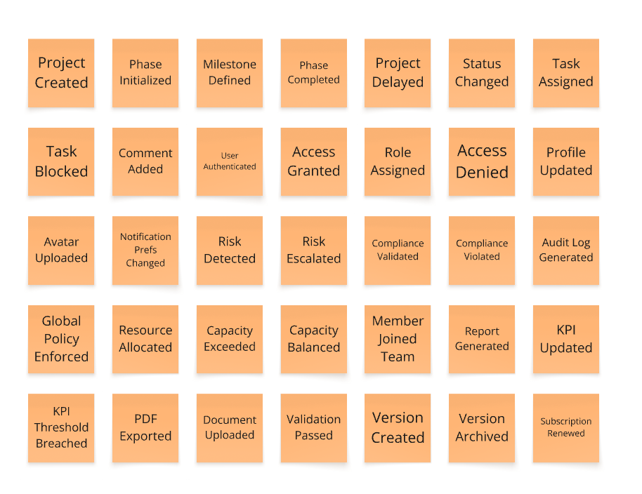

**Step 2: Chronology**

Los eventos descubiertos se ordenaron en una línea temporal coherente con el flujo real de la PMO: desde la creación del proyecto y la autenticación de usuarios, pasando por la definición de hitos, asignación de tareas y recursos, hasta la detección de riesgos, generación de reportes, actualización de KPIs y archivo de versiones. Este ordenamiento permitió visualizar dependencias y secuencias entre la operación diaria y la toma de decisiones gerencial.

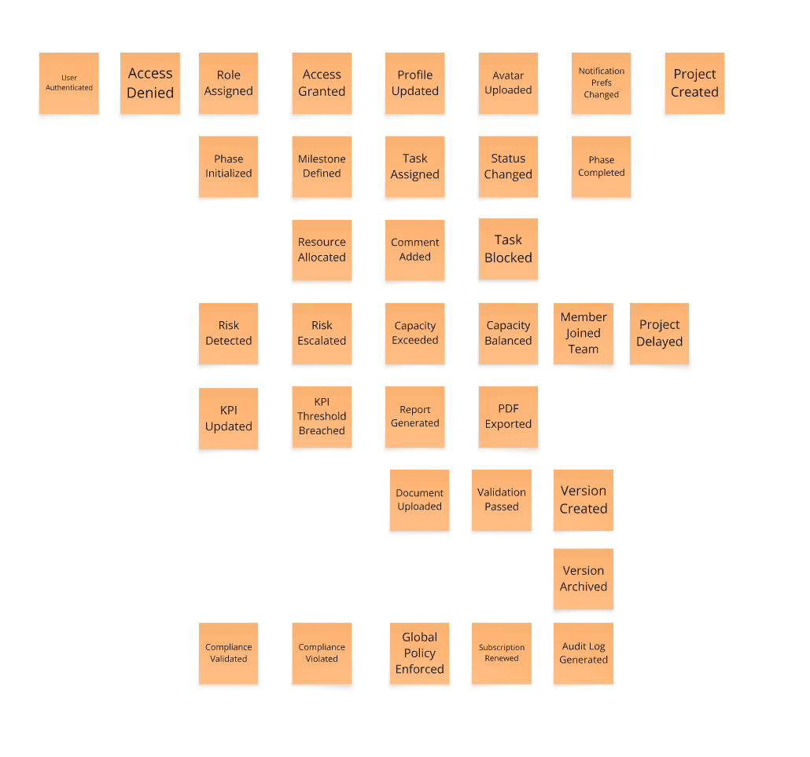

**Step 3: Pain Points**

Se marcaron los puntos de dolor del dominio donde hoy fallan los procesos manuales de gestión de proyectos: retrasos no detectados a tiempo (`Project Delayed`), tareas bloqueadas sin visibilidad, riesgos escalados tarde, sobrecarga de capacidad (`Capacity Exceeded`), umbrales de KPI incumplidos y fricción en el acceso o la gobernanza de roles. Estos hotspots justifican las hipótesis de Lean UX sobre reporteo manual, silos de información y falta de alertas tempranas.

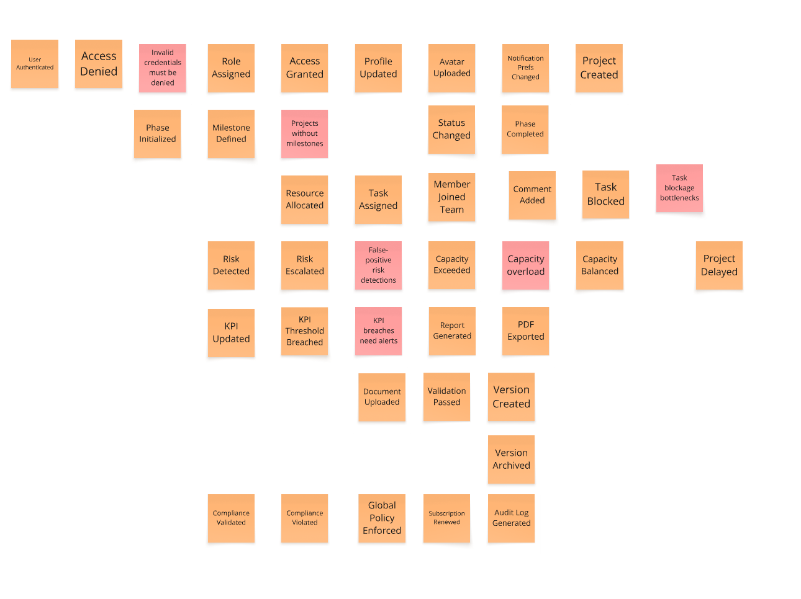

**Step 4: Pivotal Points**

Se identificaron los momentos pivote que cambian el rumbo del portafolio: creación del proyecto, definición y cierre de fases/hitos, asignación crítica de recursos, escalamiento de riesgos, validación o violación de compliance, y la generación de reportes o brechas de KPI. Estos puntos concentran las decisiones de Project Managers, PMO Leads y Stakeholders y delimitan dónde la plataforma debe aportar mayor control.

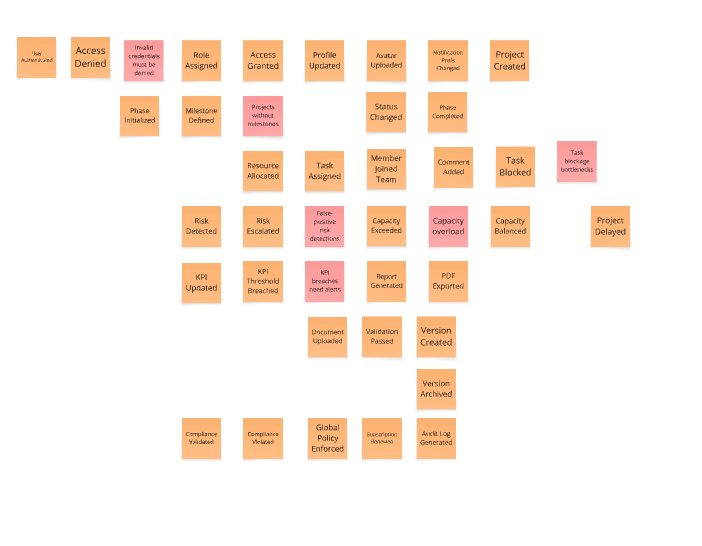

**Step 5: Commands**

A partir de cada evento se derivaron los Commands (intenciones de actor) que lo provocan: crear proyecto, inicializar fase, definir hito, asignar tarea o rol, autenticar usuario, cargar documento, exportar PDF, asignar recurso, generar reporte, etc. Los comandos modelan las acciones de Project Managers, miembros de equipo y administradores sobre la plataforma móvil y web de **MDEPS**.

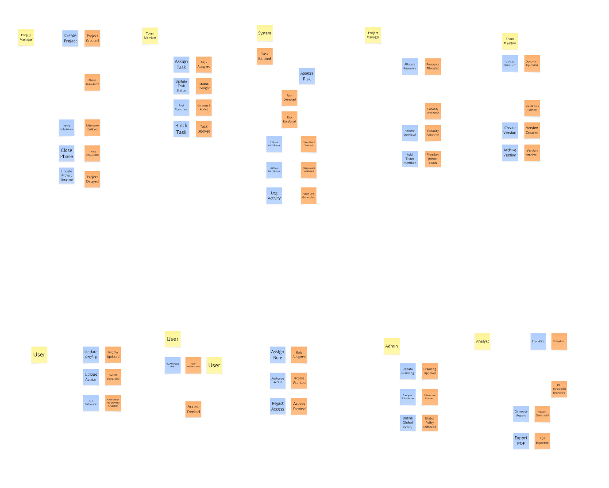

**Step 6: Policies**

Se definieron las Policies (reacciones automáticas del tipo “cuando ocurre X, entonces Y”) propias de una PMO: ante un retraso o umbral de KPI incumplido disparar alertas; al detectar un riesgo, evaluar escalamiento; al exceder capacidad, rebalancear recursos; al validar compliance, habilitar el siguiente hito; al renovar suscripción, reactivar políticas globales. Estas reglas conectan monitoreo en tiempo real con estandarización de procesos.

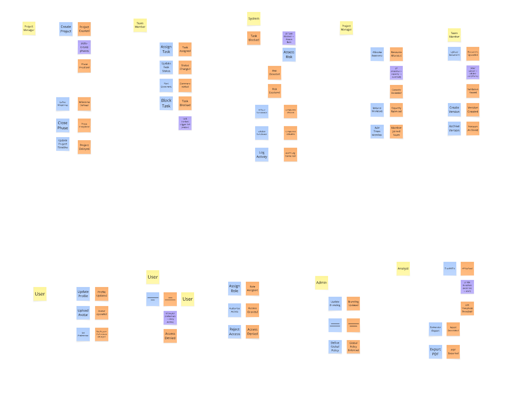

**Step 7: Read Models**

Se identificaron los Read Models (información que el actor necesita ver para decidir) alineados al producto: dashboards de salud del portafolio, listado de proyectos y hitos, estado de tareas y bloqueos, matriz de riesgos, capacidad del equipo, KPIs y semáforos, historial de auditoría, preferencias de notificación y reportes exportables. Estos modelos sustentan la visibilidad 360° prometida a Project Managers y Stakeholders.

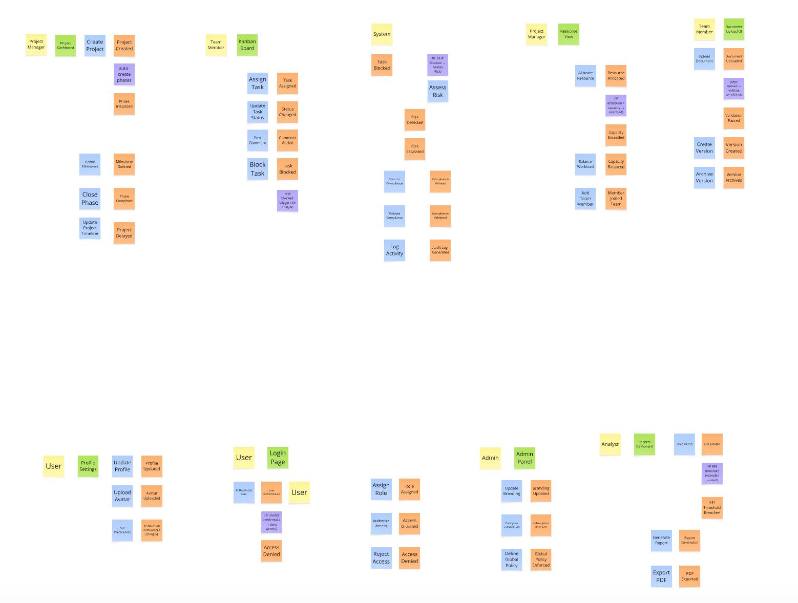

**Step 8: External Systems**

Se explicitaron los sistemas externos con los que **MDEPS** interactúa o podría integrarse en el MVP y más adelante: almacenamiento de archivos/documentos, servicio de notificaciones (correo/push), generación de PDF, autenticación/proveedores de identidad, y posibles fuentes de datos operativos (hojas de cálculo o herramientas colaborativas legadas). Quedaron fuera del alcance inicial integraciones pesadas con ERP (SAP/Oracle), según las restricciones del proyecto.

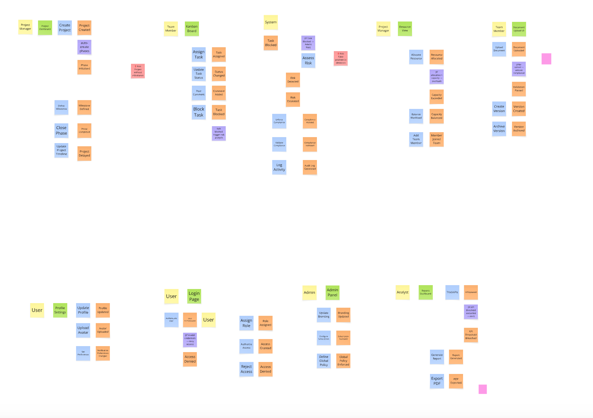

**Step 9: Aggregates**

Los eventos y comandos se agruparon en Aggregates que protegen invariantes del dominio PMO, por ejemplo: **Project** (fases, hitos, estado y retrasos), **Task** (asignación, bloqueos, comentarios), **User/Identity** (autenticación, roles y acceso), **Risk**, **Resource/Capacity**, **Report/KPI** y **Document/Version**. Cada aggregate delimita la unidad de consistencia sobre la que se ejecutan los comandos de la plataforma.

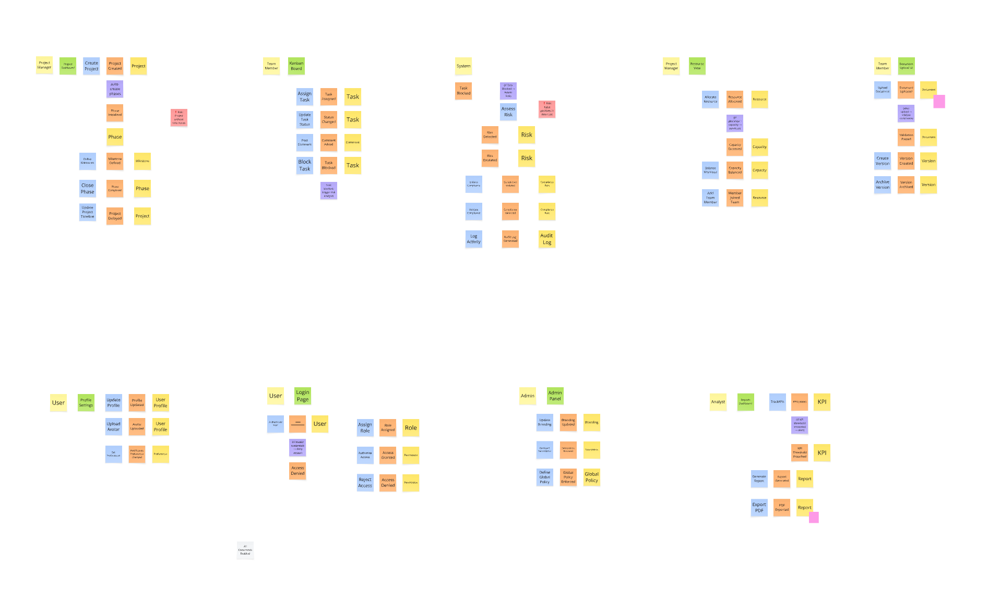

**Step 10: Bounded Contexts**

Finalmente se trazaron los Bounded Contexts candidatos a partir de los clusters del tablero, separando lenguajes y responsabilidades: **IAM** (identidad, roles y acceso), gestión de proyectos/portafolio, tareas y colaboración, riesgos y compliance, recursos y capacidad, analítica/reportes/KPIs, y documentos/versionado.

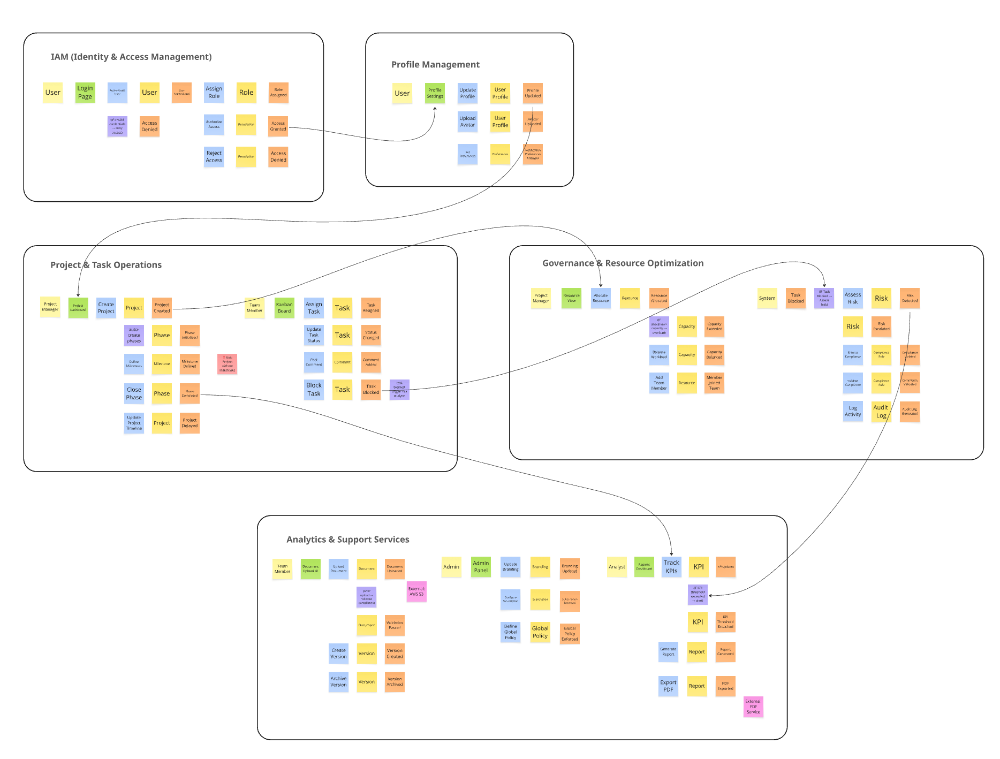

#### 2.5.1.1. Candidate Context Discovery

A partir del modelo de Event Storming elaborado en Miro, se desarrolló una sesión de Candidate Context Discovery con el propósito de identificar los bounded contexts de la solución. Durante esta sesión, se empleó principalmente la técnica look-for-pivotal-events.

Primero, se identificaron los eventos clave que reflejan cambios de estado entre las distintas partes del proceso de negocio. Luego, estos eventos se agruparon según los principales cambios de contexto. A continuación, se establecieron fronteras alrededor de los grupos definidos para determinar los límites iniciales de los bounded contexts. Finalmente, se asignaron nombres a cada bounded context. Como resultado, se definieron 5 bounded contexts y se obtuvo la **versión final del Event Storming**.

A continuación, se detallará en qué consiste cada bounded context:

**1. IAM (Identity and Access Management)**

Gestiona la autenticación de usuarios, la asignación de roles y el control de acceso a la plataforma. Define quién puede operar sobre proyectos, reportes y configuración según su perfil de seguridad.

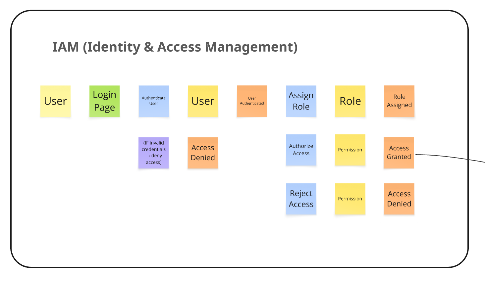

**2. Profile Management**

Administra los perfiles de usuario, preferencias personales, avatar y datos de identidad operativa dentro de **VantagePMO**. Complementa a IAM al mantener la información de presentación y configuración individual del actor.

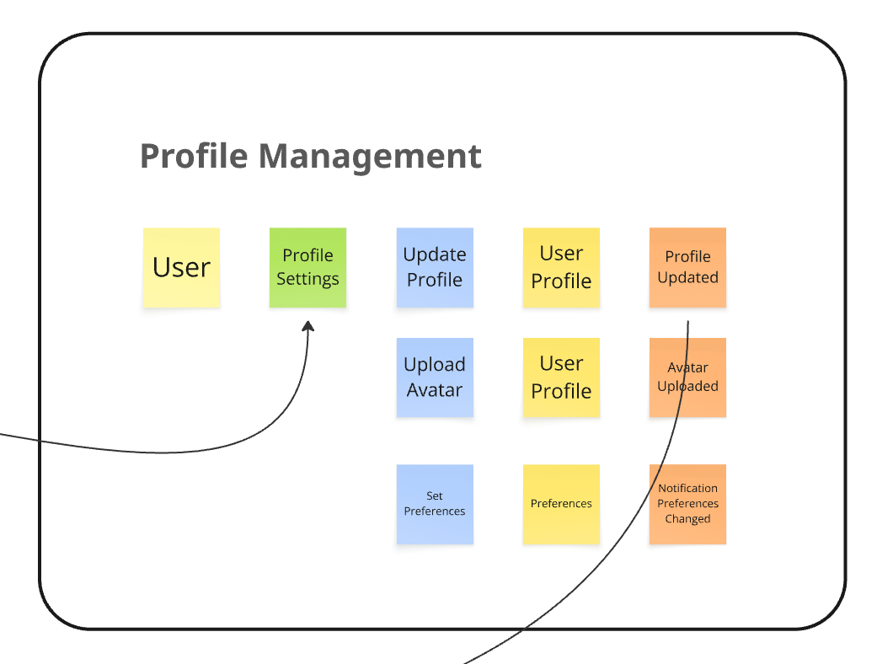

**3. Project and Task Operations**

Concentra la operación del día a día de la PMO: creación de proyectos, fases e hitos, junto con la asignación, avance, comentarios y bloqueo de tareas. Es el núcleo operativo donde Project Managers y miembros del equipo planifican y ejecutan el trabajo.

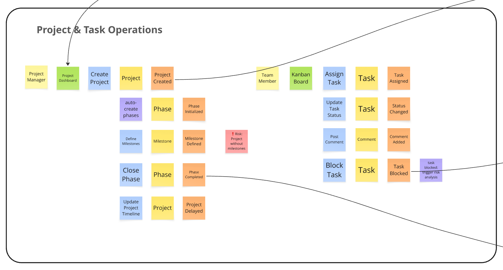

**4. Governance and Resource Optimization**

Agrupa la optimización de recursos y capacidad con la gobernanza del portafolio: asignación y balanceo de carga, evaluación y escalamiento de riesgos, compliance y registro de auditoría. Conecta la disponibilidad del equipo con el control de desviaciones y el cumplimiento normativo.

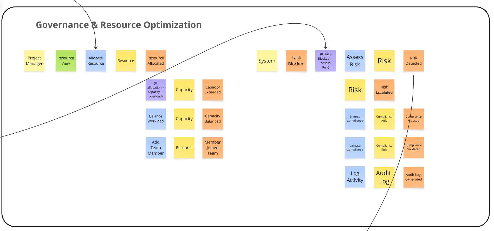

**5. Analytics and Support Services**

Integra los servicios de soporte y analítica de la plataforma: gestión documental y versionado (con almacenamiento en la nube), administración global (branding, suscripción y políticas) y el seguimiento de KPIs con generación y exportación de reportes PDF.

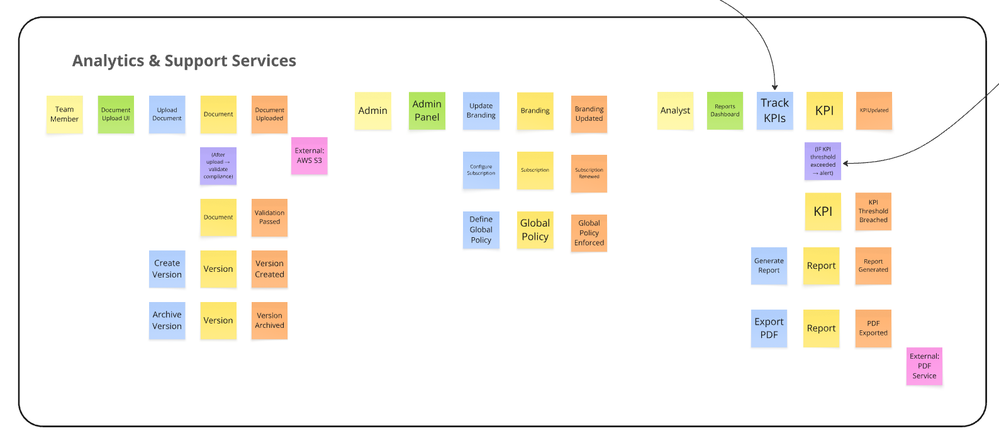

#### 2.5.1.2. Domain Message Flows Modeling

Para evidenciar el intercambio de información entre los diversos bounded contexts, se emplean flujos de mensajes de dominio (Domain Message Flows) basados en comandos, eventos y consultas. Los escenarios centrales del negocio se presentan a continuación:

**Registro e Inicio de Sesión**

Primero, el Project Manager entra desde la página web para registrarse por primera vez. Cuando llena sus datos, el sistema de seguridad guarda su cuenta y automáticamente le manda la orden al módulo de perfiles para que le cree su ficha de usuario. Una vez creado, el PM abre la aplicación móvil, pone su usuario y clave, el sistema valida que sea correcto y le da acceso para entrar a la app.

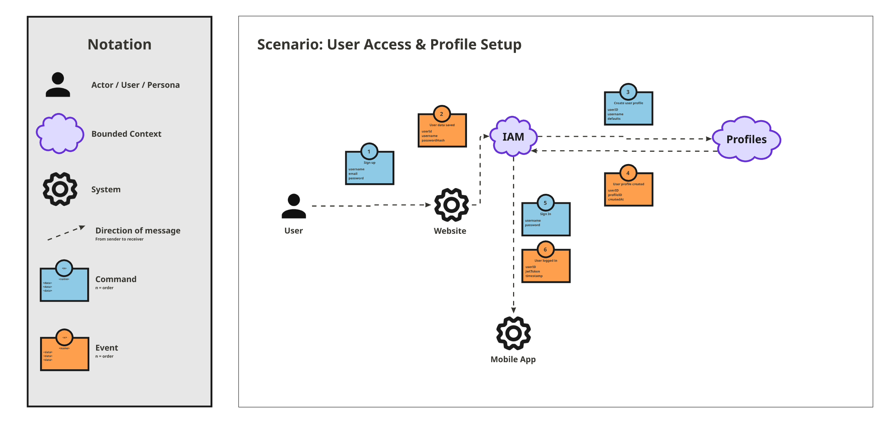

**Consulta y Actualización de Perfil**

Cuando el PM entra a la sección 'Mi Perfil' en la app móvil, el sistema primero lee sus datos para mostrarle su foto y nombre en pantalla (por eso no aparece vacía). Luego, si el PM cambia su nombre o cargo y le da a 'Guardar', la app actualiza la información del perfil y avisa al sistema central para que sus datos estén al día en todos lados.

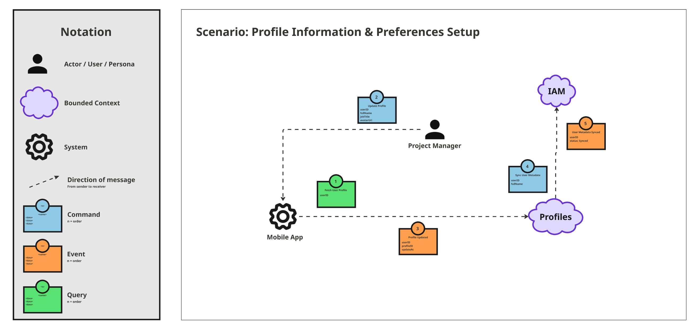

**Creación de un Proyecto e Hitos**

Aquí el PM crea un nuevo proyecto desde la app. Tan pronto presiona 'Crear Proyecto', el módulo de proyectos registra la información y le avisa al módulo de recursos para que reserve el paquete inicial de horas para el equipo. Al final, la app le muestra al PM su panel de control con el proyecto listo.

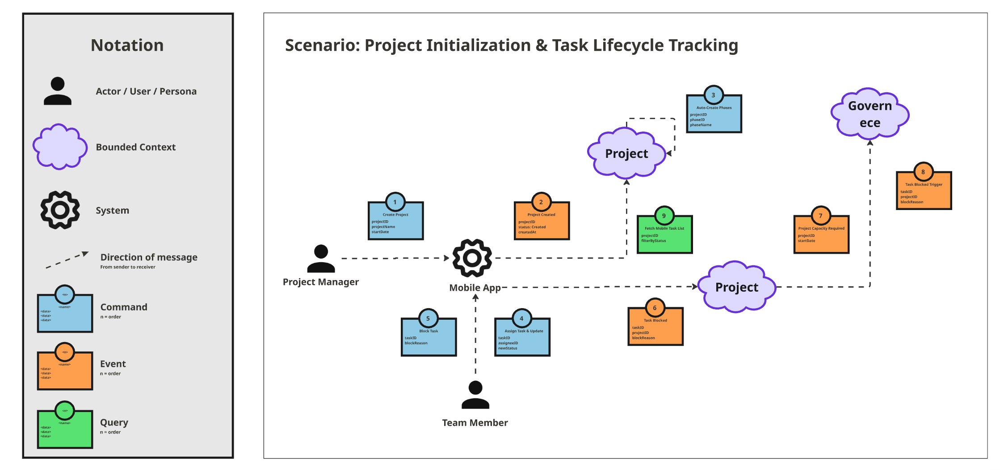

**Asignación y Avance de Tareas**

El PM entra a la app y le asigna una tarea a un desarrollador. Cuando el desarrollador avanza y marca la tarea como 'Completada', el módulo de tareas avisa automáticamente al módulo del proyecto para que recalcule el avance. Así, el PM ve de inmediato que el proyecto subió, por ejemplo, del 50% al 60% de progreso.

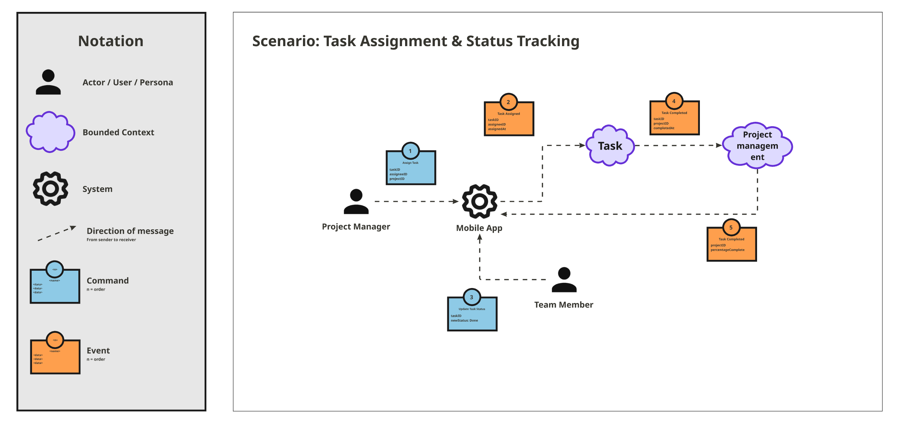

**Reporte de Bloqueos y Alerta de Riesgos**

El PM primero configura en la app qué situaciones son peligrosas para el proyecto. Si un desarrollador se frena por un problema y marca la tarea como 'Bloqueada', el sistema de tareas le avisa al módulo de gestión de riesgos. Este analiza la gravedad y le envía de inmediato una alerta roja o crítica a la pantalla del PM para que intervenga.

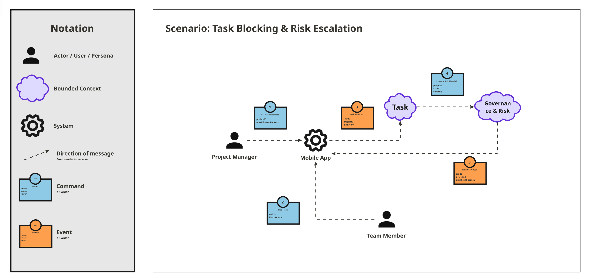

**Consulta de Disponibilidad y Balanceo de Carga**

El PM quiere asignar más trabajo, pero antes consulta en la app la disponibilidad del equipo para no saturarlos. Si al asignar horas nota que alguien se pasa de su límite, el sistema detecta la sobrecarga y sugiere o redistribuye automáticamente las tareas pendientes hacia otro miembro del equipo con tiempo libre.

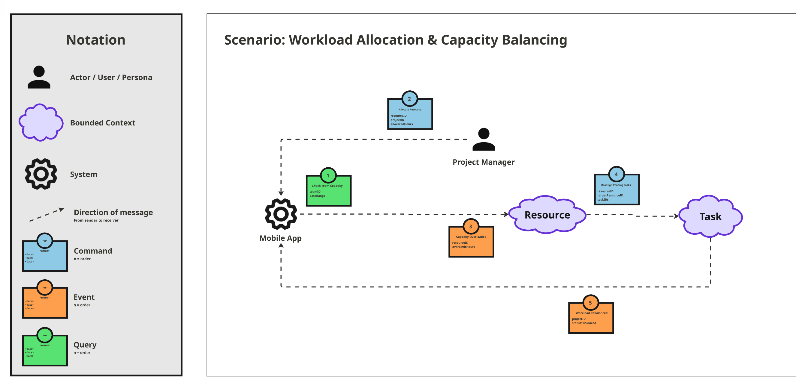

**Carga de Documentos y Archivo en la Nube**

El PM necesita adjuntar las especificaciones de un proyecto. Sube el archivo desde la app móvil; el sistema de documentos lo recibe, pero en lugar de saturar nuestra base de datos con archivos pesados, lo guarda de forma segura en un servidor en la nube (AWS S3). Una vez guardado, conecta ese enlace directo a la tarea correspondiente.

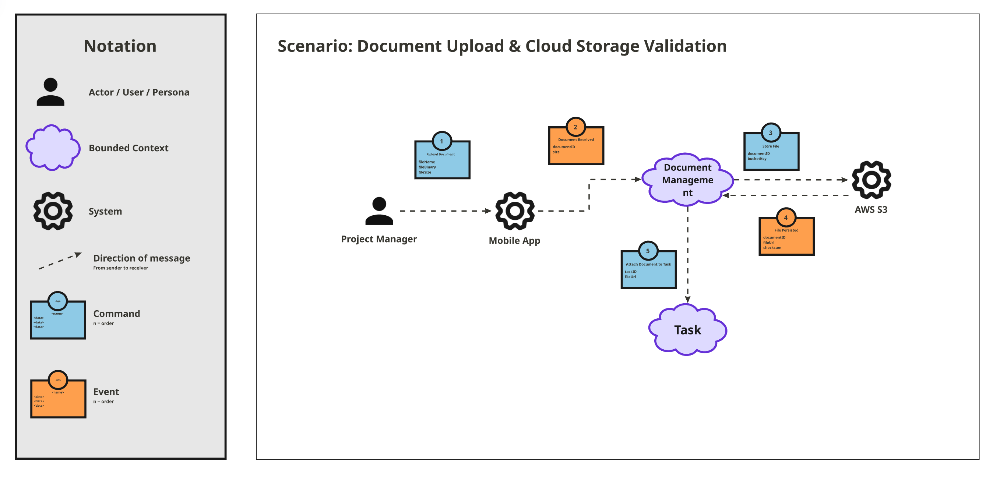

**Aplicación de Normativas y Registro de Auditoría**

El PM solicita aplicar ciertas reglas de calidad o seguridad a su proyecto. El sistema de administración activa estas políticas y le ordena al módulo de auditoría que guarde un historial con fecha y hora. Así queda una 'caja negra' o registro imborrable de quién hizo qué y cuándo.

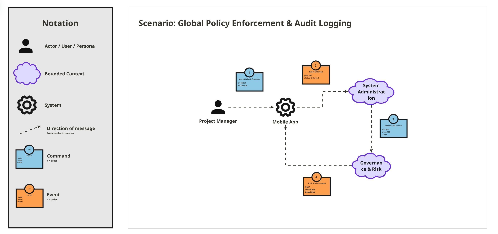

**Consulta de Indicadores y Exportación en PDF**

Para cerrar, el PM entra a ver las métricas de rendimiento en su tablero de control. Al presionar el botón 'Exportar Reporte', el sistema organiza todos los datos del proyecto y se los envía a un servicio especializado en documentos para que arme e imprima el archivo PDF listo para descargar.

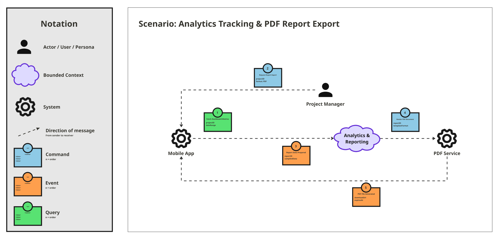

#### 2.5.1.3. Bounded Context Canvases

Con el propósito de mejorar la organización del dominio y mantener una comunicación uniforme, se desarrollaron Bounded Context Canvases para cada subdominio identificado. Estos canvases permiten definir las responsabilidades de cada contexto, establecer el lenguaje ubicuo y sus principales modelos, además de especificar los puntos de integración y los flujos de mensajes entre contextos. Los diagramas presentados a continuación reúnen estas definiciones y sirvieron como referencia para orientar la arquitectura, las interfaces y la evolución del sistema.

### 2.5.2. Context Mapping
[Diagrama con relaciones Upstream, Downstream, ACL, Conformist, Customer-Supplier].

### 2.5.3. Software Architecture
#### 2.5.3.1. Software Architecture Context Level Diagrams
[Diagrama C4 Nivel 1 Context Diagram y descripcion].

#### 2.5.3.2. Software Architecture Container Level Diagrams
[Diagrama C4 Nivel 2 Container Diagram y descripcion].

#### 2.5.3.3. Software Architecture Deployment Diagrams
[Diagrama C4 de Despliegue de infraestructura y descripcion].

---

## 2.6. Tactical-Level Domain-Driven Design

### 2.6.1. Bounded Context: IAM

Siguiendo el modelo de arquitectura "Clean Architecture", hemos dividido el proyecto en capas. A continuación detallamos las capas del Bounded Context referenciado.

#### 2.6.1.1. Domain Layer

**Sub-capa Model - Aggregates:**

| Tipo | Nombre | Descripción | Responsabilidad Principal | Relación con otros elementos |
| :--- | :--- | :--- | :--- | :--- |
| Aggregate | User | Clase para definir el Usuario de la aplicación. | Ser el punto de entrada para modificar y mantener la integridad del usuario como entidad del dominio de identidad. | Relacionado con los demás bounded contexts, ya que encapsula la identidad principal del sistema. |
| Aggregate | UserAudit | Clase para definir la auditoría de los usuarios. | Mantener el registro y la traza de los eventos críticos relacionados con los usuarios. | Relacionado directamente con la entidad `User`. |

**Sub-capa Model - Commands:**

| Tipo | Nombre | Descripción | Responsabilidad Principal | Relación con otros elementos |
| :--- | :--- | :--- | :--- | :--- |
| Command | SignInCommand | Comando para el inicio de sesión. | Representar la intención del usuario de iniciar sesión en el sistema. | Usado en la implementación del servicio de autenticación (Application Layer). |
| Command | SignUpCommand | Comando para registro. | Representar la intención de un nuevo usuario de registrarse en la aplicación. | Usado en la implementación del servicio de autenticación (Application Layer). |
| Command | UpdatePasswordCommand | Comando para actualizar credenciales. | Representar la intención de un usuario de cambiar su contraseña de acceso. | Usado en la implementación de la gestión de usuarios. |

**Sub-capa Model - Queries:**

| Tipo | Nombre | Descripción | Responsabilidad Principal | Relación con otros elementos |
| :--- | :--- | :--- | :--- | :--- |
| Query | GetAllUsersQuery | Consulta para obtener todos los usuarios. | Representar la intención de obtener la lista completa de usuarios registrados. | Usado en la implementación del servicio de consultas (UserQueryService). |
| Query | GetUserByIdQuery | Consulta para obtener un usuario por ID. | Representar la intención de buscar los detalles de un usuario específico mediante su identificador. | Usado en la implementación del servicio de consultas. |
| Query | GetUserByUsernameQuery | Consulta para obtener un usuario por su Username. | Representar la intención de buscar un usuario utilizando su nombre de usuario. | Usado en la validación y el servicio de consultas de autenticación. |

**Sub-capa Repositories:**

| Tipo | Nombre | Descripción | Responsabilidad Principal | Relación con otros elementos |
| :--- | :--- | :--- | :--- | :--- |
| Repository | IUserRepository | Interfaz de persistencia para la entidad User. | Definir el contrato para guardar, actualizar y recuperar información de la base de datos para los usuarios. | Implementado por `UserRepository` en la capa de Infraestructura (Infrastructure Layer). |

#### 2.6.1.2. Interface Layer

**Sub-capa REST - Resources:**

| Tipo | Nombre | Descripción | Responsabilidad Principal | Relación con otros elementos |
| :--- | :--- | :--- | :--- | :--- |
| Resource | UserResource | Representación del recurso de usuario. | Definir la estructura de datos que se expone al cliente cuando se consulta un usuario. | Relacionado con `UserResourceFromEntityAssembler` para transformar entidades del dominio a recursos. |
| Resource | AuthenticatedUserResource | Representación de un usuario autenticado. | Definir la estructura de datos expuesta al cliente luego de un inicio de sesión exitoso (incluye token). | Utilizado en las respuestas de autenticación y relacionado con `AuthenticatedUserResourceFromEntityAssembler`. |
| Resource | SignInResource | Representación de los datos para iniciar sesión. | Capturar los datos enviados por el cliente (ej. username y contraseña) para la autenticación. | Transformado a `SignInCommand` a través de `SignInCommandFromResourceAssembler`. |
| Resource | SignUpResource | Representación de los datos para el registro. | Capturar los datos enviados por el cliente para crear una nueva cuenta. | Transformado a `SignUpCommand` a través de `SignUpCommandFromResourceAssembler`. |
| Resource | FrontSignInUserResource | Representación adaptada para el frontend del inicio de sesión. | Estructura específica para las necesidades del frontend al iniciar sesión. | Utilizado por los controladores de autenticación. |
| Resource | FrontSignUpResource | Representación adaptada para el frontend del registro. | Estructura específica para las necesidades del frontend al crear cuenta. | Utilizado por los controladores de autenticación. |
| Resource | FrontPatchUserResource | Representación adaptada para actualizaciones desde el frontend. | Capturar datos enviados para actualización parcial de usuario. | Utilizado por los controladores para operaciones de parcheo. |

**Sub-capa REST - Transform:**

| Tipo | Nombre | Descripción | Responsabilidad Principal | Relación con otros elementos |
| :--- | :--- | :--- | :--- | :--- |
| Assembler | SignInCommandFromResourceAssembler | Ensamblador de comandos de inicio de sesión. | Transformar un `SignInResource` proveniente de la petición HTTP en un `SignInCommand` para la capa de aplicación. | Relaciona recursos HTTP con comandos de dominio. |
| Assembler | SignUpCommandFromResourceAssembler | Ensamblador de comandos de registro. | Transformar un `SignUpResource` en un `SignUpCommand` para ser procesado. | Relaciona recursos HTTP con comandos de dominio. |
| Assembler | FrontSignUpCommandFromResourceAssembler | Ensamblador de comandos de registro adaptado. | Transformar un `FrontSignUpResource` en comandos procesables. | Relaciona peticiones del frontend con la lógica de negocio. |
| Assembler | UserResourceFromEntityAssembler | Ensamblador de recursos de usuario. | Transformar una entidad `User` del dominio en un `UserResource` para la respuesta HTTP. | Permite exponer datos sin exponer la entidad de dominio directamente. |
| Assembler | AuthenticatedUserResourceFromEntityAssembler | Ensamblador de recursos de usuario autenticado. | Transformar la información de un usuario y su token en un `AuthenticatedUserResource`. | Prepara la respuesta de inicio de sesión exitoso. |
| Assembler | IamActionResultAssembler | Ensamblador de resultados de acciones IAM. | Estandarizar la creación de respuestas HTTP (ActionResults) para operaciones de identidad. | Usado por los controladores para retornar las respuestas adecuadas. |

**Sub-capa REST - Controllers:**

| Tipo | Nombre | Descripción | Responsabilidad Principal | Relación con otros elementos |
| :--- | :--- | :--- | :--- | :--- |
| Controller | AuthenticationController | Controlador para el manejo de autenticación. | Gestionar las peticiones HTTP relacionadas al inicio de sesión y registro de usuarios (endpoints). | Coordina con `IUserCommandService` para ejecutar comandos y usa assemblers para transformar datos. |
| Controller | UsersController | Controlador para la gestión de usuarios. | Exponer y gestionar endpoints RESTful para operaciones sobre cuentas de usuarios (listar, buscar). | Coordina con `IUserQueryService` y `IUserCommandService` para manejar flujos de datos. |

**Sub-capa ACL:**

| Tipo | Nombre | Descripción | Responsabilidad Principal | Relación con otros elementos |
| :--- | :--- | :--- | :--- | :--- |
| Facade Interface | IIamContextFacade | Interfaz de la fachada ACL para el contexto IAM. | Definir un contrato claro y aislado para que otros Bounded Contexts interactúen con IAM. | Define operaciones que pueden ser llamadas desde otros módulos (ej. Profiles, Projects). |
| Facade | IamContextFacade | Implementación de la fachada ACL para IAM. | Exponer servicios específicos de IAM (como verificar si existe un usuario) a otros Bounded Contexts, actuando como una capa anticorrupción. | Implementa `IIamContextFacade` y utiliza servicios internos de aplicación. |

#### 2.6.1.3. Application Layer

**Sub-capa Services - CommandServices:**

| Tipo | Nombre | Descripción | Responsabilidad Principal | Relación con otros elementos |
| :--- | :--- | :--- | :--- | :--- |
| Interface | IUserCommandService | Contrato para servicios de comandos de usuario. | Definir las operaciones de modificación de estado para los usuarios (ej. registro). | Implementado por `UserCommandService`. |
| Service | UserCommandService | Servicio de comandos para usuarios. | Manejar el flujo de ejecución de los comandos de escritura y modificación (`SignUpCommand`, `SignInCommand`). Contiene la lógica orquestadora. | Implementa `IUserCommandService`. Coordina con `IUserRepository`, `IHashingService` y `ITokenService`. |

**Sub-capa Services - QueryServices:**

| Tipo | Nombre | Descripción | Responsabilidad Principal | Relación con otros elementos |
| :--- | :--- | :--- | :--- | :--- |
| Interface | IUserQueryService | Contrato para servicios de consultas de usuario. | Definir las operaciones de solo lectura para obtener información de usuarios. | Implementado por `UserQueryService`. |
| Service | UserQueryService | Servicio de consultas para usuarios. | Orquestar la ejecución de consultas (queries) para recuperar datos de usuarios sin modificar su estado (ej. `GetAllUsersQuery`, `GetUserByIdQuery`). | Implementa `IUserQueryService`. Obtiene datos utilizando `IUserRepository`. |

**Sub-capa Services - OutboundServices (Internal):**

| Tipo | Nombre | Descripción | Responsabilidad Principal | Relación con otros elementos |
| :--- | :--- | :--- | :--- | :--- |
| Interface | IHashingService | Contrato para el servicio de encriptación. | Definir la funcionalidad necesaria para encriptar y verificar contraseñas. | Utilizado por `UserCommandService` para procesar credenciales seguras. Implementado en la capa de Infraestructura. |
| Interface | ITokenService | Contrato para el servicio de generación de tokens. | Definir la funcionalidad para generar tokens de autenticación (JWT) para sesiones válidas. | Utilizado por `UserCommandService` al confirmar el inicio de sesión. Implementado en la capa de Infraestructura. |

#### 2.6.1.4. Infrastructure Layer

**Sub-capa Hashing:**

| Tipo | Nombre | Descripción | Responsabilidad Principal | Relación con otros elementos |
| :--- | :--- | :--- | :--- | :--- |
| Service | HashingService | Implementación del servicio de hashing utilizando BCrypt. | Encriptar las contraseñas de los usuarios y verificar que los hashes coincidan al iniciar sesión. | Implementa `IHashingService` de la capa de Aplicación. |

**Sub-capa Persistence:**

| Tipo | Nombre | Descripción | Responsabilidad Principal | Relación con otros elementos |
| :--- | :--- | :--- | :--- | :--- |
| Repository | UserRepository | Implementación del repositorio de usuarios en Entity Framework Core. | Manejar las operaciones directas de base de datos (CRUD) para la entidad `User`. | Implementa la interfaz `IUserRepository` de la capa de Dominio. |
| Configuration | ModelBuilderExtensions | Extensiones para la configuración del modelo de datos. | Mapear las entidades del dominio de IAM (`User`, `UserAudit`) a tablas en la base de datos relacional. | Usado por el DbContext central de la aplicación. |

**Sub-capa Pipeline:**

| Tipo | Nombre | Descripción | Responsabilidad Principal | Relación con otros elementos |
| :--- | :--- | :--- | :--- | :--- |
| Middleware | RequestAuthorizationMiddleware | Interceptor de peticiones HTTP. | Interceptar cada petición entrante al servidor para extraer y validar el token JWT. | Se inyecta en el pipeline global de la aplicación. |
| Attribute | AuthorizeAttribute | Atributo de autorización. | Decorador utilizado para marcar controladores o endpoints que requieren una sesión iniciada válida. | Evaluado por el `RequestAuthorizationMiddleware`. |
| Attribute | AllowAnonymousAttribute | Atributo de omisión de autorización. | Decorador para marcar endpoints públicos que no requieren token (ej. registro). | Evaluado por el middleware para saltar la validación. |

**Sub-capa Tokens:**

| Tipo | Nombre | Descripción | Responsabilidad Principal | Relación con otros elementos |
| :--- | :--- | :--- | :--- | :--- |
| Service | TokenService | Implementación del generador de tokens JWT. | Crear tokens web de formato JSON (JWT) con claims de seguridad para la sesión. | Implementa `ITokenService` de la capa de Aplicación. |
| Configuration | TokenSettings | Configuración de los tokens. | Mapear los secretos y tiempos de expiración del JWT definidos en las configuraciones del proyecto. | Utilizado por `TokenService` para firmar los tokens. |

#### 2.6.1.5. Bounded Context Software Architecture Component Level Diagrams

Este diagrama representa la descomposición interna del contenedor correspondiente al Bounded Context de identidad y autenticación (IAM) dentro del sistema. Se ilustra en el Nivel 3 del C4 Model  para reflejar los principios de Clean Architecture y Domain-Driven Design aplicados.

En este diagrama se puede observar cómo las peticiones ingresan a través de los controladores REST (Interface Layer), los cuales delegan la lógica de negocio a los servicios de comando y consulta (Application Layer). Estos servicios, a su vez, orquestan las operaciones apoyándose en los componentes de infraestructura (Infrastructure Layer), como el repositorio para la persistencia de datos y los servicios externos para el manejo de encriptación (BCrypt) y generación de tokens (JWT).

#### 2.6.1.6. Bounded Context Software Architecture Code Level Diagrams
##### 2.6.1.6.1. Bounded Context Domain Layer Class Diagrams

##### 2.6.1.6.2. Bounded Context Database Design Diagram

**Tabla: USERS**

| Campo | Tipo | Nulo | Default | Comentario / Descripción |
| :--- | :--- | :--- | :--- | :--- |
| **id** | bigint | N-N | default | Identificador único del registro, generalmente una clave primaria. |
| **created_at** | datetime | NULL | default | Fecha y hora en que se creó el registro. |
| **updated_at** | datetime | NULL | default | Fecha y hora de la última actualización del registro. |
| **company_name** | varchar | NULL | default | Nombre de la empresa asociada al usuario o entidad. |
| **email** | varchar | N-N | default | Dirección de correo electrónico del usuario. |
| **first_name** | varchar | N-N | default | Primer nombre del usuario. |
| **last_name** | varchar | N-N | default | Apellido del usuario. |
| **password** | varchar | N-N | default | Contraseña del usuario (almacenada de forma segura, usualmente encriptada). |
| **trial** | bit | NULL | default | Indica si el usuario está en un período de prueba (true/false)[. |
| **username** | varchar | N-N | default | Nombre de usuario único utilizado para iniciar sesión. |

**Tabla: USER_AUDITS**

| Campo | Tipo | Nulo | Default | Comentario / Descripción |
| :--- | :--- | :--- | :--- | :--- |
| **id** | bigint | N-N | default | Identificador único del registro de auditoría. |
| **user_id** | bigint | N-N | default | Clave foránea que referencia a la tabla USERS. |
| **action** | varchar | N-N | default | Descripción de la acción o evento realizado por el usuario. |
| **timestamp** | datetime | N-N | default | Fecha y hora exacta en la que se registró el evento de auditoría. |

