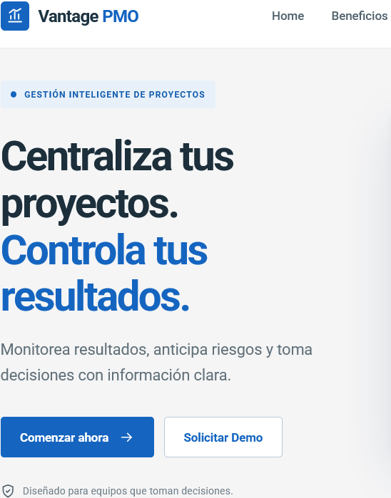
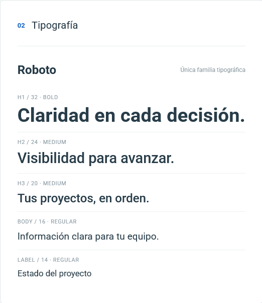
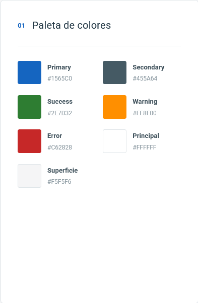
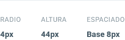

# Capítulo III: Solution UI/UX Design

## 3.1.1. Style Guidelines
Para asegurar una experiencia de usuario consistente, profesional y orientada a la productividad, el diseño visual de Vantage PMO se basa en los principios de **Material Design**, utilizando la biblioteca Angular Material para el entorno web.
### 3.1.1.1. General Style Guidelines

**1. Branding y Tono de Comunicación**
*   **Identidad de Marca:** Vantage PMO proyecta confianza, eficiencia y control. El diseño debe ser minimalista para evitar sobrecargar cognitivamente a los Project Managers y Stakeholders que manejan grandes volúmenes de datos.
*   **Tono de Comunicación:** Formal, respetuoso y sereno. La plataforma utiliza un lenguaje directo e instructivo, evitando jergas innecesarias para facilitar la toma de decisiones ejecutivas.

**2. Typography (Tipografía)**
Se ha seleccionado la familia tipográfica **Roboto** (estándar de Material Design) por su excelente legibilidad en pantallas digitales y tablas de datos densas.
*   **Headings (H1, H2, H3):** Roboto Bold y Medium (Ej. H1: 32px, H2: 24px) para diferenciar claramente las secciones de los dashboards.
*   **Body Text:** Roboto Regular (14px - 16px) para el contenido general, descripciones de tareas y reportes.
*   **Labels & Captions:** Roboto Light (12px) para etiquetas secundarias y metadatos.

**3. Colors (Paleta de Colores)**
La paleta está diseñada para reducir la fatiga visual y destacar únicamente la información crítica (alertas y estados de proyectos).
*   **Primary Color (Azul Corporativo - #1565C0):** Transmite seguridad, tecnología y profesionalismo. Utilizado en la barra de navegación, botones principales (Call to Actions) y enlaces.
*   **Secondary Color (Gris Pizarra - #455A64):** Utilizado para textos principales, fondos de paneles y bordes, manteniendo una interfaz limpia.
*   **Semantic Colors (Estados y Alertas):**
    *   *Éxito / A tiempo:* Verde (#2E7D32) para hitos completados.
    *   *Advertencia / Riesgo:* Ámbar (#FF8F00) para desviaciones de presupuesto o tiempo.
    *   *Error / Retraso Crítico:* Rojo (#C62828) para tareas bloqueadas o KPIs incumplidos.
*   **Background:** Blanco (#FFFFFF) y Gris muy claro (#F5F5F6) para maximizar el contraste y facilitar la lectura de reportes.

**4. Spacing y Grid**
Se utiliza un sistema de grilla de 12 columnas responsivas, con un espaciado base de 8px (8, 16, 24, 32) para mantener proporciones exactas y jerarquía visual entre los elementos del dashboard y el Landing Page.

## 3.1.2. Information Architecture
La arquitectura de información de Vantage PMO está estructurada para que los visitantes del Landing Page comprendan el valor del producto en menos de un minuto, y para que los usuarios de la plataforma accedan a sus portafolios sin fricción.

### 3.1.2.1. Organization Systems
*   **Landing Page:** Organización secuencial y jerárquica (Visual Hierarchy). El flujo guía al visitante desde la presentación del problema (silos de información), pasando por la solución (Vantage PMO), beneficios (reducción de tiempos), hasta el Call to Action (Registro/Contacto).
*   **Plataforma Web/Móvil:** Organización matricial y por tópicos. Los proyectos se agrupan por estado, prioridad y responsable, permitiendo a los PMs y Stakeholders alternar entre vistas de alto nivel (Portafolio) y vistas de detalle (Tareas y Recursos).

### 3.1.2.2. Labelling Systems
Las etiquetas se han definido buscando claridad, utilizando un vocabulario estándar de gestión de proyectos (Ubiquitous Language) para evitar confusiones.
*   **Navegación del Landing Page:** *Home*, *Beneficios*, *Características*, *Planes*, *Contacto*.
*   **Botones (CTAs):** *Comenzar ahora*, *Solicitar Demo*, *Iniciar Sesión*.

### 3.1.2.3. SEO Tags and Meta Tags
Para el posicionamiento orgánico del Landing Page en motores de búsqueda, se han definido las siguientes etiquetas orientadas al segmento corporativo B2B:
*   **Title Tag:** `<title>Vantage PMO | Centraliza la Gestión de tus Proyectos y Portafolios</title>`
*   **Meta Description:** `<meta name="description" content="Optimiza la gestión de proyectos de tu empresa. Reduce tiempos de reporteo, recibe alertas tempranas y toma mejores decisiones con Vantage PMO.">`
*   **Meta Keywords:** `<meta name="keywords" content="gestión de proyectos, software PMO, control de portafolios, MDEPS, productividad B2B, project management SaaS">`
*   **Author:** `<meta name="author" content="MDEPS">`

### 3.1.2.4. Searching Systems
*   **Landing Page:** Al ser un sitio web estático informativo, no requiere una barra de búsqueda compleja. La navegación se facilita mediante enlaces ancla (Anchor links).
*   **Plataforma App/Web:** Se contará con una barra de búsqueda global (Global Search) autocompletable, permitiendo a los usuarios filtrar por *Nombre de Proyecto*, *Responsable*, *Hito* o *Estado*.

### 3.1.2.5. Navigation Systems
*   **Global Navigation:** Barra de navegación superior fija (Sticky Header) en el Landing Page que acompaña al usuario durante el scroll, garantizando acceso constante al botón de "Iniciar Sesión".
*   **Footer Navigation:** Ubicado al pie de página, agrupa enlaces secundarios como *Términos y Condiciones*, *Políticas de Privacidad*, *Redes Sociales* y *Soporte*.

## 3.1.3. Landing Page UI Design
### 3.1.3.1. Landing Page Wireframe
### 3.1.3.2. Landing Page Mock-up

## 3.1.4. Mobile Applications UX/UI Design
### 3.1.4.1. Mobile Applications Wireframes
### 3.1.4.2. Mobile Applications Wireflow Diagrams
### 3.1.4.3. Mobile Applications Mock-ups
### 3.1.4.4. Mobile Applications User Flow Diagrams
### 3.1.4.5. Mobile Applications Prototyping
*(Insertar enlaces al video de Figma)*