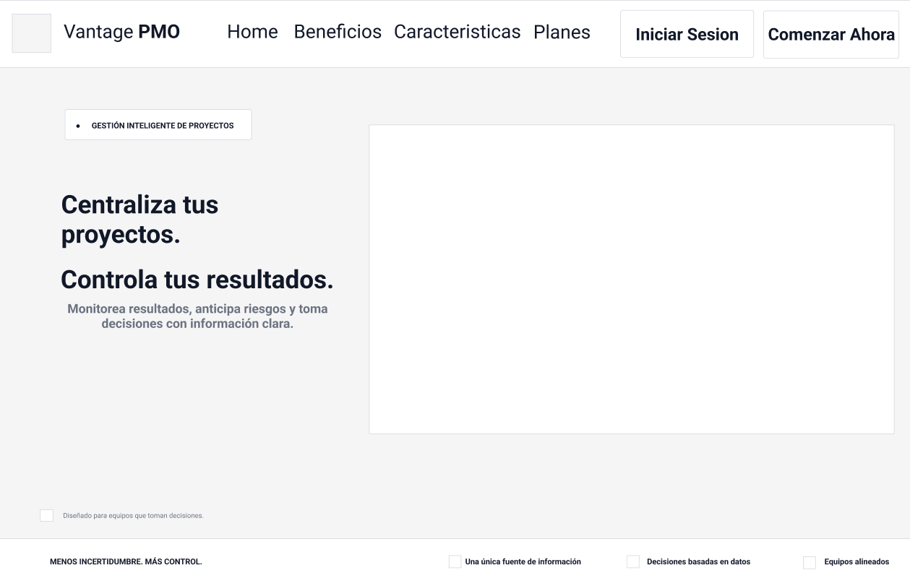
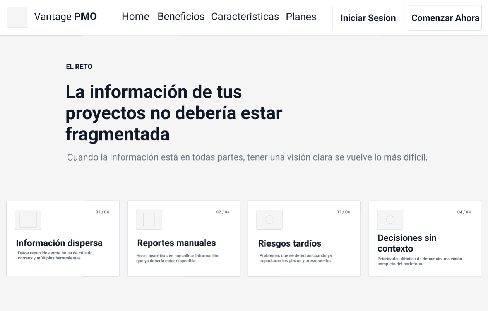
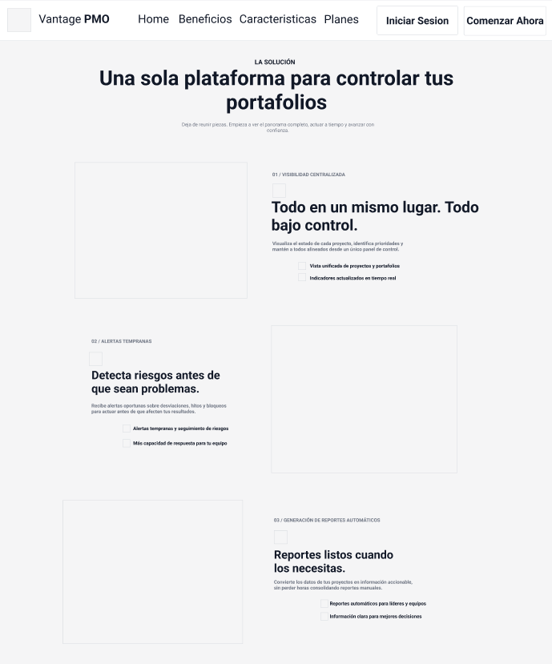
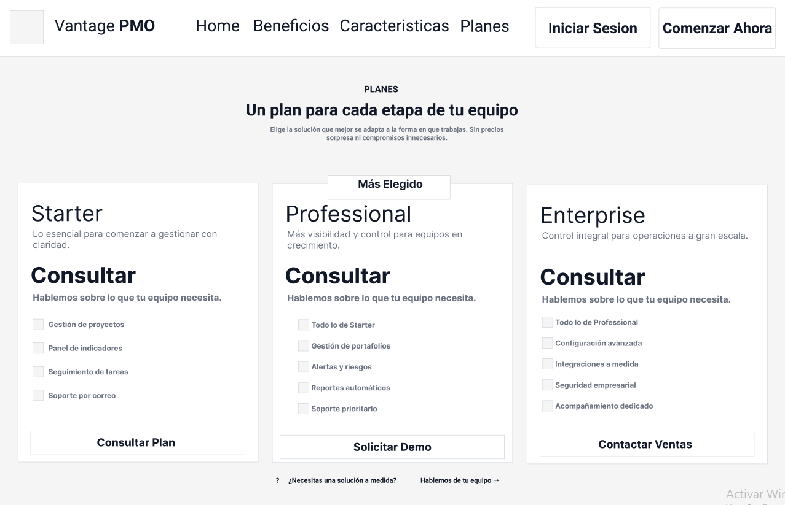
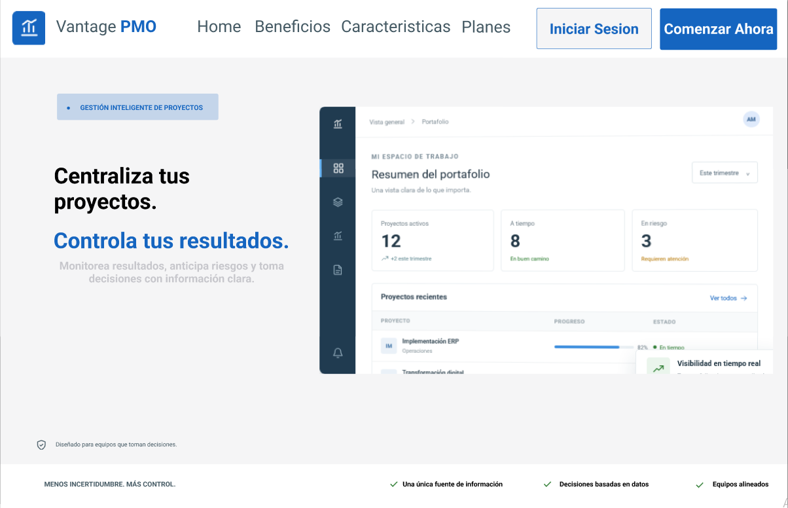
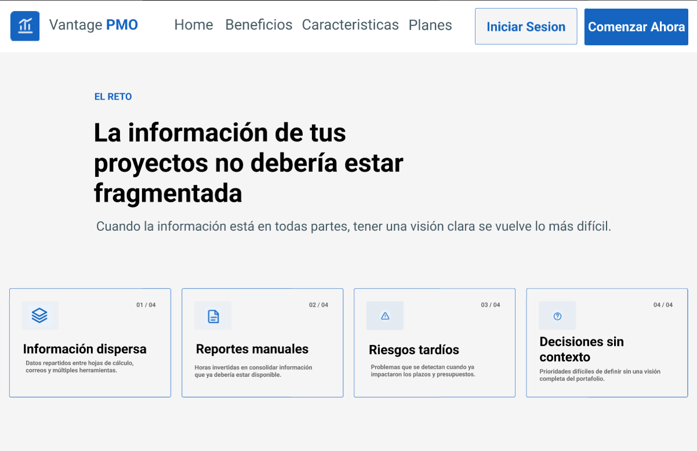
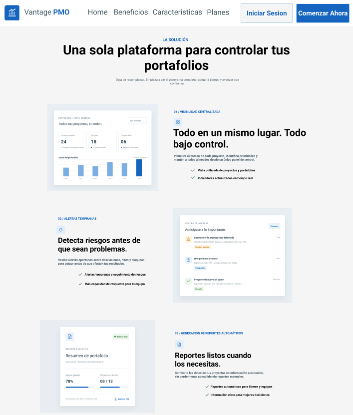
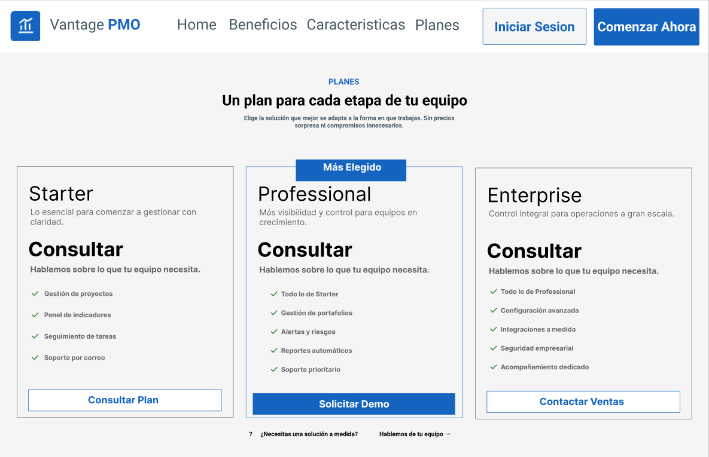

# Capítulo III: Solution UI/UX Design

## 3.1.1. Style Guidelines
Para asegurar una experiencia de usuario consistente, profesional y orientada a la productividad, el diseño visual de Vantage PMO se basa en los principios de **Material Design**, utilizando la biblioteca Angular Material para el entorno web.
### 3.1.1.1. General Style Guidelines

**1. Branding y Tono de Comunicación**
*   **Identidad de Marca:** Vantage PMO proyecta confianza, eficiencia y control. El diseño debe ser minimalista para evitar sobrecargar cognitivamente a los Project Managers y Stakeholders que manejan grandes volúmenes de datos.
*   **Tono de Comunicación:** Formal, respetuoso y sereno. La plataforma utiliza un lenguaje directo e instructivo, evitando jergas innecesarias para facilitar la toma de decisiones ejecutivas.

**2. Typography (Tipografía)**
Se ha seleccionado la familia tipográfica **Roboto** (estándar de Material Design) por su excelente legibilidad en pantallas digitales y tablas de datos densas.
*   **Headings (H1, H2, H3):** Roboto Bold y Medium (Ej. H1: 32px, H2: 24px) para diferenciar claramente las secciones de los dashboards.
*   **Body Text:** Roboto Regular (14px - 16px) para el contenido general, descripciones de tareas y reportes.
*   **Labels & Captions:** Roboto Light (12px) para etiquetas secundarias y metadatos.

**3. Colors (Paleta de Colores)**
La paleta está diseñada para reducir la fatiga visual y destacar únicamente la información crítica (alertas y estados de proyectos).
*   **Primary Color (Azul Corporativo - #1565C0):** Transmite seguridad, tecnología y profesionalismo. Utilizado en la barra de navegación, botones principales (Call to Actions) y enlaces.
*   **Secondary Color (Gris Pizarra - #455A64):** Utilizado para textos principales, fondos de paneles y bordes, manteniendo una interfaz limpia.
*   **Semantic Colors (Estados y Alertas):**
    *   *Éxito / A tiempo:* Verde (#2E7D32) para hitos completados.
    *   *Advertencia / Riesgo:* Ámbar (#FF8F00) para desviaciones de presupuesto o tiempo.
    *   *Error / Retraso Crítico:* Rojo (#C62828) para tareas bloqueadas o KPIs incumplidos.
*   **Background:** Blanco (#FFFFFF) y Gris muy claro (#F5F5F6) para maximizar el contraste y facilitar la lectura de reportes.

**4. Spacing y Grid**
Se utiliza un sistema de grilla de 12 columnas responsivas, con un espaciado base de 8px (8, 16, 24, 32) para mantener proporciones exactas y jerarquía visual entre los elementos del dashboard y el Landing Page.

## 3.1.2. Information Architecture
La arquitectura de información de Vantage PMO está estructurada para que los visitantes del Landing Page comprendan el valor del producto en menos de un minuto, y para que los usuarios de la plataforma accedan a sus portafolios sin fricción.

### 3.1.2.1. Organization Systems
*   **Landing Page:** Organización secuencial y jerárquica (Visual Hierarchy). El flujo guía al visitante desde la presentación del problema (silos de información), pasando por la solución (Vantage PMO), beneficios (reducción de tiempos), hasta el Call to Action (Registro/Contacto).
*   **Plataforma Web/Móvil:** Organización matricial y por tópicos. Los proyectos se agrupan por estado, prioridad y responsable, permitiendo a los PMs y Stakeholders alternar entre vistas de alto nivel (Portafolio) y vistas de detalle (Tareas y Recursos).

### 3.1.2.2. Labelling Systems
Las etiquetas se han definido buscando claridad, utilizando un vocabulario estándar de gestión de proyectos (Ubiquitous Language) para evitar confusiones.
*   **Navegación del Landing Page:** *Home*, *Beneficios*, *Características*, *Planes*, *Contacto*.
*   **Botones (CTAs):** *Comenzar ahora*, *Solicitar Demo*, *Iniciar Sesión*.

### 3.1.2.3. SEO Tags and Meta Tags
Para el posicionamiento orgánico del Landing Page en motores de búsqueda, se han definido las siguientes etiquetas orientadas al segmento corporativo B2B:
*   **Title Tag:** `<title>Vantage PMO | Centraliza la Gestión de tus Proyectos y Portafolios</title>`
*   **Meta Description:** `<meta name="description" content="Optimiza la gestión de proyectos de tu empresa. Reduce tiempos de reporteo, recibe alertas tempranas y toma mejores decisiones con Vantage PMO.">`
*   **Meta Keywords:** `<meta name="keywords" content="gestión de proyectos, software PMO, control de portafolios, MDEPS, productividad B2B, project management SaaS">`
*   **Author:** `<meta name="author" content="MDEPS">`

### 3.1.2.4. Searching Systems
*   **Landing Page:** Al ser un sitio web estático informativo, no requiere una barra de búsqueda compleja. La navegación se facilita mediante enlaces ancla (Anchor links).
*   **Plataforma App/Web:** Se contará con una barra de búsqueda global (Global Search) autocompletable, permitiendo a los usuarios filtrar por *Nombre de Proyecto*, *Responsable*, *Hito* o *Estado*.

### 3.1.2.5. Navigation Systems
*   **Global Navigation:** Barra de navegación superior fija (Sticky Header) en el Landing Page que acompaña al usuario durante el scroll, garantizando acceso constante al botón de "Iniciar Sesión".
*   **Footer Navigation:** Ubicado al pie de página, agrupa enlaces secundarios como *Términos y Condiciones*, *Políticas de Privacidad*, *Redes Sociales* y *Soporte*.

## 3.1.3. Landing Page UI Design
El diseño del Landing Page tiene como objetivo principal convertir visitantes (líderes de proyectos, directores de PMO y ejecutivos) en usuarios o leads comerciales, comunicando de manera clara y directa la propuesta de valor de Vantage PMO.
### 3.1.3.1. Landing Page Wireframe
Los wireframes de baja fidelidad establecen la estructura esquelética de la web. Se ha priorizado la correcta distribución de los bloques de contenido (Hero Section, Problema/Solución, Beneficios, Planes y Formulario de Contacto), garantizando un flujo de lectura lógico antes de aplicar los estilos visuales.

**Wireframe Desktop:**

### 3.1.3.2. Landing Page Mock-up
Los mock-ups de alta fidelidad aplican directamente las Style Guidelines definidas previamente. Reflejan el uso estratégico del azul corporativo (#1565C0), la jerarquía de la tipografía Roboto y la limpieza de los componentes, asegurando que la interfaz transmita confianza, eficiencia y profesionalismo empresarial B2B.

**Mock-up Desktop:**

## 3.1.4. Mobile Applications UX/UI Design
### 3.1.4.1. Mobile Applications Wireframes

Los siguientes wireframes presentan las principales vistas de la aplicación móvil Vantage PMO. Se organizan según el recorrido del usuario: acceso, registro, consulta del dashboard y gestión de proyectos, análisis, gobernanza y perfil. Las pantallas representan tanto vistas principales como estados de confirmación y formularios necesarios para comprender la navegación propuesta.

**Principios y elementos de diseño.** La propuesta prioriza la jerarquía visual y la consistencia entre pantallas: encabezados que identifican la sección, contenido agrupado por tarea, controles ubicados cerca de la información relacionada y acciones principales destacadas. Se aplican visibilidad del estado del sistema y retroalimentación mediante indicadores de avance, etiquetas de estado y confirmaciones; además, los pasos y opciones visibles favorecen el reconocimiento frente a la memorización. La interfaz usa una composición de una columna, tipografía jerarquizada, espacios de separación, superficies agrupadas, botones de acción y componentes de datos como métricas, filtros y barras de progreso.

**Diseño inclusivo.** La presentación móvil mantiene una lectura lineal y agrupa los formularios por propósito. Las etiquetas textuales acompañan a los iconos de navegación; los estados también se expresan con texto, números o indicadores, y no únicamente mediante color. El registro y la recuperación de contraseña muestran pasos consecutivos, mientras que los mensajes de éxito explican el resultado de las acciones. Estos wireframes establecen una intención de diseño inclusivo, pero no demuestran por sí solos conformidad: en la implementación se deberán validar contraste, ampliación del texto, áreas táctiles, navegación por teclado y nombres accesibles para tecnologías de asistencia, tomando WCAG 2.2 nivel AA como referencia.

**Arquitectura de información.** Antes de iniciar sesión, la información se organiza en acceso, recuperación de credenciales y creación de cuenta. Después de autenticarse, una navegación persistente agrupa las áreas principales en Home, Projects, Analytics, Governance y Profile. Dentro de cada área, la jerarquía conduce de la vista general a una tarea concreta por ejemplo, seleccionar un proyecto, revisar una alerta o editar la cuenta— y presenta confirmaciones al completar acciones relevantes. Esta organización responde a la necesidad identificada de consultar desde el móvil el estado de los proyectos, sus responsables, fechas, indicadores y alertas desde un punto centralizado.

#### 3.1.4.1.1. Authentication

El recorrido de autenticación comienza con la pantalla de inicio de Vantage PMO y el formulario de acceso. Si el usuario no recuerda sus credenciales, puede solicitar un código, verificarlo, definir una nueva contraseña y confirmar la actualización. La secuencia hace visible el paso actual y ofrece una confirmación final; la pantalla de cierre exitoso comunica que la sesión terminó.

| Inicio de la aplicación | Acceso | Recuperación por correo |
|:--:|:--:|:--:|
|  |  |  |

| Verificación del código | Nueva contraseña | Recuperación completada |
|:--:|:--:|:--:|
|  |  |  |

#### 3.1.4.1.2. Registration

El registro se divide en cuatro pasos datos personales, contacto y acceso, perfil profesional y selección de rol seguidos por una pantalla de cuenta creada. El indicador numerado permite reconocer el avance y anticipar cuánto falta; la agrupación de campos reduce la carga de cada pantalla. La selección de rol introduce una arquitectura personalizada según las responsabilidades del usuario dentro de la PMO.

| Datos personales | Contacto y acceso | Perfil profesional |
|:--:|:--:|:--:|
|  |  |  |

| Selección de rol | Registro completado |
|:--:|:--:|
|  |  |

#### 3.1.4.1.3. Dashboard

El dashboard es la entrada al espacio de trabajo autenticado. Presenta primero el saludo y el contexto del usuario, después una alerta prioritaria y métricas resumidas de proyectos, hitos, salud y capacidad. Esta jerarquía permite detectar asuntos que requieren atención antes de profundizar en cada proyecto. La barra inferior mantiene accesibles las cinco áreas principales y combina icono con etiqueta.

#### 3.1.4.1.4. Projects

La sección de proyectos organiza el trabajo desde una lista filtrable hacia la creación de iniciativas, el tablero Kanban y acciones de seguimiento. Los formularios agrupan la identificación, los participantes y las fechas; el tablero permite consultar tareas por estado y equipo, mientras que la creación de una tarea muestra un formulario contextual y una confirmación. Las vistas de exportación y roadmap amplían el recorrido hacia la consulta ejecutiva y la planificación del portafolio.

| Lista de proyectos | Crear proyecto | Proyecto creado |
|:--:|:--:|:--:|
|  |  |  |

| Confirmación con detalles | Crear tarea en Kanban | Tarea registrada |
|:--:|:--:|:--:|
|    |  ||

| Exportar reporte | Dossier exportado | Roadmap estratégico |
|:--:|:--:|:--:|
|  |  |  |

#### 3.1.4.1.5. Analytics

Analytics presenta indicadores de eficiencia y desempeño en una vista resumida. Los filtros temporales permiten delimitar el análisis y la acción de exportación abre una selección de periodo y formato. La pantalla de éxito cierra ese flujo e informa que el reporte fue generado, haciendo visible el resultado de la acción.

| Dashboard analítico | Configurar exportación | Exportación completada |
|:--:|:--:|:--:|
|  |  |  |

#### 3.1.4.1.6. Governance

Governance agrupa la supervisión de cumplimiento y la atención de alertas. El dashboard resume el estado institucional y los protocolos activos; la vista de alertas prioriza bloqueos y riesgos, explica su causa y propone una acción. La combinación de prioridad textual, descripción e intervención reduce la dependencia de señales cromáticas y facilita decidir qué atender primero.

| Supervisión de gobernanza | Resolución de alertas |
|:--:|:--:|
|  |  |

#### 3.1.4.1.7. Profile

Profile reúne la información de la cuenta, las preferencias y los controles de seguridad. Desde el perfil se accede a la edición de la cuenta, a la actualización de la fotografía y a la confirmación de cierre de sesión. Los estados de éxito hacen explícito cuándo los cambios quedaron guardados; separar estas acciones del contenido de Projects y Governance mantiene una arquitectura predecible.

| Perfil | Editar cuenta y seguridad | Actualizar fotografía |
|:--:|:--:|:--:|
|  |  |  |

| Cambios guardados | Confirmar cierre de sesión | Cierre de sesión exitoso|
|:--:|:--:|:--:|
|  |  |

|

### 3.1.4.2. Mobile Applications Wireflow Diagrams

Los diagramas de flujo de interfaz (wireflows) muestran cómo se conectan las pantallas y acciones de Vantage PMO para que cada usuario alcance un objetivo concreto (User Goal). Cada recorrido presenta la secuencia de interacción, desde el punto de entrada hasta la respuesta del sistema, e incluye los pasos necesarios para completar la tarea. Los nueve objetivos se relacionan con las User Stories (US) del capítulo II cuando corresponde; también se incluyen flujos complementarios de autenticación, registro y gestión de cuenta para representar de forma integral la experiencia móvil.

<table width="100%">
	<tr>
		<th width="30%">User Goal</th>
		<th width="70%">Wireflow</th>
	</tr>
	<tr>
		<td><strong>UG-01 — Gestión de acceso a la cuenta.</strong> Como usuario, quiero iniciar sesión o recuperar mi contraseña, para acceder de forma segura a Vantage PMO. El recorrido comienza en la pantalla de acceso; si el usuario no recuerda su contraseña, solicita un código por correo, lo valida y define una nueva. El flujo concluye con la confirmación de actualización, dejando la cuenta disponible para iniciar sesión.</td>
		<td>
			
		</td>
	</tr>
	<tr>
		<td><strong>UG-02 — Registro de usuario.</strong> Como visitante, quiero crear una cuenta y completar mis datos, para comenzar a utilizar Vantage PMO con un perfil adecuado a mis responsabilidades. El proceso organiza la información personal, los datos de contacto y acceso, y el perfil profesional en pasos consecutivos; luego permite seleccionar un rol. La confirmación final comunica que el registro se completó.</td>
		<td>
			
		</td>
	</tr>
	<tr>
		<td><strong>UG-03 — Consulta móvil del portafolio.</strong> Como Project Manager, quiero consultar el estado del portafolio desde el móvil, para detectar avances y desviaciones. El recorrido parte del dashboard, donde se resumen indicadores y alertas; continúa en la lista de proyectos y permite profundizar en el roadmap. Así, el usuario pasa de una vista general a la planificación de iniciativas bajo su responsabilidad. (US03, US14)</td>
		<td>
			
		</td>
	</tr>
	<tr>
		<td><strong>UG-04 — Registro de proyecto.</strong> Como Project Manager, quiero registrar un proyecto con su información principal, para iniciar su planificación y seguimiento. El usuario parte de la lista de proyectos, completa el formulario de creación y revisa la confirmación con los datos de la nueva iniciativa. El proyecto queda incorporado al espacio de trabajo para continuar con su gestión. (US01)</td>
		<td>
			
		</td>
	</tr>
	<tr>
		<td><strong>UG-05 — Gestión de tareas en Kanban.</strong> Como Project Manager, quiero crear y asignar tareas, para organizar el trabajo del equipo. Desde el tablero del proyecto, el usuario abre el formulario contextual, registra la tarea y define la información necesaria para asignarla. El flujo concluye con su incorporación al tablero y una confirmación visible. (US04)</td>
		<td>
			
		</td>
	</tr>
	<tr>
		<td><strong>UG-06 — Análisis y generación de reportes.</strong> Como Project Manager, quiero consultar indicadores y generar reportes, para evaluar el desempeño de los proyectos. El usuario revisa los KPIs y sus filtros, selecciona las opciones de exportación y solicita el reporte. Una confirmación informa que la descarga se completó y que el resultado está disponible para su consulta. (US11, US12)</td>
		<td>
			
		</td>
	</tr>
	<tr>
		<td><strong>UG-07 — Seguimiento de alertas y riesgos.</strong> Como Project Manager, quiero revisar alertas y riesgos, para actuar oportunamente ante eventos que puedan afectar los proyectos. Desde el dashboard de Governance, el usuario accede a las alertas activas, revisa su prioridad y contexto, y consulta las acciones propuestas. El flujo facilita decidir qué situación requiere atención primero. (US07, US13)</td>
		<td>
			
		</td>
	</tr>
	<tr>
		<td><strong>UG-08 — Actualización del perfil.</strong> Como usuario registrado, quiero actualizar mis datos personales o mi fotografía, para mantener vigente la información de mi cuenta. Desde la vista de perfil, el usuario accede a la edición correspondiente, realiza los cambios y los guarda. La confirmación final indica que la actualización se completó correctamente.</td>
		<td>
			
		</td>
	</tr>
	<tr>
		<td><strong>UG-09 — Cierre de sesión.</strong> Como usuario autenticado, quiero cerrar mi sesión de forma segura, para proteger el acceso a mi cuenta cuando termine de utilizar la aplicación. El usuario inicia la acción desde su perfil y confirma su decisión en el diálogo correspondiente. El flujo termina en la pantalla de cierre exitoso y deja la sesión finalizada.</td>
		<td>
			
		</td>
	</tr>
</table>

### 3.1.4.3. Mobile Applications Mock-ups

Los siguientes mockups presentan la propuesta visual de Vantage PMO en un dispositivo móvil. A diferencia de los wireframes, muestran la aplicación de color, tipografía, iconografía, componentes y estados de interacción con mayor nivel de detalle. Se organizan según las áreas de uso para facilitar la lectura de las pantallas principales y sus variantes.

#### 3.1.4.3.1. Authentication

Este flujo reúne el inicio de la aplicación, el acceso y la recuperación de contraseña. También incluye el cierre de sesión exitoso como estado de salida de la cuenta.

| Inicio | Inicio de sesión | Recuperación por correo |
|:--:|:--:|:--:|
|  |  |  |

| Verificación del código | Nueva contraseña | Recuperación completada |
|:--:|:--:|:--:|
|  |  |  |

#### 3.1.4.3.2. Registration

El registro se presenta como un proceso progresivo, con indicadores de avance y formularios separados por tipo de información. La última pantalla confirma la creación de la cuenta y resume el perfil configurado.

| Datos personales | Contacto y acceso | Perfil profesional |
|:--:|:--:|:--:|
|  |  |  |

| Selección de rol | Registro completado |
|:--:|:--:|
|  |  |

#### 3.1.4.3.3. Dashboard

La pantalla principal combina una alerta prioritaria con indicadores del portafolio, hitos, salud de proyectos y capacidad del equipo. La navegación inferior mantiene el acceso a las áreas centrales de la aplicación.

#### 3.1.4.3.4. Projects

Projects concentra la consulta del portafolio, el registro de iniciativas y la gestión del trabajo en Kanban. También presenta las opciones de exportación y la planificación estratégica mediante el roadmap.

| Lista de proyectos | Crear proyecto | Proyecto creado |
|:--:|:--:|:--:|
|  |  |  |

| Tablero Kanban | Crear tarea | Tarea registrada |
|:--:|:--:|:--:|
|  |  |  |

| Exportar reporte | Dossier exportado | Roadmap estratégico |
|:--:|:--:|:--:|
|   |  |  |

#### 3.1.4.3.5. Analytics

Analytics ofrece una vista de indicadores de desempeño, filtros temporales y opciones de exportación. El estado de éxito muestra la confirmación de generación y descarga del dossier ejecutivo.

| Indicadores | Configurar exportación | Exportación completada |
|:--:|:--:|:--:|
|  |  |  |

#### 3.1.4.3.6. Governance

Governance reúne el estado de cumplimiento institucional y la atención de bloqueos. La segunda pantalla prioriza alertas, expone sus causas y ofrece acciones de mitigación.

| Supervisión de gobernanza | Resolución de alertas |
|:--:|:--:|
|  |  |

#### 3.1.4.3.7. Profile

Profile centraliza la información de la cuenta, las opciones de seguridad y las preferencias. Los mockups incluyen la edición de datos, el cambio de fotografía, la confirmación de modificaciones y el diálogo previo al cierre de sesión.

| Perfil | Editar cuenta y seguridad | Actualizar fotografía |
|:--:|:--:|:--:|
|  |  |  |

| Cambios guardados | Confirmar cierre de sesión | Cierre de sesión exitoso |
|:--:|:--:|:--:|
|  |  |

|

### 3.1.4.4. Mobile Applications User Flow Diagrams

Esta sección presenta la propuesta de User Flows para la aplicación móvil Vantage PMO. Se define un flujo para cada User Goal, considerando las personas usuarias involucradas —visitante, usuario registrado y Project Manager— y manteniendo la correspondencia con los Wireflows de la sección anterior. Los diagramas incorporan los mock-ups de las pantallas, la ruta esperada (happy path) y las rutas alternativas o condiciones que pueden interrumpir o desviar el recorrido (unhappy paths). Se elaboraron con la herramienta de diseño indicada para la propuesta (Figma). Cada flujo incluye el objetivo del usuario y una explicación de sus pasos y decisiones.

<table width="100%">
	<tr>
		<th width="35%">User Goal y explicación</th>
		<th width="65%">User Flow</th>
	</tr>
	<tr>
		<td><strong>UG-01 — Gestión de acceso a la cuenta.</strong> Como usuario, quiero iniciar sesión o recuperar mi contraseña, para acceder de forma segura a Vantage PMO.  <strong>Happy path:</strong> desde el acceso, el usuario solicita recuperar la contraseña, recibe y verifica el código enviado a su correo, define una contraseña nueva y llega a la confirmación. <strong>Alternativas:</strong> si no recibe el código, puede solicitar su reenvío; si el código o los datos no son válidos, debe corregirlos o volver a solicitarlo antes de continuar. También puede volver al acceso e iniciar sesión.</td>
		<td></td>
	</tr>
	<tr>
		<td><strong>UG-02 — Registro de usuario.</strong> Como visitante, quiero crear una cuenta y completar mis datos, para comenzar a utilizar Vantage PMO con un perfil adecuado a mis responsabilidades.  <strong>Happy path:</strong> completa los datos personales, de contacto y acceso, y el perfil profesional; selecciona un rol y recibe la confirmación de la cuenta creada. <strong>Alternativas:</strong> los datos obligatorios incompletos o no válidos deben corregirse en el paso correspondiente antes de avanzar; el usuario puede permanecer en el formulario y completar la información pendiente.</td>
		<td></td>
	</tr>
	<tr>
		<td><strong>UG-03 — Consulta móvil del portafolio.</strong> Como Project Manager, quiero consultar el estado del portafolio desde el móvil, para detectar avances y desviaciones.  <strong>Happy path:</strong> revisa los indicadores y alertas del dashboard, abre la lista de proyectos y profundiza en el roadmap para consultar la planificación. <strong>Alternativas:</strong> puede permanecer en la vista general o ajustar los filtros y periodos disponibles para enfocar la consulta antes de abrir un proyecto o el roadmap.</td>
		<td></td>
	</tr>
	<tr>
		<td><strong>UG-04 — Registro de proyecto.</strong> Como Project Manager, quiero registrar un proyecto con su información principal, para iniciar su planificación y seguimiento.  <strong>Happy path:</strong> parte de la lista de proyectos, completa la información de la iniciativa y sus datos de planificación, y consulta la confirmación de creación. <strong>Alternativas:</strong> si faltan datos requeridos o no son válidos, debe corregir el formulario antes de registrar el proyecto; también puede salir del formulario sin completar el alta.</td>
		<td></td>
	</tr>
	<tr>
		<td><strong>UG-05 — Gestión de tareas en Kanban.</strong> Como Project Manager, quiero crear y asignar tareas, para organizar el trabajo del equipo.  <strong>Happy path:</strong> abre el tablero del proyecto, crea una tarea, define su información y responsables, y recibe confirmación de que quedó registrada. <strong>Alternativas:</strong> si falta información necesaria para registrar o asignar la tarea, debe completarla antes de confirmar; puede cancelar la creación y regresar al tablero sin guardar.</td>
		<td></td>
	</tr>
	<tr>
		<td><strong>UG-06 — Análisis y generación de reportes.</strong> Como Project Manager, quiero consultar indicadores y generar reportes, para evaluar el desempeño de los proyectos.  <strong>Happy path:</strong> revisa los KPIs, selecciona el periodo y formato de exportación, solicita el reporte y recibe la confirmación de descarga. <strong>Alternativas:</strong> puede cambiar el periodo o formato, o cancelar la exportación y volver a los indicadores; si la generación no se completa, el flujo no muestra un éxito y permite volver a intentarlo.</td>
		<td></td>
	</tr>
	<tr>
		<td><strong>UG-07 — Seguimiento de alertas y riesgos.</strong> Como Project Manager, quiero revisar alertas y riesgos, para actuar oportunamente ante eventos que puedan afectar los proyectos.  <strong>Happy path:</strong> accede desde Governance a la cola de alertas, revisa la prioridad, la causa y la acción recomendada, y aplica la mitigación o marca la alerta como atendida. <strong>Alternativas:</strong> si la acción requiere autorización, puede dejarla pendiente o reasignarla a una