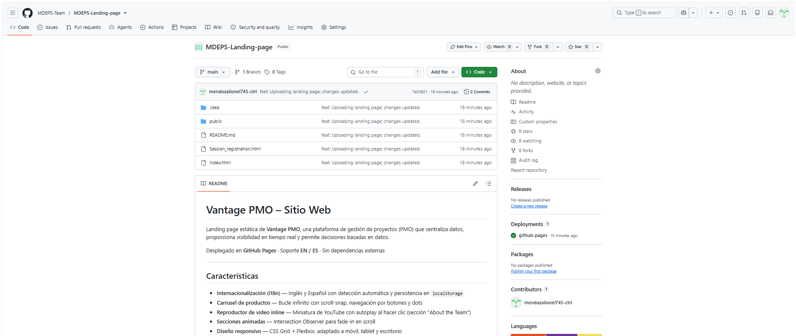
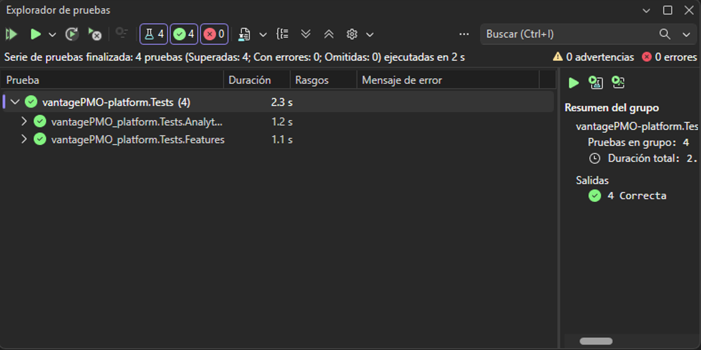
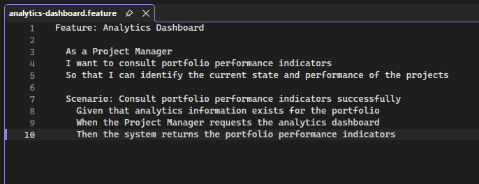
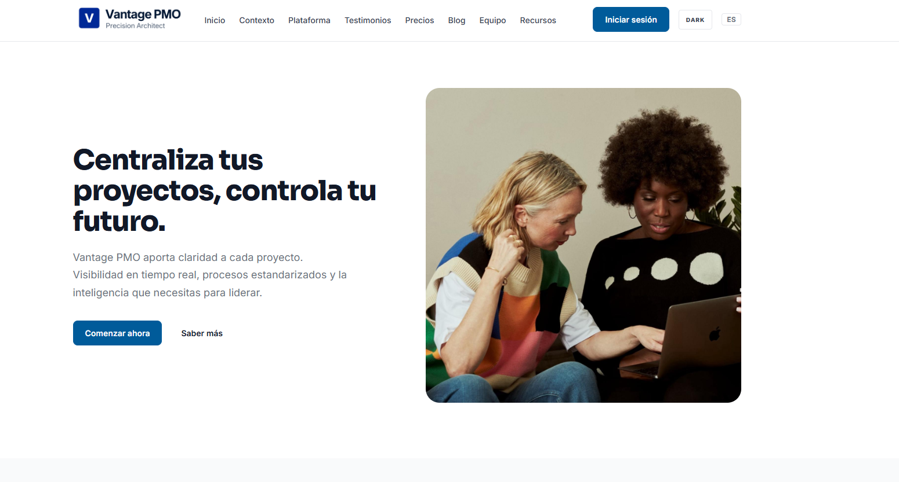
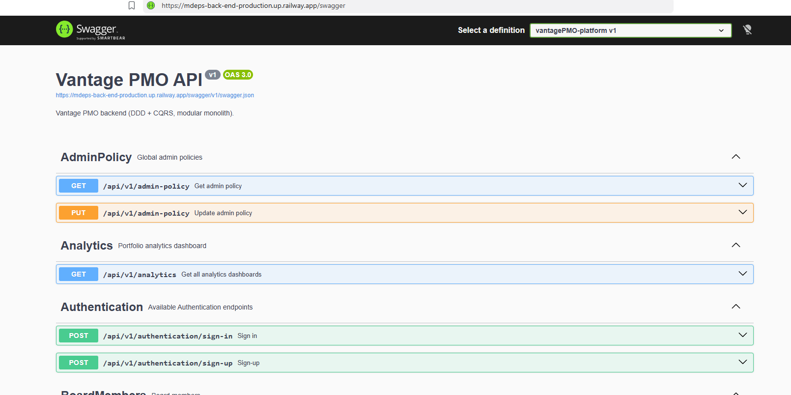
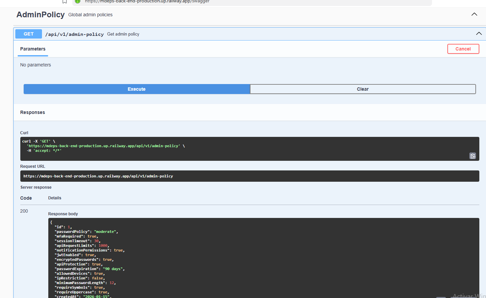

<div style="page-break-before: always;"></div>

# IV Product Implementation, Validation & Deployment

## 4.1. Software Configuration Management
<a id="5-1-software-configuration-management"></a>

### 4.1.1. Software Development Environment Configuration
<a id="5-1-1-software-development-environment-configuration"></a>

A continuación, se listan las herramientas y estándares adoptados por el equipo para el desarrollo colaborativo del sistema:

| Actividad               | Herramienta / Guía | Propósito                                                                    | Tipo de acceso / Ruta     |
| ----------------------- | --------------------------------------------------------------------------------------------------------------------------------------------------------------------------------- | ----------------------------------------------------------------------------- | ------------------------------------------------------------------------------------------------------------------------------------------------------------------------------------------------------------------- |
| Project Management      | Trello Software   | Seguimiento de backlog, tareas y sprints.                                     | SaaS –[https://trello.com/](https://trello.com/software/jira)          |
| Requirements Management | Gherkin Conventions   | Escritura legible de requisitos con formato Given/When/Then.                  | [https://cucumber.io/docs/gherkin/](https://cucumber.io/docs/gherkin/)          |
| Product UX/UI Design    | Figma   | Prototipos y diseño responsive.                                              | SaaS –[https://figma.com](https://figma.com)     |
| Landing Page             | HTML, CSS, JavaScript, Vue     | Construcción de la interfaz web.                                             | [https://vuejs.org/guide/introduction.html](https://vuejs.org/guide/introduction.html)       |
| User Personas, Empathy Journey Mapping, Impact Mapping   | UXPressia                | Es una herramienta en línea para el mapeo de la trayectoria del cliente que crea mapas de impacto y personas.    | [https://uxpressia.com/](https://uxpressia.com/)        |
| Class Diagram and Database Diagram  | LucidChart | Organización y modelado de las tablas y entidades del proyecto.         | [https://www.lucidchart.com/](https://www.lucidchart.com/)                                                                            |
| Code Standards          | Google HTML/CSS Style Guide, Vue Style Guide, MDN Guidelines, W3C JavaScript Style Guide, Google JavaScript Style Guide, C# Coding Conventions, Microsoft ASP.NET Core Guidelines | Aplicación de buenas prácticas de desarrollo en frontend y backend.         | [https://developer.mozilla.org/](https://developer.mozilla.org/) / [https://learn.microsoft.com/en-us/dotnet/csharp/fundamentals/coding-style](https://learn.microsoft.com/en-us/dotnet/csharp/fundamentals/coding-style) |
| Version Control         | Git + GitHub     | Control de versiones y trabajo colaborativo.                                  | SaaS –[https://github.com](https://github.com)  |
| Software Deployment     | Github pages   | Despliegue continuo de la aplicación para ambientes de prueba y validación. | SaaS –[https://railway.app](https://railway.app) / [https://render.com](https://render.com)  |
| Upgrade of Branches and Commits | Visual Studio Code | Optimización y documentación del proyecto asimismo el trabajo colaborativo. |[https://code.visualstudio.com/](https://code.visualstudio.com/)  |
| EventStorming | Miro | Herramienta colaborativa grupal que permitio diseñar mejor algunos puntos del trabajo. |[https://miro.com/es/](https://miro.com/es/)  |

<div style="text-align: left; max-width: 900px; margin: 0 auto;">

### 4.1.2. Source Code Management
<a id="5-1-2-source-code-management"></a>

Para la gestión del código del proyecto, el equipo adoptó una estrategia simplificada en lugar de implementar completamente el modelo Git Flow. Se trabajó principalmente sobre una rama principal (main), la cual contiene la versión estable y actual del sistema en desarrollo. 

Adicionalmente, se crearon algunas ramas específicas organizadas por capítulos del proyecto. Estas ramas permitieron desarrollar avances de manera más ordenada antes de integrarlos a la rama principal, sin llegar a una estructura compleja de múltiples ramas por funcionalidades o versiones. 

Todas las funcionalidades y mejoras fueron finalmente integradas en la rama main, asegurando que esta siempre represente el estado más actualizado del proyecto. Este enfoque, aunque más sencillo que Git Flow, resultó adecuado para el alcance del trabajo, ya que facilitó el control del progreso sin generar una sobrecarga en la gestión de ramas.

 Por otro lado, se utilizó GitHub como repositorio central del proyecto, aprovechando también herramientas como GitHub Pages para la visualización del Landing Page. Esto permitió desplegar rápidamente los avances en formato web y contar con una versión accesible del sistema de manera ágil y eficiente.

---

URL de los Repositorios:
Organización: https://github.com/MDEPS-Team
Reporte: https://github.com/MDEPS-Team/MDEPS-Landing-page
Landing Page: https://github.com/MDEPS-Team/MDEPS-Landing-page
Backend: https://github.com/MDEPS-Team/MDEPS-Back-End


### Versionado Semántico

Se aplicará el esquema de **Semantic Versioning 2.0.0**, con el siguiente formato:

- **MAJOR**: Incompatibilidades en la API.
- **MINOR**: Nuevas funcionalidades sin romper compatibilidad.
- **PATCH**: Correcciones de errores menores y ajustes sin afectar funcionalidades.

_Ejemplo de versión:_ `v1.3.4`

### Convenciones de Commits

Se adoptará el estándar de **Conventional Commits** para la redacción de los mensajes de commit, lo cual permitirá estructurar mejor los cambios realizados. Este enfoque facilita la automatización de procesos como la integración continua y la generación de historiales de cambios (changelogs).

**Ejemplos:**

- `feat: add project creation form`
- `fix: resolve error in task assignment module`
- `docs: update user stories and diagrams`
- `chore: update dependencies`
### 4.1.3. Source Code Style Guide & Conventions
<a id="5-1-3-source-code-style-guide-conventions"></a>

El código desarrollado por los miembros del equipo esté completamente redactado en inglés.

## **HTML**

* **Use Lowercase Element Names**: Se recomienda utilizar minúsculas para todos los elementos HTML.
```html
<section class="hero">
<h1>Centralize your projects</h1>
</section>

**Close All HTML Elements**: Todos los elementos deben cerrarse correctamente para evitar errores de renderizado.
```html
<p>Centralize your projects, control your future.</p>

<a href="#Contact">Solicitar demo</a>
```

**Use Lowercase Attribute Names**: Los atributos deben escribirse en minúsculas.

```html
<input type="email" placeholder="tu@correo.com" id="fe"/>
```
**Use Semantic HTML Elements**: Se deben utilizar etiquetas semánticas para mejorar la estructura y accesibilidad.

```html
<nav>...</nav>
<section id="funciones">...</section>
<footer>...</footer>
```

**Use Descriptive IDs and Classes**: Los nombres deben ser claros y representar su función.
```html
<section id="contact">
  <div class="contact-form">
```
## **CSS**

**Use Kebab-Case for Class Names**: Las clases deben escribirse en minúsculas separadas por guiones.
```css
.contact-form {
  display: flex;
}
```
**Use CSS Variables for Colors**: Se deben definir colores reutilizables en :root.
```css
:root {
  --blue: #1E40AF;
  --navy: #0F172A;
}
```
**Group Styles by Sections**: El código CSS debe organizarse por secciones del sitio.
```css
/* NAV */
nav { ... }
/* HERO */
.hero { ... }
/* FOOTER */
footer { ... }
```
**Use Consistent Spacing**: Se debe mantener consistencia en márgenes, padding y alineación.
```css
.section {
  padding: 6rem 2rem;
}
```
**Responsive Design with Media Queries**: Se deben usar breakpoints para adaptar la interfaz.
```css
@media (max-width: 600px) {
  .hero {
    padding: 4rem 1rem;
  }
}
```
## **JavaScript**

**Use CamelCase for Variables and Functions**: Las variables y funciones deben usar camelCase.
```js
function sendForm() {
  const userName = document.getElementById('fn').value;
}
```
**Keep Functions Simple and Clear**: Las funciones deben ser cortas y fáciles de entender.
```js
if (!n || !e) {
  alert('Por favor completa tu nombre y correo.');
  return;
}
```

**Use Meaningful Variable Names**: Los nombres deben representar su propósito.
```js
const navLinks = document.getElementById('navLinks');
const hamburger = document.getElementById('hamburger');
```
**Avoid Inline JavaScript**: Se recomienda mantener la lógica separada del HTML.
```js
< button onclick="sendForm()">Enviar</ button>
```
### 4.1.4. Software Deployment Configuration
<a id="5-1-4-software-deployment-configuration"></a>

Para la Landing Page desarrollada en HTML, CSS y JavaScript, la configuración del despliegue en GitHub Pages se define de la siguiente manera:

**Repositorio de Código Fuente**

Se debe crear un repositorio en GitHub y subir todos los archivos del proyecto (HTML, CSS, JS). Es obligatorio que el archivo index.html esté ubicado en la raíz del repositorio para poder realizar el despliegue correctamente.



**Despliegue del Backend (Web Service)**

Para el despliegue de la API REST y la base de datos, se utilizó la plataforma **Railway**. El proceso de configuración consistió en:
1. Provisión de un servicio de base de datos **MySQL** alojado en la nube.
2. Vinculación directa con el repositorio de GitHub (`MDEPS-Back-End`) utilizando el archivo `Dockerfile` ubicado en la raíz del proyecto para la compilación del entorno en .NET 10.
3. Configuración de variables de entorno, incluyendo la cadena de conexión a la base de datos (`ConnectionStrings__DefaultConnection`) y la habilitación de la documentación pública (`ASPNETCORE_ENVIRONMENT = Development`).
# 4.2
## 4.2.1. Sprint 1
##### 4.2.1.1. Sprint Planning 1

En esta sección, se presenta la planificación correspondiente al Sprint 1 de Vantage PMO.

| **Sprint #** | **Sprint 1** |
|--------------|--------------|
| **Sprint Planning Background** | |
| **Date** | [Fecha real del Sprint Planning] |
| **Time** | [Hora real] |
| **Location** | [Lugar o plataforma utilizada] |
| **Prepared By** | Fuentes Alvarez, Angiela Stephany |
| **Attendees** | Fuentes Alvarez, Angiela Stephany / Guillen Giraldo, Mike Dylan / Mendoza Machoa, Lionel Snayder / Pacheco Lavado, Rafael Agustin / Quiliano Motta, Kirk Douglas |
| **Sprint n-1 Review Summary** | No aplica |
| **Sprint n-1 Retrospective Summary** | No aplica |
| **Sprint Goal & User Stories** | |
| **Sprint 1** | El objetivo del Sprint 1 es transformar los requerimientos y hallazgos obtenidos durante las etapas de análisis en propuestas concretas de diseño y planificación para Vantage PMO. Durante este sprint, el equipo trabajará en la elaboración de los Wireframes y Mock-ups del Landing Page, el diseño UX/UI de la aplicación móvil, la definición de los flujos de usuario y el desarrollo del prototipo, buscando mantener coherencia con las necesidades identificadas en los segmentos objetivo y con los artefactos desarrollados previamente. |
| **Sprint 1 Velocity** | [XX Story Points] |
| **Sum of Story Points** | [XX Story Points] |
##### 4.2.1.2. Aspect Leaders and Collaborators

En el marco del Sprint 1, se han priorizado las actividades relacionadas con la transformación de los requerimientos y hallazgos obtenidos durante las etapas de análisis en propuestas concretas de diseño y planificación para Vantage PMO. Los esfuerzos del equipo se orientan hacia el diseño de la Landing Page, el diseño UX/UI de la aplicación móvil, la elaboración de flujos de usuario y prototipos, así como las actividades relacionadas con la implementación y documentación de la solución.

A fin de garantizar una ejecución coordinada y una adecuada distribución de responsabilidades, se ha implementado la Matriz de Liderazgo y Colaboración (LACX). En esta herramienta se identifican los responsables principales (L) y los colaboradores (C) para cada aspecto del Sprint 1.

| **Team Member (Last Name, First Name)** | **GitHub Username** | **Landing Page** | **Mobile App UX/UI** | **User Flows & Prototyping** | **Implementation** | **Testing** | **Documentation** |
| ---------------------------------------- | ------------------- | ---------------- | -------------------- | ----------------------------- | ------------------ | ----------- | ---------------- |
| Fuentes Alvarez, Angiela Stephany | [GitHub Username] | L | C | C | C | C | L |
| Guillen Giraldo, Mike Dylan | [GitHub Username] | C | L | C | C | C | C |
| Mendoza Machoa, Lionel Snayder | [GitHub Username] | C | C | L | C | C | C |
| Pacheco Lavado, Rafael Agustin | [GitHub Username] | C | C | C | L | C | C |
| Quiliano Motta, Kirk Douglas | [GitHub Username] | C | C | C | C | L | C |
##### 4.2.1.3. Sprint Backlog 1

El Sprint Backlog 1 reúne las historias de usuario y actividades priorizadas por el equipo para el desarrollo del Sprint 1 de Vantage PMO. El trabajo se encuentra orientado a transformar los requerimientos y necesidades identificados durante las etapas anteriores en propuestas concretas de diseño y planificación para la solución.

Durante este sprint se consideran actividades relacionadas con el diseño de la Landing Page, el desarrollo de la experiencia UX/UI de la aplicación móvil, la elaboración de Wireflows y User Flows, la creación de Mock-ups y el desarrollo del prototipo. Estas actividades buscan asegurar que la solución mantenga coherencia con los User Personas, User Journey Maps, Empathy Maps y demás artefactos desarrollados durante el proceso de Requirements Elicitation & Analysis.

**Screenshot del Board**


*Trello:* [URL DEL TABLERO DE TRELLO]

<table border="1" cellspacing="0" cellpadding="5">
  <tr>
    <th>Sprint #</th>
    <th>Sprint 01</th>
    <th colspan="7"></th>
  </tr>

  <tr>
    <th colspan="2">User Story</th>
    <th colspan="2">Work-item / Task</th>
    <th colspan="5"></th>
  </tr>

  <tr>
    <th>Id</th>
    <th>Title</th>
    <th>Id</th>
    <th>Title</th>
    <th>Description</th>
    <th>Estimation (hours)</th>
    <th>Assigned To</th>
    <th>Status</th>
  </tr>

  <!-- USER STORY 01 -->
  <tr>
    <td>US-XXX</td>
    <td>Diseño de Landing Page</td>
    <td>T001</td>
    <td>Elaboración de Wireframes</td>
    <td>Diseñar la estructura visual y organización de contenidos del Landing Page considerando las necesidades identificadas durante el proceso de análisis.</td>
    <td>[XX h]</td>
    <td>[Integrante]</td>
    <td>[Status]</td>
  </tr>

  <tr>
    <td></td>
    <td></td>
    <td>T002</td>
    <td>Elaboración de Mock-ups</td>
    <td>Desarrollar los Mock-ups del Landing Page aplicando los lineamientos visuales y de experiencia de usuario definidos para Vantage PMO.</td>
    <td>[XX h]</td>
    <td>[Integrante]</td>
    <td>[Status]</td>
  </tr>

  <!-- USER STORY 02 -->
  <tr>
    <td>US-XXX</td>
    <td>Diseño UX/UI de la Aplicación Móvil</td>
    <td>T003</td>
    <td>Elaboración de Wireframes</td>
    <td>Diseñar los Wireframes de las aplicaciones móviles considerando los User Personas y las necesidades identificadas durante el proceso de Needfinding.</td>
    <td>[XX h]</td>
    <td>[Integrante]</td>
    <td>[Status]</td>
  </tr>

  <tr>
    <td></td>
    <td></td>
    <td>T004</td>
    <td>Elaboración de Wireflow Diagrams</td>
    <td>Definir los flujos de interacción de las aplicaciones mediante Wireflows asociados a los principales objetivos de los usuarios.</td>
    <td>[XX h]</td>
    <td>[Integrante]</td>
    <td>[Status]</td>
  </tr>

  <tr>
    <td></td>
    <td></td>
    <td>T005</td>
    <td>Elaboración de Mock-ups</td>
    <td>Desarrollar los Mock-ups de la aplicación móvil incorporando los principios de diseño, arquitectura de información y lineamientos visuales definidos.</td>
    <td>[XX h]</td>
    <td>[Integrante]</td>
    <td>[Status]</td>
  </tr>

  <tr>
    <td></td>
    <td></td>
    <td>T006</td>
    <td>Elaboración de User Flow Diagrams</td>
    <td>Representar los flujos de interacción esperados para los principales objetivos de los usuarios, incluyendo los caminos principales y alternativos.</td>
    <td>[XX h]</td>
    <td>[Integrante]</td>
    <td>[Status]</td>
  </tr>
  
  <tr>
    <td>US-XXX</td>
    <td>Prototipado de la Aplicación</td>
    <td>T007</td>
    <td>Desarrollo del prototipo</td>
    <td>Integrar los Mock-ups y flujos definidos para construir un prototipo navegable que permita validar la experiencia propuesta.</td>
    <td>[XX h]</td>
    <td>[Integrante]</td>
    <td>[Status]</td>
  </tr>

</table>
### 4.2.1.4. Development Evidence for Sprint Review

Durante el Sprint 1 se realizaron avances en la implementación de los productos que conforman Vantage PMO. Como parte del desarrollo, se avanzó en la construcción de los servicios del backend, incorporando la estructura necesaria para gestionar las principales capacidades del dominio mediante servicios RESTful.

El código fuente se mantiene en repositorios de GitHub, utilizando control de versiones para registrar los cambios realizados durante la implementación. En el backend se incorporaron componentes correspondientes a las capas de dominio, aplicación, infraestructura e interfaces REST, permitiendo establecer la base para las funcionalidades definidas para el Sprint 1.

A continuación, se presentan los commits asociados a los avances de implementación realizados durante el Sprint.

| Repository | Branch | Commit Id | Commit Message | Commit Message Body | Commited on (Date) |
| :--- | :--- | :--- | :--- | :--- | :--- |
| [MDEPS-Team/MDEPS-Back-End](https://github.com/MDEPS-Team/MDEPS-Back-End) | main | 062e857 | feat: backend migration | — | 2026-10-04 |

El commit presentado corresponde a la incorporación de la implementación inicial del backend de Vantage PMO, incluyendo la estructura de los diferentes módulos del dominio y los servicios REST necesarios para exponer las funcionalidades del sistema.

### 4.2.1.5. Testing Suite Evidence for Sprint Review

Durante el Sprint 1 se implementó una suite de pruebas automatizadas para validar parte de las funcionalidades del backend de Vantage PMO. Las pruebas fueron desarrolladas utilizando **xUnit** sobre **.NET 10**, incorporando pruebas unitarias, una prueba de integración y una prueba de aceptación bajo el enfoque BDD.

Las pruebas realizadas se encuentran relacionadas principalmente con la **US11 - Consultar indicadores de desempeño**, debido a que validan componentes pertenecientes al bounded context de Analytics, encargado de gestionar y proporcionar información relacionada con los indicadores de desempeño del portafolio.

La suite desarrollada permitió verificar tanto el comportamiento de objetos individuales del dominio como la interacción entre componentes de persistencia y la correcta satisfacción de un escenario de aceptación definido mediante Gherkin.

#### Unit Tests

Para las pruebas unitarias se seleccionaron objetos de valor pertenecientes al módulo Analytics. El objetivo fue comprobar que los objetos mantengan correctamente la información proporcionada durante su creación.

| Test ID | Test Type | Related User Story | Class | Test | Description |
| :--- | :--- | :--- | :--- | :--- | :--- |
| UT01 | Unit Test | US11 | `SummaryKpis` | `Constructor_ShouldAssignProvidedValues` | Verifica que los valores correspondientes a fondos disponibles, índice de velocidad, exposición al riesgo y planes de mitigación sean asignados correctamente al crear un objeto `SummaryKpis`. |
| UT02 | Unit Test | US11 | `PortfolioRoi` | `Constructor_ShouldAssignProvidedValues` | Verifica que el porcentaje de ROI, nivel de eficiencia, valor objetivo y valor proyectado sean almacenados correctamente en un objeto `PortfolioRoi`. |

Estas pruebas permiten validar de manera aislada los objetos utilizados para representar los principales indicadores de desempeño mostrados por el módulo Analytics.

#### Integration Tests

Para validar la interacción entre la capa de persistencia y el dominio se implementó una prueba de integración utilizando **Entity Framework Core InMemory**.

| Test ID | Test Type | Related User Story | Component | Test | Description |
| :--- | :--- | :--- | :--- | :--- | :--- |
| IT01 | Integration Test | US11 | `AnalyticsDashboardRepository` | `AddAndList_ShouldPersistAndReturnAnalyticsDashboard` | Verifica que un objeto `AnalyticsDashboard` pueda almacenarse mediante el repositorio y posteriormente recuperarse correctamente, conservando sus indicadores y datos asociados. |

La prueba utiliza una base de datos en memoria para verificar la integración entre `AppDbContext`, Entity Framework Core y `AnalyticsDashboardRepository`, evitando modificar la base de datos utilizada por la aplicación durante el desarrollo.

#### Acceptance Tests

Para validar el comportamiento esperado desde la perspectiva del usuario se implementó un Acceptance Test bajo el enfoque **Behavior-Driven Development (BDD)**.

El escenario se relaciona con la **US11 - Consultar indicadores de desempeño**, donde el Project Manager debe poder consultar los indicadores correspondientes al desempeño del portafolio.

El escenario fue definido mediante un archivo `.feature` utilizando Gherkin:

```gherkin
Feature: Analytics Dashboard

  As a Project Manager
  I want to consult portfolio performance indicators
  So that I can identify the current state and performance of the projects

  Scenario: Consult portfolio performance indicators successfully
    Given that analytics information exists for the portfolio
    When the Project Manager requests the analytics dashboard
    Then the system returns the portfolio performance indicators
```

Los Steps correspondientes fueron implementados en la clase `AnalyticsDashboardSteps`. En el paso `Given` se prepara información de Analytics utilizando una base de datos en memoria; en el paso `When` se consulta la información mediante `AnalyticsDashboardRepository`; finalmente, en el paso `Then` se verifica que el sistema retorne correctamente los indicadores de desempeño esperados.

| Test ID | Test Type | Related User Story | Feature | Scenario |
| :--- | :--- | :--- | :--- | :--- |
| AT01 | Acceptance Test - BDD | US11 | Analytics Dashboard | Consult portfolio performance indicators successfully |

#### Testing Execution Evidence

La ejecución de la suite de pruebas fue realizada mediante el Test Explorer de Visual Studio. Como resultado se ejecutaron cuatro pruebas automatizadas, obteniendo los siguientes resultados:

| Test Type | Tests Executed | Passed | Failed |
| :--- | :---: | :---: | :---: |
| Unit Tests | 2 | 2 | 0 |
| Integration Tests | 1 | 1 | 0 |
| Acceptance Tests | 1 | 1 | 0 |
| **Total** | **4** | **4** | **0** |

La ejecución confirmó que las cuatro pruebas implementadas finalizaron correctamente, sin presentar errores ni pruebas omitidas.



*Figura. Ejecución de la suite de pruebas del backend de Vantage PMO en Visual Studio, mostrando cuatro pruebas superadas y cero errores.*

Asimismo, la siguiente evidencia muestra el escenario de aceptación definido mediante Gherkin para la consulta de indicadores de desempeño.



*Figura. Escenario de Acceptance Test en Gherkin correspondiente a la US11 - Consultar indicadores de desempeño.*

#### Testing Repository and Commits

Los archivos correspondientes a las pruebas automatizadas se encuentran almacenados dentro del repositorio del backend de Vantage PMO, en el proyecto `vantagePMO-platform.Tests`.

**Repository:** [MDEPS-Team/MDEPS-Back-End](https://github.com/MDEPS-Team/MDEPS-Back-End)

Los principales archivos incorporados para la suite de pruebas son:

- `vantagePMO-platform.Tests/SummaryKpisTests.cs`
- `vantagePMO-platform.Tests/PortfolioRoiTests.cs`
- `vantagePMO-platform.Tests/AnalyticsDashboardRepositoryIntegrationTests.cs`
- `vantagePMO-platform.Tests/Features/analytics-dashboard.feature`
- `vantagePMO-platform.Tests/Features/Steps/AnalyticsDashboardSteps.cs`
- `vantagePMO-platform.Tests/vantagePMO-platform.Tests.csproj`

A continuación, se presenta el commit relacionado con la implementación de las pruebas durante el Sprint 1.

| Repository | Branch | Commit Id | Commit Message | Commit Message Body | Commited on (Date) |
| :--- | :--- | :--- | :--- | :--- | :--- |
| MDEPS-Team/MDEPS-Back-End | feature/4.2.1.5-testing | ff70649 | test: add sprint 1 backend test suite | — | 2026-10-05 |

### 4.2.1.6. Execution Evidence for Sprint Review
<a id="5-2-1-5-execution-evidence-for-sprint-review"></a>

Durante el presente Sprint, se ha logrado la transición de una interfaz estática a un ecosistema interactivo y funcional, cumpliendo con el objetivo de establecer el núcleo de acceso y la propuesta de valor visual de Vantage PMO. Los hitos alcanzados se centran en la implementación de un sistema de seguridad robusto, la personalización dinámica de la identidad de marca y la optimización de la experiencia de usuario a través de múltiples dispositivos y lenguajes.

**Resumen de Logros:**

- Seguridad y Acceso: Se ha desplegado un módulo de autenticación completo que integra proveedores de identidad modernos, garantizando un flujo de inicio de sesión seguro, validado y alineado con normativas legales de privacidad.

- Interactividad y Demostración: Se implementó un motor de previsualización en tiempo real que permite a los potenciales clientes interactuar con la plataforma, personalizando elementos de branding y visualizando la capacidad del dashboard de portafolio sin fricciones técnicas.

- Accesibilidad y Alcance Global: Gracias a la implementación de internacionalización (i18n) y un diseño estrictamente responsivo, la plataforma es ahora capaz de ofrecer una navegación coherente y profesional tanto en entornos de escritorio como en dispositivos móviles, eliminando barreras de idioma y formato.

- Comunicación Persistente: Se estableció la infraestructura de notificaciones push, permitiendo una conexión directa con el usuario y mejorando los índices de retención mediante alertas del sistema optimizadas.

A continuación, se presentan las evidencias gráficas de las vistas implementadas y el recurso audiovisual que detalla el flujo de navegación alcanzado:

Video de Demostración y Navegación: https://upcedupe-my.sharepoint.com/:v:/g/personal/u202417433_upc_edu_pe/IQBngnzzXajyRpPAik2w-PdQAW6q0V01RTT5qhqPQLRNLcg?nav=eyJyZWZlcnJhbEluZm8iOnsicmVmZXJyYWxBcHAiOiJPbmVEcml2ZUZvckJ1c2luZXNzIiwicmVmZXJyYWxBcHBQbGF0Zm9ybSI6IldlYiIsInJlZmVycmFsTW9kZSI6InZpZXciLCJyZWZlcnJhbFZpZXciOiJNeUZpbGVzTGlua0NvcHkifX0&e=SXvFNG

Screenshots de la Implementación:



**Ejecución e Interactividad del Backend**

Además del entorno web, se logró desplegar exitosamente el backend de Vantage PMO basado en arquitectura DDD y CQRS. A través de la interfaz interactiva de Swagger, se demostró la ejecución real de los Endpoints de los distintos Bounded Contexts (Authentication, Projects, Analytics, etc.).

Durante la validación, se ejecutaron peticiones `POST` para la creación de entidades y peticiones `GET` para verificar su correcta persistencia en la base de datos MySQL alojada en Railway, confirmando que la API no retorna datos simulados, sino que procesa transacciones reales.


*Figura: Interfaz interactiva de Swagger documentando los Bounded Contexts del sistema.*


*Figura: Ejecución de un endpoint de la API y respuesta HTTP validando la persistencia en la base de datos.*

### 4.2.1.7. Services Documentation Evidence for Sprint Review
### 4.2.1.8. Software Deployment Evidence for Sprint Review
### 4.2.1.9. Team Collaboration Insights during Sprint
